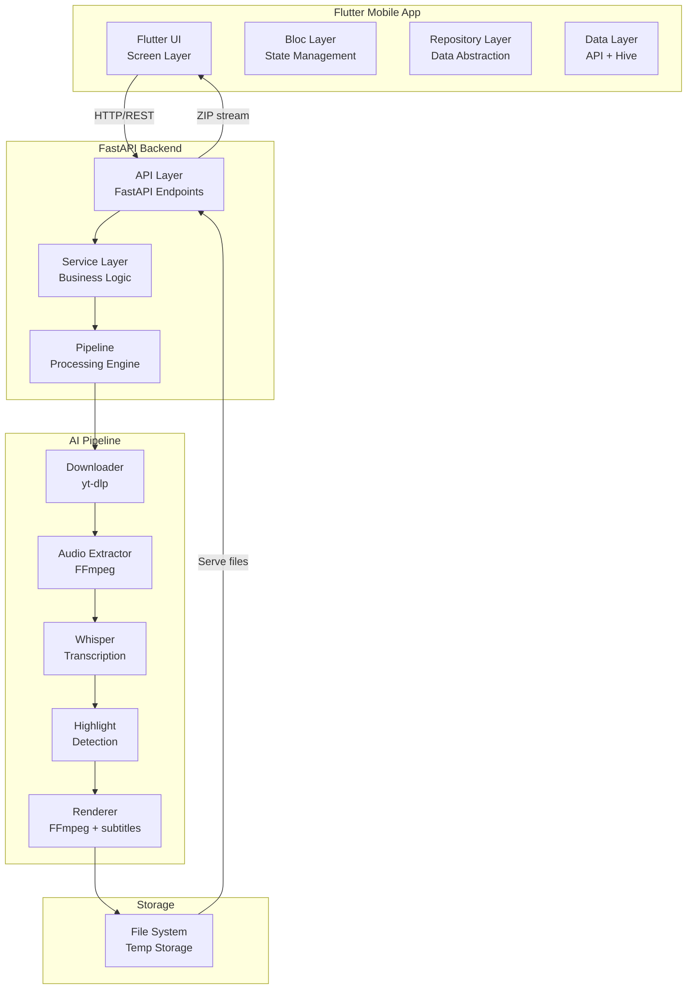
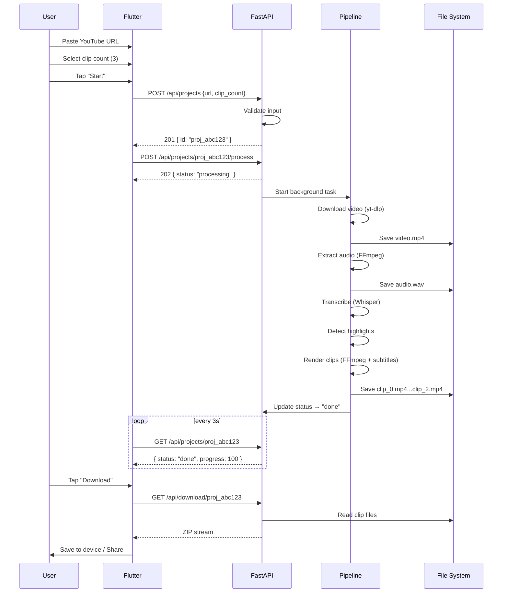

# AI YouTube Clipper — Architecture

## Overall Architecture



## Responsibilities

### Flutter (Client)

- **UI layer**: Render screens, handle gestures, show progress
- **Bloc layer**: Business logic per feature, state transitions, API polling
- **Repository layer**: Abstract data sources (API + Hive) behind interface
- **Data layer**: HTTP client (Dio), local cache (Hive), DTOs

### FastAPI (Backend)

- **API layer**: Endpoints, validation, error handling, CORS
- **Service layer**: Orchestration, project lifecycle management
- **Pipeline**: Sequential processing stages (download → transcribe → highlight → render)

### AI Pipeline

- **yt-dlp**: Download YouTube video in best quality available
- **FFmpeg**: Audio extraction, video cropping/resizing, subtitle burning
- **Whisper (openai-whisper)**: Speech-to-text transcription with timestamps
- **Highlight Detection**: Heuristic algorithm based on transcript features (speech rate, keyword density, silence gaps)

## Communication Pattern

```
Flutter                     FastAPI                      Pipeline
   │                          │                            │
   │── POST /api/projects ───→│                            │
   │←──── { id, status } ─────│                            │
   │                          │── Start background task ──→│
   │                          │                            │
   │── GET /api/projects/id ─→│                            │── Downloading ──→ ...
   │←─── { status: 30% } ─────│                            │
   │                          │                            │
   │── GET /api/projects/id ─→│                            │── Rendering ────→ ...
   │←─── { status: 70% } ─────│                            │
   │                          │                            │
   │── GET /api/projects/id ─→│                            │── Done
   │←─── { status: done } ────│                            │
   │                          │                            │
   │── GET /api/download/id ─→│                            │
   │←───── ZIP stream ────────│                            │
```

## Data Flow (End-to-End)



## Folder Structure

### Flutter

```
lib/
├── main.dart
├── app.dart
├── core/
│   ├── constants/
│   ├── errors/
│   ├── network/
│   ├── router/
│   ├── theme/
│   └── ui/
├── data/
│   ├── datasources/
│   │   ├── api/
│   │   └── local/
│   ├── dto/
│   └── repositories/
├── domain/
│   ├── entities/
│   └── repositories/     # abstract interfaces
└── features/
    ├── home/
    │   └── presentation/
    │       ├── pages/
    │       └── widgets/
    ├── new_project/
    │   ├── bloc/
    │   └── presentation/
    ├── processing/
    │   ├── bloc/
    │   └── presentation/
    └── results/
        ├── bloc/
        └── presentation/
```

### Python (Backend)

```
backend/
├── app/
│   ├── __init__.py
│   ├── main.py              # FastAPI app entry
│   ├── config.py            # pydantic-settings
│   ├── logging_config.py    # structlog setup
│   ├── api/
│   │   ├── __init__.py
│   │   ├── router.py        # all endpoint routes
│   │   ├── schemas.py       # pydantic request/response models
│   │   └── dependencies.py  # DI
│   ├── services/
│   │   ├── __init__.py
│   │   ├── project_service.py
│   │   ├── video_service.py
│   │   ├── audio_service.py
│   │   ├── transcript_service.py
│   │   ├── highlight_service.py
│   │   └── render_service.py
│   ├── pipeline/
│   │   ├── __init__.py
│   │   ├── orchestrator.py  # pipeline coordinator
│   │   └── exceptions.py
│   └── models/
│       ├── __init__.py
│       └── project.py       # Project dataclass/model
├── temp/                     # working directory for downloads/outputs
├── pyproject.toml
├── Dockerfile
└── .env.example
```

## Key Architecture Decisions

| Decision              | Choice                       | Rationale                                                         |
| --------------------- | ---------------------------- | ----------------------------------------------------------------- |
| State management      | Bloc                         | Predictable, testable, scales with features                       |
| API communication     | REST + polling               | Simpler than WebSocket for MVP; polling sufficient for 5-min jobs |
| Background processing | FastAPI BackgroundTasks      | Avoids Celery/Redis complexity for MVP; revisit if load grows     |
| Highlight detection   | Heuristic (transcript-based) | No ML model training needed; decent results for MVP               |
| Local storage         | File system (temp dir)       | Simple, no DB needed for MVP; ZIP on demand                       |
| Client caching        | Hive                         | Lightweight, fast, no native dependencies                         |
| DI                    | Injectable + GetIt           | Generated DI, minimal boilerplate                                 |
| Code generation       | Freezed                      | Immutable state/events, union types, equality                     |

## Non-Functional Architecture

### Concurrency

- **Flutter**: Single isolate (no isolates for MVP)
- **Backend**: BackgroundTasks runs in same process; GIL-bound but I/O-heavy pipeline benefits from async
- **Pipeline stages**: Sequential within a project; parallel across projects (up to 10 concurrent)

### Scalability

- Limited by server CPU (Whisper) and disk I/O
- Future: Celery workers, GPU inference, S3 storage

### Security

- No auth for MVP (closed deployment)
- Input validation on both client and server
- Temp file cleanup after download or on failure
- Rate limiting per IP (future)
