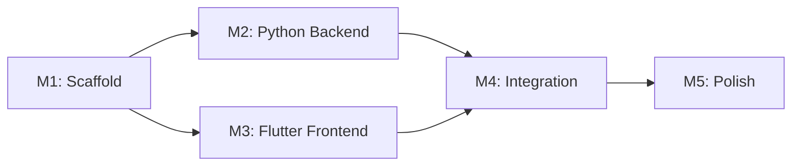

# AI YouTube Clipper — Implementation Checklist

## Milestone 1: Project Scaffolding & Configuration

**Goal:** Initialize Flutter and Python projects with all dependencies and build tooling.

### Tasks

- [ ] Flutter project setup
  - [ ] Create Flutter project with latest stable channel
  - [ ] Configure FVM (`.fvmrc`) for pinned Flutter version
  - [ ] Set up `analysis_options.yaml` with strict lint rules
  - [ ] Configure `build.yaml` for code generation (freezed, injectable)

- [ ] Python project setup
  - [ ] Create `backend/` directory with `pyproject.toml`
  - [ ] Configure FastAPI app entry point
  - [ ] Set up virtual environment + requirements.txt
  - [ ] Create Dockerfile for backend deployment

- [ ] Dependencies installation
  - [ ] Flutter: bloc, freezed, injectable, get_it, go_router, hive, dio, media_kit
  - [ ] Python: fastapi, uvicorn, yt-dlp, openai-whisper, ffmpeg-python, python-multipart

- [ ] Git repository setup
  - [ ] Initialize git repo
  - [ ] Create `.gitignore` for Flutter + Python
  - [ ] Initial commit

**Acceptance Criteria:**

- `flutter pub get` succeeds with no errors
- `python -m pip install -e .` succeeds
- `flutter analyze` passes with 0 errors
- GitHub repo initialized and pushed

**Definition of Done:** Flutter app launches on iOS simulator and Android emulator. Python server starts with `uvicorn`.

**Estimated Time:** 2 hours

---

## Milestone 2: Python Backend — API & Processing Pipeline

**Goal:** Implement FastAPI server with full video processing pipeline.

### Tasks

- [ ] API endpoints
  - [ ] `POST /api/projects` — create project with YouTube URL and clip count
  - [ ] `GET /api/projects/{id}` — get project status and progress
  - [ ] `POST /api/projects/{id}/cancel` — cancel processing
  - [ ] `GET /api/download/{id}` — download completed clips as ZIP
  - [ ] `GET /api/health` — health check endpoint

- [ ] Video processing pipeline
  - [ ] Service: `VideoService.download()` — yt-dlp download to temp directory
  - [ ] Service: `AudioService.extract()` — FFmpeg audio extraction
  - [ ] Service: `TranscriptService.transcribe()` — Whisper transcription
  - [ ] Service: `HighlightService.detect()` — heuristic highlight detection
  - [ ] Service: `RenderService.render()` — FFmpeg clip generation with subtitles

- [ ] Background task execution
  - [ ] Implement `BackgroundTasks` for async processing (no Celery for MVP)
  - [ ] File lock management for concurrent project safety
  - [ ] Cleanup temp files on completion or failure

- [ ] Error handling & recovery
  - [ ] Input validation (URL format, clip count range)
  - [ ] Graceful failure handling per pipeline stage
  - [ ] Partial output cleanup on error

- [ ] Configuration & logging
  - [ ] `pydantic-settings` for environment variables
  - [ ] `structlog` for structured logging
  - [ ] CORS middleware configured for Flutter dev server

**Acceptance Criteria:**

- `POST /api/projects` returns 201 with project ID
- Processing pipeline completes end-to-end for a test YouTube video
- Generated clips playable with visible subtitles
- `GET /api/download/{id}` returns valid ZIP
- Error cases return appropriate HTTP status codes

**Definition of Done:** All endpoints tested with curl. Pipeline produces at least one valid clip.

**Estimated Time:** 8 hours

---

## Milestone 3: Flutter Frontend — UI & API Integration

**Goal:** Build Flutter app with all MVP screens and API integration.

### Tasks

- [ ] Clean Architecture scaffold
  - [ ] Create `lib/core/` — base, theme, router, network, errors, ui
  - [ ] Create `lib/domain/` — entities, repositories, use cases (if needed)
  - [ ] Create `lib/data/` — DTOs, API datasource, Hive datasource
  - [ ] Create `lib/features/` — feature modules (home, new_project, processing, results)

- [ ] Screen implementations
  - [ ] **HomeScreen** — URL input with validation (paste + "Next" button)
  - [ ] **ClipCountScreen** — chip selector (1/3/5/10) + "Start" button
  - [ ] **ProcessingScreen** — animated progress indicator with stage labels, cancel button
  - [ ] **ResultsScreen** — clip grid, download all button, retry button

- [ ] State management (Bloc)
  - [ ] `ProjectBloc` — create project, validate URL, navigate
  - [ ] `ProcessBloc` — poll status, update progress, cancel, handle errors
  - [ ] `DownloadBloc` — download ZIP, save to device, track progress

- [ ] API integration
  - [ ] Create `ApiClient` using Dio with base URL config
  - [ ] Implement repository: `ProjectRepository` with api/data source
  - [ ] Implement polling logic in `ProcessBloc` (3s interval)
  - [ ] Implement download with `Dio` streaming to file

- [ ] Local persistence
  - [ ] Hive box for project history (project ID, URL, status, timestamps)
  - [ ] Sync local history with API status on app launch

- [ ] Navigation (GoRouter)
  - [ ] Route: `/` → HomeScreen
  - [ ] Route: `/new-project` → ClipCountScreen
  - [ ] Route: `/processing/:id` → ProcessingScreen
  - [ ] Route: `/results/:id` → ResultsScreen
  - [ ] Error handling for invalid routes and processing failures

**Acceptance Criteria:**

- All 4 screens render correctly on iOS and Android
- URL validation works with copy/paste
- Processing screen updates progress in real-time
- ZIP downloads and extracts correctly
- Error states handled gracefully

**Definition of Done:** Complete UI flow works end-to-end with running backend.

**Estimated Time:** 10 hours

---

## Milestone 4: Integration & End-to-End Testing

**Goal:** Connect Flutter frontend with Python backend and validate full pipeline.

### Tasks

- [ ] Local integration
  - [ ] Configure API_BASE_URL for dev environment
  - [ ] Start backend with `uvicorn`
  - [ ] Run Flutter app pointing to local backend
  - [ ] Execute full user flow: URL → process → download

- [ ] Error scenarios
  - [ ] Test with invalid YouTube URLs
  - [ ] Test with private/deleted videos
  - [ ] Test network disconnection during processing
  - [ ] Test cancel mid-processing
  - [ ] Test concurrent project creation

- [ ] Performance validation
  - [ ] Measure: URL-to-processing-started latency (< 2s)
  - [ ] Measure: 10-clip processing time (< 5 min for 60-min video)
  - [ ] Measure: ZIP download time (< 10s for 10 clips)
  - [ ] Verify: all clips are 1080×1920, subtitles visible

- [ ] CI setup
  - [ ] GitHub Actions: Flutter analyze + test on PR
  - [ ] GitHub Actions: Python lint + test on PR
  - [ ] GitHub Actions: integration test (if feasible)

**Acceptance Criteria:**

- Full user flow completes without errors
- All error scenarios handled gracefully
- Performance metrics meet NFR targets
- CI passes on PR creation

**Definition of Done:** End-to-end test passes. CI green on test branch.

**Estimated Time:** 4 hours

---

## Milestone 5: Polish & Production Readiness

**Goal:** Finalize UI, error handling, documentation, and deployment setup.

### Tasks

- [ ] UI polish
  - [ ] Loading states for all buttons and screens
  - [ ] Empty states for no projects
  - [ ] Error states with retry actions
  - [ ] Smooth transitions between screens
  - [ ] Responsive layout handling (small screens, tablets)

- [ ] Error boundary & crash reporting
  - [ ] Global `FlutterError.onError` handler
  - [ ] Dio error interceptor for API errors
  - [ ] User-friendly error messages (no raw exceptions)
  - [ ] Sentry or similar crash reporting (optional for MVP)

- [ ] Documentation
  - [ ] README.md with setup instructions
  - [ ] API documentation (already in `.ai/api.md`)
  - [ ] Deployment guide (Docker Compose)
  - [ ] Architecture decisions (already in `.ai/`)

- [ ] Deployment configuration
  - [ ] Docker compose file for backend + Redis (future)
  - [ ] nginx config for production (reverse proxy, CORS, rate limiting)
  - [ ] Environment variable documentation (.env.example)

- [ ] Final testing
  - [ ] Flutter: `flutter analyze` zero errors, zero warnings
  - [ ] Python: `ruff` zero errors (or configured linter)
  - [ ] Manual QA: full flow on 3 test videos (short/medium/long)
  - [ ] Edge cases: empty URL, max clip count, very long video

**Acceptance Criteria:**

- `flutter analyze` passes with zero errors
- No console warnings during normal usage
- App handles all edge cases gracefully
- Documentation complete and accurate

**Definition of Done:** MVP ready for internal demo. All checkboxes above checked.

**Estimated Time:** 4 hours

---

## Milestone Summary

| Milestone | Description                         | Est. Time | Status |
| --------- | ----------------------------------- | --------- | ------ |
| M1        | Project Scaffolding & Configuration | 2h        | ⬜     |
| M2        | Python Backend — API & Processing   | 8h        | ⬜     |
| M3        | Flutter Frontend — UI & Integration | 10h       | ⬜     |
| M4        | Integration & E2E Testing           | 4h        | ⬜     |
| M5        | Polish & Production Readiness       | 4h        | ⬜     |
| **Total** |                                     | **28h**   |        |

## Key Dependencies

## Notes

- Milestones can be worked in parallel: M2 (backend) and M3 (frontend) start simultaneously after M1
- M4 requires both M2 and M3 to be complete
- M5 is overlapping — UI polish can start during M4, deployment config after M2
