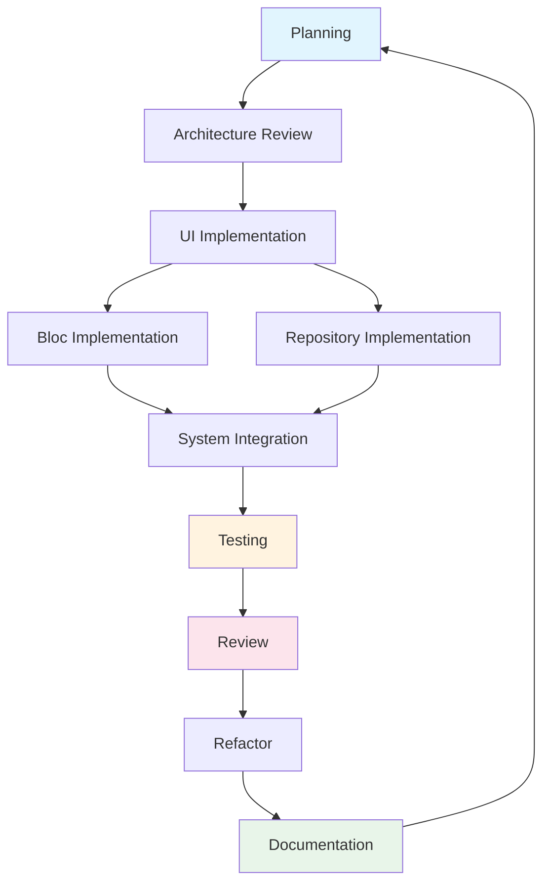

# AI YouTube Clipper — Development Workflow

## Overview

This document defines the complete end-to-end development workflow for every feature in the AI YouTube Clipper project. Each stage has explicit inputs, outputs, acceptance criteria, risks, rollback strategy, and a checklist. The workflow is designed for AI-human collaboration where the AI (Cline) handles implementation and the human reviews, approves, and makes architectural decisions.

```
┌────────────┐     ┌──────────────────┐     ┌────────────────┐
│  Planning   │────→│ Architecture Rev │────→│  UI Impl       │
└────────────┘     └──────────────────┘     └────────────────┘
       │                                               │
       │         ┌──────────────────┐                  │
       │         │   Bloc Impl      │←─────────────────│
       │         └──────────────────┘                  │
       │                    │                           │
       │         ┌──────────────────┐                  │
       ├────────→│  RepositoryImpl  │←─────────────────│
       │         └──────────────────┘                  │
       │                    │                           │
       │         ┌──────────────────┐                  │
       ├────────→│   Integration    │←─────────────────│
       │         └──────────────────┘                  │
       │                    │                           │
       │         ┌──────────────────┐                  │
       ├────────→│    Testing       │                  │
       │         └──────────────────┘                  │
       │                    │                           │
       │         ┌──────────────────┐                  │
       ├────────→│    Review        │                  │
       │         └──────────────────┘                  │
       │                    │                           │
       │         ┌──────────────────┐                  │
       ├────────→│   Refactor       │                  │
       │         └──────────────────┘                  │
       │                    │                           │
       │         ┌──────────────────┐                  │
       └────────→│  Documentation   │──────────────────│
                └──────────────────┘                  │
                         │                             │
                         ▼                             ▼
               Feature Complete ──────────────→ Next Feature
```

## Stage Dependency Graph



## Role Matrix

| Stage                     | AI (Cline)                                 | Human                              |
| ------------------------- | ------------------------------------------ | ---------------------------------- |
| Planning                  | Propose breakdown, estimate                | Approve scope, set priority        |
| Architecture Review       | Present options, document ADRs             | Make final architectural decisions |
| UI Implementation         | Scaffold screens, widgets                  | Review visual fidelity             |
| Bloc Implementation       | Write bloc/event/state, unit tests         | Review logic correctness           |
| Repository Implementation | Write datasources, repo impl, mappers      | Review data consistency            |
| Integration               | Wire layers, test E2E on device            | Approve working feature            |
| Testing                   | Write all test types, run suite            | Review test coverage report        |
| Review                    | Present diff summary, fix detected issues  | Approve or request changes         |
| Refactor                  | Execute refactoring, verify no regression  | Approve final state                |
| Documentation             | Write memory.md, update checklist/progress | Review documentation               |

## Stage 1: Planning

| Field                   | Description                                                                                                                                                                                                                                                                  |
| ----------------------- | ---------------------------------------------------------------------------------------------------------------------------------------------------------------------------------------------------------------------------------------------------------------------------- |
| **Input**               | PRD, Vision, User stories, Checklist milestone definition                                                                                                                                                                                                                    |
| **Output**              | Task breakdown with files-to-create list, dependency order, risk register                                                                                                                                                                                                    |
| **Acceptance Criteria** | AC-1: Every user story maps to ≥1 task. AC-2: Dependencies identified (blocking/blocked). AC-3: File creation order determined (no circular deps). AC-4: Estimated time per task (<4h per task, split if larger).                                                            |
| **Risks**               | R1: Missing edge case → mitigation: review PRD acceptance criteria before task breakdown. R2: Over-engineered solution → mitigation: YAGNI pass on every proposed file. R3: Hidden platform dependency → mitigation: verify `pubspec.yaml` and `build.gradle` compatibility. |
| **Definition of Done**  | All tasks written as checkboxes in checklist.md. Dependencies mapped. File list matches folder structure in flutter.md.                                                                                                                                                      |
| **Rollback Strategy**   | Delete proposed checklist items. No code committed — risk-free.                                                                                                                                                                                                              |

### Checklist

- [ ] PRD reviewed for this feature's AC
- [ ] User stories mapped to concrete tasks
- [ ] Dependencies identified and ordered
- [ ] File creation list compiled
- [ ] Risk register updated
- [ ] Checklist.md updated with milestone items
- [ ] Human approval obtained

---

## Stage 2: Architecture Review

| Field                   | Description                                                                                                                                                                                                                                                                                                                                      |
| ----------------------- | ------------------------------------------------------------------------------------------------------------------------------------------------------------------------------------------------------------------------------------------------------------------------------------------------------------------------------------------------ |
| **Input**               | Planning output, existing architecture.md, existing flutter.md, ADR log from memory.md                                                                                                                                                                                                                                                           |
| **Output**              | ADRs (if any new decision), layer mapping (domain/data/presentation file allocation), data flow diagram, interface contracts                                                                                                                                                                                                                     |
| **Acceptance Criteria** | AC-1: Every new file assigned to correct Clean Architecture layer. AC-2: Repository interface defined before implementation. AC-3: Data flow documented (Flutter → API → Pipeline → Storage). AC-4: No layer violation in design. AC-5: YAGNI pass — no unused abstractions.                                                                     |
| **Risks**               | R1: Over-abstraction (interface with 1 impl) → mitigation: enforce YAGNI, skip interface if only one implementation is certain. R2: Missing error pathways → mitigation: enumerate all error states at architecture level. R3: State management mismatch → mitigation: verify Bloc-per-feature rule; combine only if states are tightly coupled. |
| **Definition of Done**  | ADRs documented in memory.md. Layer mapping reviewed and approved. No abstractions without justification.                                                                                                                                                                                                                                        |
| **Rollback Strategy**   | Revert ADR entries from memory.md. Delete interface files not yet implemented.                                                                                                                                                                                                                                                                   |

### Checklist

- [ ] Layer mapping (which files go to domain/data/presentation)
- [ ] Repository interface defined (if needed)
- [ ] Data sources identified (API + local)
- [ ] DTO ↔ Entity mapping planned
- [ ] Error states enumerated
- [ ] New ADRs written to memory.md
- [ ] YAGNI pass completed
- [ ] Human approval obtained

---

## Stage 3: UI Implementation

| Field                   | Description                                                                                                                                                                                                                                                                                                                                               |
| ----------------------- | --------------------------------------------------------------------------------------------------------------------------------------------------------------------------------------------------------------------------------------------------------------------------------------------------------------------------------------------------------- |
| **Input**               | UI.md component specs, Design System tokens, GoRouter route definitions, Architecture Review output                                                                                                                                                                                                                                                       |
| **Output**              | Screen scaffold files, widget tree, theme integration, route registration, placeholder screens for loading/error/empty states                                                                                                                                                                                                                             |
| **Acceptance Criteria** | AC-1: All screens from UI.md exist as scaffold files. AC-2: Widget tree uses Design System tokens (no hardcoded colors/spacing). AC-3: Routes registered in app_router.dart. AC-4: Loading, error, and empty state widgets exist. AC-5: Responsive layout passes at 360px, 390px, 430px widths. AC-6: No business logic in widgets.                       |
| **Risks**               | R1: Bloated widget (>200 lines) → mitigation: extract widgets at 40-line threshold. R2: Missing const constructors → mitigation: lint check `prefer_const_constructors`. R3: Theme misuse (hardcoded value) → mitigation: code review grep for color/size literals. R4: Non-responsive layout → mitigation: test on 3 screen sizes before declaring done. |
| **Definition of Done**  | All screen files created. All routes work. Design System tokens used exclusively. Widget tree matches UI.md mockups. Const constructors verified.                                                                                                                                                                                                         |
| **Rollback Strategy**   | `git checkout` affected files. If committed: `git revert <sha>`.                                                                                                                                                                                                                                                                                          |

### Checklist

- [ ] Screen files created per UI.md
- [ ] Widget files created per component spec
- [ ] Design System tokens used (no hardcoded values)
- [ ] Routes registered in app_router.dart
- [ ] Loading/error/empty states scaffolded
- [ ] const constructors verified
- [ ] Responsive layout tested at 360/390/430px
- [ ] No business logic in widgets
- [ ] All widgets under 200 lines
- [ ] Human approval obtained

---

## Stage 4: Bloc Implementation

| Field                   | Description                                                                                                                                                                                                                                                                                                                                                                                                                                                                                      |
| ----------------------- | ------------------------------------------------------------------------------------------------------------------------------------------------------------------------------------------------------------------------------------------------------------------------------------------------------------------------------------------------------------------------------------------------------------------------------------------------------------------------------------------------ |
| **Input**               | UI scaffold files, Domain entities, Repository interface, Data flow from Architecture Review                                                                                                                                                                                                                                                                                                                                                                                                     |
| **Output**              | `{feature}_bloc.dart`, `{feature}_event.dart`, `{feature}_state.dart`, Bloc unit tests, Bloc integration test (with mock repository)                                                                                                                                                                                                                                                                                                                                                             |
| **Acceptance Criteria** | AC-1: State union covers all states: initial, loading, data, error (and sub-states like valid/invalid for forms). AC-2: Event union covers all user interactions and system events (polling, retry). AC-3: Bloc uses exhaustive `when()`/`map()` — no `is` checks. AC-4: Bloc depends only on Repository interface (never DataSource). AC-5: Polling Timer cancelled in `close()`. AC-6: `blocProvider` scoped to feature route (not global). AC-7: Bloc unit tests cover all state transitions. |
| **Risks**               | R1: Bloc too large (>300 lines) → mitigation: split into multiple blocs or extract pure functions. R2: Missing `close()` override for timers → mitigation: checklist item + lint for Timer instances. R3: State explosion (>7 union cases) → mitigation: reconsider state design, maybe merge cases. R4: `emit` called after Bloc closed → mitigation: `isClosed` guard on async operations.                                                                                                     |
| **Definition of Done**  | Bloc/event/state follow Freezed union pattern. All state transitions tested. Lint clean. No `is` state checks. Timer lifecycle verified.                                                                                                                                                                                                                                                                                                                                                         |
| **Rollback Strategy**   | Delete bloc files and test files. Remove BlocProvider from route.                                                                                                                                                                                                                                                                                                                                                                                                                                |

### Checklist

- [ ] Event union defined (Freezed)
- [ ] State union defined (Freezed) with all required cases
- [ ] Bloc handles all events
- [ ] Exhaustive `when()`/`map()` used — no `is` checks
- [ ] Bloc depends only on Repository interface
- [ ] Timer lifecycle managed in `close()`
- [ ] `blocProvider` scoped to route
- [ ] Bloc unit tests written (all states)
- [ ] Lint passes (`flutter analyze`)
- [ ] Human approval obtained

---

## Stage 5: Repository Implementation

| Field                   | Description                                                                                                                                                                                                                                                                                                                                                                                                                                 |
| ----------------------- | ------------------------------------------------------------------------------------------------------------------------------------------------------------------------------------------------------------------------------------------------------------------------------------------------------------------------------------------------------------------------------------------------------------------------------------------- |
| **Input**               | Repository interface (from domain layer), API endpoints (from api.md), DTO definitions, Hive schema, Dio client                                                                                                                                                                                                                                                                                                                             |
| **Output**              | `{feature}_repository_impl.dart`, DataSource implementations, DTO ↔ Entity mappers, Hive TypeAdapters, DataSource unit tests, Repository integration test (with mock API)                                                                                                                                                                                                                                                                   |
| **Acceptance Criteria** | AC-1: RepositoryImpl satisfies all interface methods. AC-2: DTO → Entity mapper handles null fields gracefully. AC-3: API DataSource uses Dio with error mapping (failure sealed class). AC-4: Local DataSource (Hive) has fallback when API fails. AC-5: Error types map correctly (network → NetworkFailure, server → ServerFailure, parse → ParseFailure). AC-6: DataSource unit tests cover success, error, timeout, parse error cases. |
| **Risks**               | R1: DTO ↔ Entity mapping too complex → mitigation: use Freezed `fromJson`/`toJson` consistently; write mapper as extension. R2: Hive box not registered before use → mitigation: register in `bootstrap.dart` before runApp. R3: Dio interceptor order wrong → mitigation: logger first, auth (future), retry last. R4: Error swallowing → mitigation: every catch must return Failure (never rethrow null/throw in repo layer).            |
| **Definition of Done**  | Repository passes all tests. DataSources implemented. Mappers cover all fields. Error types comprehensive (no `Exception` leaks to domain). Hive TypeAdapter registered.                                                                                                                                                                                                                                                                    |
| **Rollback Strategy**   | Delete repo impl, datasource, mapper, and test files. Remove Hive TypeAdapter registration.                                                                                                                                                                                                                                                                                                                                                 |

### Checklist

- [ ] Repository interface fully implemented
- [ ] API DataSource created with Dio
- [ ] Local DataSource (Hive) created
- [ ] DTO → Entity mapper complete
- [ ] Entity → DTO mapper complete (if needed)
- [ ] Hive TypeAdapter registered in bootstrap
- [ ] Error mapping covers all failure modes
- [ ] DataSource unit tests written
- [ ] Repository integration tests written
- [ ] Dio interceptor chain verified (order correct)
- [ ] No Exception leaks to domain layer
- [ ] Human approval obtained

---

## Stage 6: Integration

| Field                   | Description                                                                                                                                                                                                                                                                                                                                                                                                                                                                |
| ----------------------- | -------------------------------------------------------------------------------------------------------------------------------------------------------------------------------------------------------------------------------------------------------------------------------------------------------------------------------------------------------------------------------------------------------------------------------------------------------------------------- |
| **Input**               | UI screens, Blocs, Repository implementation, AppRouter, backend API (running or mock)                                                                                                                                                                                                                                                                                                                                                                                     |
| **Output**              | End-to-end working feature, integration test (screen → bloc → repo → API → response → state update → UI render)                                                                                                                                                                                                                                                                                                                                                            |
| **Acceptance Criteria** | AC-1: Screen loads and displays data from backend (or mock). AC-2: User interaction flows end-to-end without crash. AC-3: Error states trigger correct UI (snackbar, error screen, retry). AC-4: Loading states visible during async operations. AC-5: Navigation works (submit → process screen → download screen). AC-6: Backend polling displays progress correctly. AC-7: Ground truth test — paste URL, select 3 clips, process, download — works on device/emulator. |
| **Risks**               | R1: Backend unavailable → mitigation: mock API response via Dio interceptor for development. R2: State mismatch (Bloc expects X, backend returns Y) → mitigation: validate DTO parsing with `json_serializable` strict mode. R3: Memory leak from unclosed streams → mitigation: check `close()` override, profile with DevTools. R4: Slow backend response → mitigation: test with 5s/10s/30s delays, ensure loading UI holds.                                            |
| **Definition of Done**  | Feature works end-to-end on device. Ground truth test passes. No unhandled errors in console. Memory profile stable (no leak).                                                                                                                                                                                                                                                                                                                                             |
| **Rollback Strategy**   | `git revert` integration commit. Disable feature route. Remove feature from navigation.                                                                                                                                                                                                                                                                                                                                                                                    |

### Checklist

- [ ] Feature works end-to-end on device/emulator
- [ ] Loading states visible and responsive
- [ ] Error states trigger correct feedback
- [ ] Navigation flow works correctly
- [ ] Ground truth test passes
- [ ] No console errors or unhandled exceptions
- [ ] Memory profile stable (DevTools check)
- [ ] Dio interceptor mock swapped for real API (if applicable)
- [ ] Human approval obtained

---

## Stage 7: Testing

| Field                   | Description                                                                                                                                                                                                                                                                                                                                                                                                                                      |
| ----------------------- | ------------------------------------------------------------------------------------------------------------------------------------------------------------------------------------------------------------------------------------------------------------------------------------------------------------------------------------------------------------------------------------------------------------------------------------------------ |
| **Input**               | Complete feature code, Integration test from Stage 6, Checklist of test types needed                                                                                                                                                                                                                                                                                                                                                             |
| **Output**              | Unit tests (Bloc, Repository, DataSource, Mapper), Widget tests (screen states), Integration test (full flow), Golden tests (if UI is stable), Test coverage report                                                                                                                                                                                                                                                                              |
| **Acceptance Criteria** | AC-1: Unit tests cover all state transitions for every Bloc. AC-2: Widget tests render every state (loading, data, error, empty). AC-3: Integration test covers happy path + 1 error path. AC-4: Mapper tests verify DTO ↔ Entity conversion (null, malformed, partial). AC-5: Tests run in <30s for unit, <2min for integration. AC-6: Coverage ≥80% for new code. AC-7: No flaky tests (run 3x, all pass).                                     |
| **Risks**               | R1: Test too brittle (golden tests) → mitigation: only add golden for truly stable UI; prefer widget tests with `pumpAndSettle`. R2: Mock setup too complex → mitigation: use `mocktail` with `@GenerateMocks` (future: mockito). R3: Integration test environment mismatch → mitigation: run on CI with the same Flutter version. R4: Test timeout → mitigation: use `skip: !Platform.isWeb` for platform-specific tests; add timeout per test. |
| **Definition of Done**  | All test types present. All tests pass (3 consecutive runs). Coverage ≥80%. No warnings in test output.                                                                                                                                                                                                                                                                                                                                          |
| **Rollback Strategy**   | Delete test files. Revert test dependency additions in `pubspec.yaml`.                                                                                                                                                                                                                                                                                                                                                                           |

### Checklist

- [ ] Bloc unit tests written (all state transitions)
- [ ] Widget tests written (all states)
- [ ] Mapper tests written (null/malformed/partial)
- [ ] Integration test written (happy + 1 error path)
- [ ] Golden tests added (if UI stable)
- [ ] All tests pass (3 consecutive runs)
- [ ] Test coverage ≥80% for new code
- [ ] No flaky tests
- [ ] Test run time within limits
- [ ] human approval obtained

---

## Stage 8: Review

| Field                   | Description                                                                                                                                                                                                                                                                                                                         |
| ----------------------- | ----------------------------------------------------------------------------------------------------------------------------------------------------------------------------------------------------------------------------------------------------------------------------------------------------------------------------------- |
| **Input**               | All feature code, all tests, Stage integration output                                                                                                                                                                                                                                                                               |
| **Output**              | Review diff summary, lint output, Code Review Checklist (from implementation_rules.md) analysis, change list with rationale                                                                                                                                                                                                         |
| **Acceptance Criteria** | AC-1: `flutter analyze` passes with 0 errors, 0 warnings. AC-2: Code Review Checklist applied — no violations. AC-3: No dead code (unused imports, unused parameters). AC-4: No TODO left without owner. AC-5: No print statements (use Logger). AC-6: No hardcoded strings (use Constants or l10n). AC-7: No layer violations.     |
| **Risks**               | R1: Human reviewer overload → mitigation: present diff summary with file list + changes per file + risk level. R2: Style disagreements → mitigation: automation by linter+formatter; human reviews only logic and architecture. R3: TODO accumulation → mitigation: block approval on TODO count; each TODO needs a tracking issue. |
| **Definition of Done**  | `flutter analyze` clean. Checklist adoption 100%. Human approval received.                                                                                                                                                                                                                                                          |
| **Rollback Strategy**   | Address review comments directly. No rollback unless structural issues found → rollback to Stage 2/3.                                                                                                                                                                                                                               |

### Checklist

- [ ] `flutter analyze` passes (0 errors, 0 warnings)
- [ ] `dart format` applied
- [ ] Code Review Checklist applied (from implementation_rules.md)
- [ ] No dead code (unused imports, params, variables)
- [ ] No `print` statements (Logger used instead)
- [ ] No hardcoded strings (Constants or l10n)
- [ ] No TODO without owner
- [ ] Layer violations checked
- [ ] Diff summary prepared for human
- [ ] Human approval obtained

---

## Stage 9: Refactor

| Field                   | Description                                                                                                                                                                                                                                                                                                                      |
| ----------------------- | -------------------------------------------------------------------------------------------------------------------------------------------------------------------------------------------------------------------------------------------------------------------------------------------------------------------------------- |
| **Input**               | Review feedback, Code Review Checklist violations, lint warnings, TODO items                                                                                                                                                                                                                                                     |
| **Output**              | Cleaned codebase, extracted shared utilities (if needed), removed dead code, renamed misnamed symbols, debt documentation in memory.md                                                                                                                                                                                           |
| **Acceptance Criteria** | AC-1: All review feedback addressed. AC-2: No functional changes (tests still pass). AC-3: Extracted code has its own test if non-trivial. AC-4: Refactored files remain under file size limit (400 lines). AC-5: No change to public API of feature (unless approved).                                                          |
| **Risks**               | R1: Scope creep (refactor turns into rewrite) → mitigation: lock scope to review feedback only; defer improvements to new feature. R2: Test breakage from rename → mitigation: rename via IDE refactoring tool, not manual. R3: Over-extraction (extracting single-use code) → mitigation: wait for 3rd usage before extracting. |
| **Definition of Done**  | All review feedback resolved. All tests pass. No new lint warnings. memory.md updated with refactoring decisions.                                                                                                                                                                                                                |
| **Rollback Strategy**   | `git checkout --` refactored files. Revert extraction commits individually.                                                                                                                                                                                                                                                      |

### Checklist

- [ ] All review feedback addressed
- [ ] All tests still pass
- [ ] No new lint warnings
- [ ] Extracted code has tests (if non-trivial)
- [ ] No functional changes
- [ ] File size limits maintained
- [ ] Debt documented in memory.md
- [ ] Human approval obtained

---

## Stage 10: Documentation

| Field                   | Description                                                                                                                                                                                                                                                                                                                                                  |
| ----------------------- | ------------------------------------------------------------------------------------------------------------------------------------------------------------------------------------------------------------------------------------------------------------------------------------------------------------------------------------------------------------ |
| **Input**               | Completed feature, ADRs, refactoring decisions, test results                                                                                                                                                                                                                                                                                                 |
| **Output**              | memory.md append, checklist.md update, progress.md update, snapshot of feature state                                                                                                                                                                                                                                                                         |
| **Acceptance Criteria** | AC-1: memory.md has timestamped entry describing what was built, decisions made, gotchas encountered. AC-2: checklist.md milestone items checked off. AC-3: progress.md reflects new completion percentage. AC-4: Any changes to architecture.md, flutter.md, or api.md are committed. AC-5: No stale documentation (outdated doc is worse than no doc).     |
| **Risks**               | R1: Documentation drift (doc says X, code does Y) → mitigation: document immediately after feature completes, not later. R2: Over-documentation (every method gets a comment) → mitigation: only document why, never what (code says what). R3: Forgetting to update architecture docs → mitigation: checklist item forces review of architecture.md/api.md. |
| **Definition of Done**  | All 3 files (memory.md, checklist.md, progress.md) updated. Architecture docs consistent with implementation. Documentation reviewed and approved.                                                                                                                                                                                                           |
| **Rollback Strategy**   | Revert memory.md append entry. Revert checklist.md checkboxes. Delete progress.md entry.                                                                                                                                                                                                                                                                     |

### Checklist

- [ ] memory.md updated with timestamped entry
- [ ] checklist.md milestone items checked off
- [ ] progress.md updated with percentage
- [ ] architecture.md updated if architecture changed
- [ ] flutter.md updated if folder structure changed
- [ ] api.md updated if endpoints changed
- [ ] ui.md updated if UI changed
- [ ] design_system.md updated if tokens changed
- [ ] implementation_rules.md updated if rules changed
- [ ] No stale documentation remaining
- [ ] Human approval obtained

---

## AI Memory Update Protocol

After every completed feature, the AI MUST update three files in this exact order:

### 1. memory.md Update Rules

- **Format**: Append-only, timestamped entries at the end of the file
- **Entry structure**:

  ```markdown
  #### YYYY-MM-DD: [Feature Name] — [Stage Completed]

  **What was built:**

  - [Brief description]

  **Files created:**

  - `path/to/file.dart` — purpose
  - `path/to/test_file_test.dart` — what it tests

  **Decisions made:**

  - [ADR-like entry for each decision]

  **Gotchas encountered:**

  - [Issue + how it was resolved]

  **State:** [Completed | Blocked on X | In Progress]
  ```

- **Never overwrite** previous entries
- **Never edit** previous entries (unless correcting factual error with `[Corrected YYYY-MM-DD]` annotation)
- **State field** must be one of: `Completed`, `Blocked on <reason>`, `In Progress (<stage>)`

### 2. checklist.md Update Rules

- **After stage completion**: Check off the stage item in the milestone checklist
  ```markdown
  - [x] Stage 3: UI Implementation
  ```
- **After stage failure**: Append `(blocked: <reason>)` suffix to current stage
  ```markdown
  - [ ] Stage 4: Bloc Implementation (blocked: API contract not finalized)
  ```
- **Before starting a new stage**: Verify parent stage checklist item is complete
  - If parent stage is not complete → DO NOT start current stage → flag to human
- **After feature completion**: Append `✅ [Feature Name]` to the milestone summary

### 3. progress.md Update Rules

**File structure** (create if not exists):

```markdown
# Development Progress

## Feature: [Feature Name]

| Stage                     | Status  | Date       | Notes                |
| ------------------------- | ------- | ---------- | -------------------- |
| Planning                  | ✅      | YYYY-MM-DD |                      |
| Architecture Review       | ✅      | YYYY-MM-DD | ADR logged           |
| UI Implementation         | 🔄      | YYYY-MM-DD | Widgets in review    |
| Bloc Implementation       | ⏳      | —          | Awaiting UI approval |
| Repository Implementation | ⏳      | —          |                      |
| Integration               | ⏳      | —          |                      |
| Testing                   | ⏳      | —          |                      |
| Review                    | ⏳      | —          |                      |
| Refactor                  | ⏳      | —          |                      |
| Documentation             | ⏳      | —          |                      |
| **Overall**               | **30%** | YYYY-MM-DD |                      |

## Overall Project

- Total features: N
- Completed: M
- Blocked: B
- Overall progress: X%
```

**Update rules:**

- Change stage status to ✅ when stage passes
- Change stage status to 🔄 when stage is in progress
- Change stage status to ❌ when stage fails (high-severity)
- Recalculate overall percentage after every stage update
- Keep date when status changes

**Status icon legend:**
| Icon | Meaning |
|---|---|
| ⏳ | Not started |
| 🔄 | In progress |
| ✅ | Complete |
| ❌ | Failed / Needs rework |
| ⛔ | Blocked |

### Update Order

The AI MUST follow this sequence after each stage completes:

1. Update progress.md (stage status + percentage)
2. Update checklist.md (check off stage, advance to next)
3. Update memory.md (append feature entry with decisions)
4. Commit all three files (if using version control)

This order ensures that if the AI is interrupted mid-update, progress.md has the most recent checkpoint and memory.md has the complete history.

### Context Recovery Protocol

If the AI's context window is reset mid-feature:

1. Read progress.md → identify current stage for each feature
2. Read memory.md last entry → understand last decisions
3. Read checklist.md → identify completed/pending items
4. Resume from the last incomplete stage in progress.md
5. Do NOT redo completed stages without human approval

---

## Stage Skip Conditions

A stage may be skipped under these conditions:

| Stage               | Skip Condition                                            | Decision Authority         |
| ------------------- | --------------------------------------------------------- | -------------------------- |
| Architecture Review | Trivial change (bug fix, parameter rename, test addition) | AI (document in memory.md) |
| UI Implementation   | Change has no UI impact (data layer only, test only)      | AI                         |
| Bloc Implementation | Change is only in data layer                              | AI                         |
| Testing             | Change is in documentation only                           | AI                         |
| Review              | Change is <5 lines and already approved by human          | Human                      |
| Refactor            | No review feedback + linter passes                        | AI                         |

**Skip recording**: When a stage is skipped, document in memory.md:

```
Stage X skipped: [reason] (decision by: [AI/Human])
```

## Stage Retry Policy

| Attempt     | Action                                             | Escalation    |
| ----------- | -------------------------------------------------- | ------------- |
| 1st failure | Fix issue, rerun stage                             | None          |
| 2nd failure | Investigate root cause, document in memory.md, fix | Inform human  |
| 3rd failure | Full stop, human intervention required             | Block feature |

## Workflow State Machine

```
INIT → PLANNING → ARCH_REVIEW → UI_IMPL → BLOC_IMPL → REPO_IMPL → INTEGRATION → TESTING → REVIEW → REFACTOR → DOC → COMPLETE
  │        │            │           │          │           │            │          │        │        │      │
  └────────┴────────────┴───────────┴──────────┴───────────┴────────────┴──────────┴────────┴────────┴──────┘
  Any stage can return to ARCH_REVIEW or PLANNING if architecture/scope change required
```

### Transition Rules

1. Each stage can only transition to the next stage (linear forward)
2. Any stage can transition back to PLANNING if scope changes
3. Any stage can transition back to ARCH_REVIEW if architecture change needed
4. REVIEW can transition back to UI_IMPL, BLOC_IMPL, or REPO_IMPL depending on feedback type
5. REFACTOR can transition back to TESTING if refactoring touches test-affecting code
6. DOCUMENTATION always transitions to COMPLETE (feature done)
