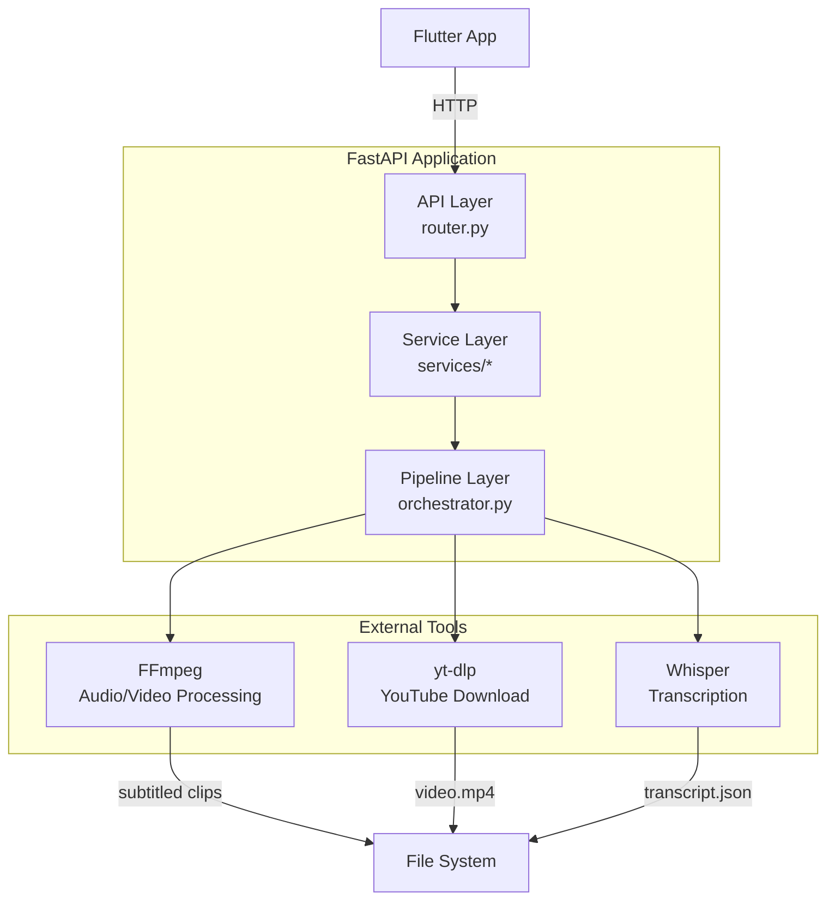

# AI YouTube Clipper — Python Backend Architecture

## Technology Stack

| Category               | Choice                  | Rationale                                            |
| ---------------------- | ----------------------- | ---------------------------------------------------- |
| Framework              | FastAPI                 | Async, auto-docs, Pydantic validation, modern Python |
| ASGI server            | Uvicorn                 | Low overhead, production-ready                       |
| Video download         | yt-dlp                  | Best YouTube downloader, active maintenance          |
| Audio/video processing | FFmpeg (ffmpeg-python)  | Industry standard, subtitle burning, cropping        |
| Transcription          | openai-whisper          | Accurate, free, local (no API cost)                  |
| Config                 | pydantic-settings       | Type-safe env vars, .env support                     |
| Logging                | structlog               | Structured JSON logs, request context                |
| Testing                | pytest                  | Standard Python testing framework                    |
| Async tasks            | FastAPI BackgroundTasks | Simpler than Celery for MVP                          |

## Folder Structure

```
backend/
├── app/
│   ├── __init__.py
│   ├── main.py                 # FastAPI app factory, lifespan, middleware
│   ├── config.py               # Settings via pydantic-settings
│   ├── logging_config.py       # structlog configuration
│   │
│   ├── api/
│   │   ├── __init__.py
│   │   ├── router.py           # APIRouter, endpoint registration
│   │   ├── schemas.py          # Pydantic request/response models
│   │   └── dependencies.py     # FastAPI Depends() providers
│   │
│   ├── services/
│   │   ├── __init__.py
│   │   ├── project_service.py  # Project lifecycle management
│   │   ├── video_service.py    # yt-dlp download wrapper
│   │   ├── audio_service.py    # FFmpeg audio extraction
│   │   ├── transcript_service.py # Whisper transcription
│   │   ├── highlight_service.py   # Heuristic highlight detection
│   │   └── render_service.py   # FFmpeg clip rendering + subtitles
│   │
│   ├── pipeline/
│   │   ├── __init__.py
│   │   ├── orchestrator.py     # Coordinates pipeline execution
│   │   └── exceptions.py       # Pipeline-specific errors
│   │
│   └── models/
│       ├── __init__.py
│       └── project.py          # Project dataclass/state machine
│
├── temp/                       # Working directory (gitignored)
│   ├── downloads/              # Raw YouTube downloads
│   ├── audio/                  # Extracted audio
│   ├── transcripts/            # Whisper output
│   └── clips/                  # Rendered clip outputs
│
├── tests/
│   ├── __init__.py
│   ├── conftest.py             # Fixtures, mock data
│   ├── test_api.py             # Endpoint tests
│   ├── test_services.py        # Service unit tests
│   └── test_pipeline.py        # Pipeline integration tests
│
├── pyproject.toml              # Dependencies, tool config
├── Dockerfile                  # Production container
├── docker-compose.yml          # Multi-service (future: +Redis)
├── .env.example                # Environment template
└── README.md
```

## Architecture



## Service Layer

### ProjectService

- **Responsibility**: Project lifecycle: create, get status, cancel, cleanup
- **State machine**: `pending → downloading → transcribing → highlighting → rendering → done | error`
- **Store**: In-memory dict (MVP) — no DB needed for single-server

```python
class ProjectService:
    def __init__(self):
        self._projects: dict[str, Project] = {}

    def create_project(self, url: str, clip_count: int) -> Project:
        # Validate, generate ID, store project
        ...

    def get_project(self, project_id: str) -> Project | None:
        return self._projects.get(project_id)

    def update_status(self, project_id: str, status: str, progress: int):
        ...

    def cancel_project(self, project_id: str):
        # Set status to cancelled, cleanup temp files
        ...
```

### VideoService

- **Responsibility**: Download YouTube video using yt-dlp
- **Output**: `temp/downloads/{project_id}/video.mp4`
- **Format**: Best quality, mp4 container

```python
class VideoService:
    def download(self, url: str, output_dir: Path) -> Path:
        ydl_opts = {
            'format': 'bestvideo[ext=mp4]+bestaudio[ext=m4a]/best[ext=mp4]/best',
            'outtmpl': str(output_dir / 'video.%(ext)s'),
            'quiet': True,
        }
        with yt_dlp.YoutubeDL(ydl_opts) as ydl:
            ydl.download([url])
        return output_dir / 'video.mp4'
```

### AudioService

- **Responsibility**: Extract audio from video for Whisper
- **Output**: `temp/audio/{project_id}/audio.wav` (16kHz mono WAV)

```python
class AudioService:
    def extract(self, video_path: Path, output_dir: Path) -> Path:
        output_path = output_dir / 'audio.wav'
        ffmpeg.input(str(video_path)).output(
            str(output_path),
            acodec='pcm_s16le',
            ac=1,        # mono
            ar='16000',  # 16kHz (Whisper optimal)
        ).run(quiet=True, overwrite_output=True)
        return output_path
```

### TranscriptService

- **Responsibility**: Transcribe audio using Whisper
- **Model**: `base` (balance of speed vs accuracy for MVP)
- **Output**: `temp/transcripts/{project_id}/transcript.json` (segments with start, end, text)

```python
class TranscriptService:
    def __init__(self, model_name: str = "base"):
        self.model = whisper.load_model(model_name)

    def transcribe(self, audio_path: Path, output_dir: Path) -> Path:
        result = self.model.transcribe(str(audio_path), language="en")
        output_path = output_dir / 'transcript.json'
        with open(output_path, 'w') as f:
            json.dump(result['segments'], f, indent=2)
        return output_path
```

### HighlightService

- **Responsibility**: Detect best highlight segments from transcript
- **Algorithm**: Heuristic scoring based on:
  - Speech rate variance (fast sections = excitement)
  - Keyword density (topic shifts, key phrases)
  - Sentiment peaks (positive/negative spikes from Whisper confidence)
  - Silence proximity (prefer segments flanked by pauses)
- **Output**: List of `(start_seconds, end_seconds)` tuples sorted by score

```python
class HighlightService:
    def detect(self, segments: list[dict], clip_count: int) -> list[tuple[float, float]]:
        """
        Score each N-second window and return top clip_count highlights.

        Window size: 30-60 seconds depending on video length.
        """
        # 1. Parse segments into time-series of: speech_rate, keyword_score, silence_before
        # 2. Slide window across timeline, compute composite score
        # 3. Sort windows by score, deduplicate (non-overlapping, gap >= 10s)
        # 4. Return top clip_count windows as (start, end) tuples
        ...
```

### RenderService

- **Responsibility**: Create vertical clips with burnt-in subtitles
- **Input**: Video file, highlight segments, transcript segments
- **Output**: `temp/clips/{project_id}/clip_0.mp4` ... `clip_N.mp4`

```python
class RenderService:
    def render_clips(
        self,
        video_path: Path,
        segments: list[tuple[float, float]],
        transcript_segments: list[dict],
        output_dir: Path,
    ) -> list[Path]:
        clips = []
        for i, (start, end) in enumerate(segments):
            clip_path = output_dir / f'clip_{i}.mp4'
            self._render_single(video_path, start, end, transcript_segments, clip_path)
            clips.append(clip_path)
        return clips

    def _render_single(self, video_path, start, end, transcript_segments, output_path):
        # 1. Build SRT for this clip's time range
        srt_content = self._generate_srt(start, end, transcript_segments)

        # 2. Use FFmpeg: crop to 9:16 vertical, trim, burn subtitles
        (
            ffmpeg
            .input(str(video_path), ss=start, to=end)
            .filter_('crop', 'ih*9/16', 'ih')  # vertical crop
            .filter_('scale', 1080, 1920)       # target resolution
            .output(
                str(output_path),
                vcodec='libx264',
                acodec='aac',
                preset='fast',
                crf=23,
                **{'vf': f"subtitles={self._write_temp_srt(srt_content)}"},
            )
            .run(quiet=True, overwrite_output=True)
        )

    def _generate_srt(self, start, end, segments):
        # Filter segments within [start, end], offset timestamps, format SRT
        ...
```

## Pipeline Orchestrator

```python
class PipelineOrchestrator:
    def __init__(
        self,
        video_service: VideoService,
        audio_service: AudioService,
        transcript_service: TranscriptService,
        highlight_service: HighlightService,
        render_service: RenderService,
        project_service: ProjectService,
    ):
        self.video_service = video_service
        self.audio_service = audio_service
        self.transcript_service = transcript_service
        self.highlight_service = highlight_service
        self.render_service = render_service
        self.project_service = project_service

    async def run(self, project_id: str, url: str, clip_count: int):
        try:
            self.project_service.update_status(project_id, "downloading", 10)
            video_path = await asyncio.to_thread(
                self.video_service.download, url, Path(f"temp/downloads/{project_id}")
            )

            self.project_service.update_status(project_id, "extracting_audio", 25)
            audio_path = await asyncio.to_thread(
                self.audio_service.extract, video_path, Path(f"temp/audio/{project_id}")
            )

            self.project_service.update_status(project_id, "transcribing", 45)
            transcript_path = await asyncio.to_thread(
                self.transcript_service.transcribe, audio_path,
                Path(f"temp/transcripts/{project_id}")
            )

            self.project_service.update_status(project_id, "detecting_highlights", 65)
            with open(transcript_path) as f:
                segments = json.load(f)
            highlights = await asyncio.to_thread(
                self.highlight_service.detect, segments, clip_count
            )

            self.project_service.update_status(project_id, "rendering", 80)
            clips = await asyncio.to_thread(
                self.render_service.render_clips, video_path, highlights, segments,
                Path(f"temp/clips/{project_id}")
            )

            self.project_service.update_status(project_id, "done", 100)
            self.project_service.set_clips(project_id, clips)

        except Exception as e:
            logger.error("pipeline_failed", project_id=project_id, error=str(e))
            self.project_service.update_status(project_id, "error", -1)
            self.project_service.set_error(project_id, str(e))
            # Cleanup partial files
            shutil.rmtree(Path(f"temp/{project_id}"), ignore_errors=True)
```

## Configuration

```python
# app/config.py
from pydantic_settings import BaseSettings

class Settings(BaseSettings):
    app_name: str = "AI YouTube Clipper"
    debug: bool = False
    max_clip_count: int = 10
    whisper_model: str = "base"
    temp_dir: str = "temp"
    max_file_size_mb: int = 50
    cleanup_on_completion: bool = False  # Keep files for download

    class Config:
        env_file = ".env"
```

## Logging

```python
# app/logging_config.py
import structlog

def setup_logging():
    structlog.configure(
        processors=[
            structlog.stdlib.filter_by_level,
            structlog.stdlib.add_logger_name,
            structlog.stdlib.add_log_level,
            structlog.stdlib.PositionalArgumentsFormatter(),
            structlog.processors.TimeStamper(fmt="iso"),
            structlog.processors.StackInfoRenderer(),
            structlog.processors.format_exc_info,
            structlog.processors.UnicodeDecoder(),
            structlog.dev.ConsoleRenderer() if __debug__
            else structlog.processors.JSONRenderer(),
        ],
        context_class=dict,
        logger_factory=structlog.stdlib.LoggerFactory(),
        cache_logger_on_first_use=True,
    )

logger = structlog.get_logger(__name__)
```

## Testing

```python
# tests/conftest.py
@pytest.fixture
def sample_video():
    """Return path to a small test video fixture."""
    return Path("tests/fixtures/sample.mp4")

@pytest.fixture
def sample_transcript():
    """Return mock transcript segments for testing highlights."""
    return [
        {"start": 0.0, "end": 5.0, "text": "Hello world", "confidence": 0.95},
        {"start": 5.0, "end": 10.0, "text": "This is a test", "confidence": 0.92},
        ...
    ]

# tests/test_services.py
class TestHighlightService:
    def test_detect_returns_correct_count(self, sample_transcript):
        service = HighlightService()
        result = service.detect(sample_transcript, clip_count=3)
        assert len(result) == 3

    def test_detect_returns_non_overlapping(self, sample_transcript):
        service = HighlightService()
        result = service.detect(sample_transcript, clip_count=5)
        for i in range(len(result) - 1):
            assert result[i][1] < result[i+1][0] - 5  # at least 5s gap
```

## Best Practices

1. **Type hints everywhere** — all functions annotated, use `mypy` in CI
2. **Async for I/O** — network calls, file reads; sync for CPU-bound via `asyncio.to_thread`
3. **No global state** — ProjectService injected via FastAPI `Depends()`
4. **Error handling** — specific exceptions per service layer, caught in orchestrator
5. **Temp file management** — UUID-based project directories, cleanup on error
6. **Resource limits** — max 10 concurrent pipelines, queue overflow with 503
7. **Validation** — Pydantic for request bodies, URL validation (regex + HEAD request)
8. **Docker** — multi-stage build: Python base + FFmpeg + model cache
9. **Secrets** — no secrets in code; all via env vars or .env
10. **Graceful shutdown** — cancel running pipelines on SIGTERM

## Known MVP Simplifications

- `ponytail: In-memory project store → SQLite when persistence needed`
- `ponytail: No Celery/Redis → BackgroundTasks fine for <10 concurrent`
- `ponytail: No GPU Whisper → base model is CPU-friendly ~2x realtime`
- `ponytail: Heuristic highlights → ML model when quality data available`
