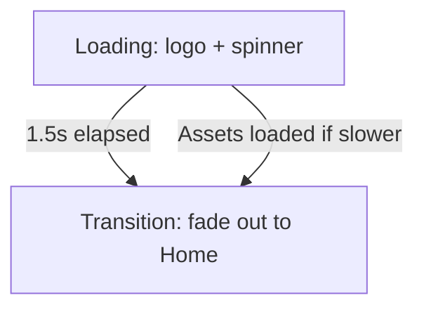
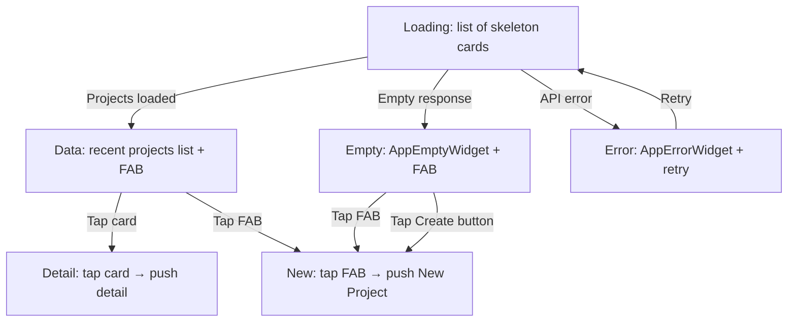
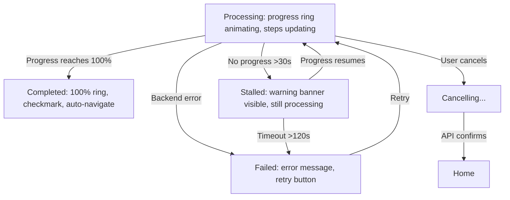
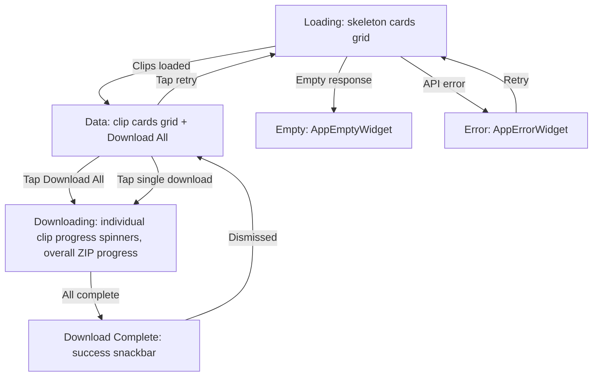
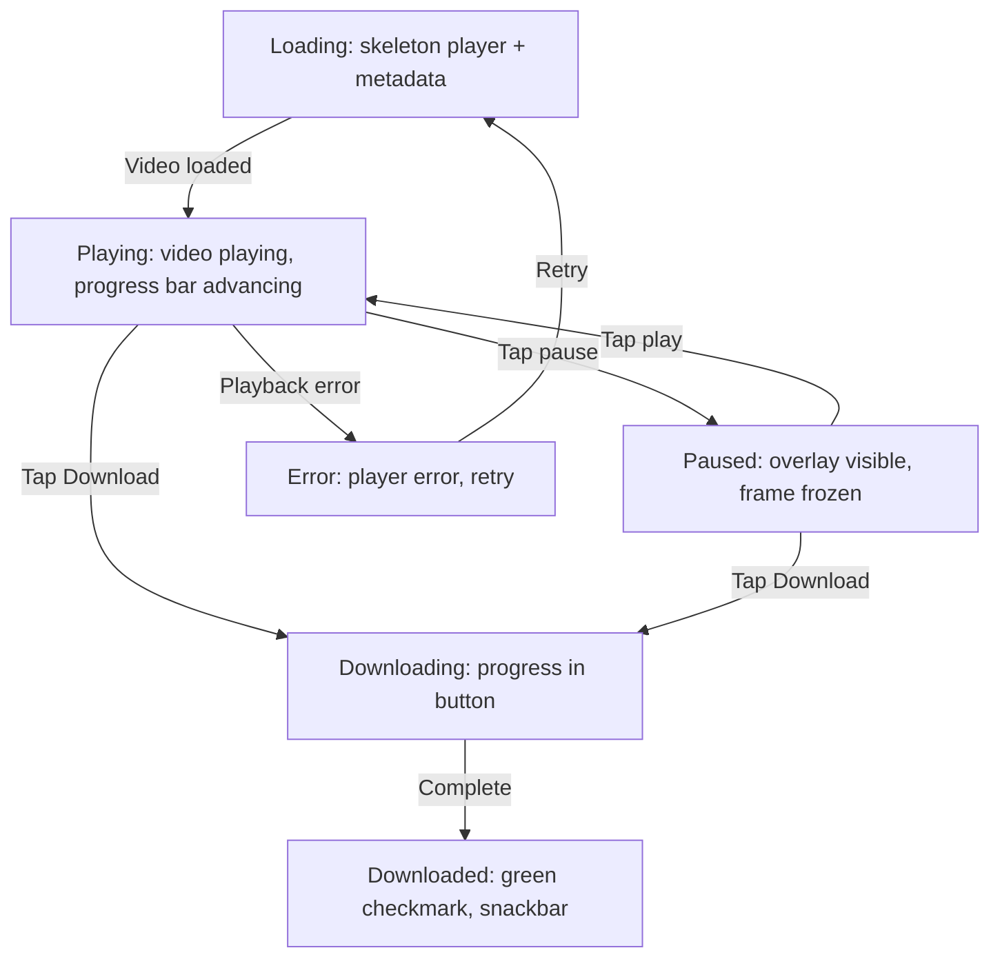
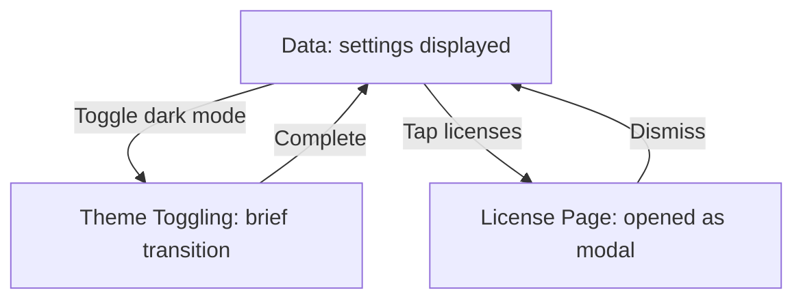

# UI Specification

> **Document Version:** 2.0.0
> **Last Updated:** 2026-07-03
> **Author:** Lead Product Designer / AI Software Architect
> **Status:** Draft
> **Scope:** MVP (AI YouTube Clipper — Flutter mobile app)

---

## Table of Contents

1. [Introduction](#1-introduction)
2. [Design Principles](#2-design-principles)
3. [Color Palette](#3-color-palette)
4. [Typography](#4-typography)
5. [Spacing & Grid](#5-spacing--grid)
6. [Elevation & Shadows](#6-elevation--shadows)
7. [Iconography](#7-iconography)
8. [Border Radius](#8-border-radius)
9. [Component Library](#9-component-library)
10. [Screen: Splash](#10-screen-splash)
11. [Screen: Home](#11-screen-home)
12. [Screen: New Project](#12-screen-new-project)
13. [Screen: Processing](#13-screen-processing)
14. [Screen: Results](#14-screen-results)
15. [Screen: Clip Detail](#15-screen-clip-detail)
16. [Screen: Settings](#16-screen-settings)
17. [Empty States](#17-empty-states)
18. [Loading States](#18-loading-states)
19. [Error States](#19-error-states)
20. [Navigation & Routing](#20-navigation--routing)
21. [Dialogs & Bottom Sheets](#21-dialogs--bottom-sheets)
22. [Snackbars & Toasts](#22-snackbars--toasts)
23. [Animations & Micro-interactions](#23-animations--micro-interactions)
24. [Accessibility](#24-accessibility)
25. [Responsive & Adaptive Behavior](#25-responsive--adaptive-behavior)
26. [Post-MVP Considerations](#26-post-mvp-considerations)

---

## 1. Introduction

### 1.1 Purpose

This document defines the complete UI specification for the AI YouTube Clipper MVP — a Flutter mobile application that converts YouTube videos into vertical short clips with embedded subtitles.

The spec covers: design tokens, component library, screen layouts, state machines, accessibility, animations, and responsive behavior. It is intended for Flutter engineers, QA testers, and future designers.

### 1.2 Scope

**In scope (MVP):**

- Splash → Home → New Project → Processing → Results → Clip Detail flow
- Settings screen (minimal)
- All loading, empty, error states
- iOS and Android (Phone first, foldable/tablet adapted)

**Out of scope (MVP):**

- Login/authentication
- Timeline editor
- Subtitle editor
- Cloud sync
- Desktop/web layouts
- Custom illustrations (icons only)

### 1.3 Reading This Document

- **Design tokens** (Sections 3–9): Implement as `ThemeExtension<DesignSystemTokens>` in Flutter.
- **Components** (Section 10): Build as reusable widgets in `lib/shared/widgets/`.
- **Screens** (Sections 11–16): Implement in `lib/features/{name}/presentation/`.
- **State machines**: Each screen includes a `StateDiagram` (Mermaid) showing all visual states and transitions.
- **Post-MVP notes**: Marked with `[POST-MVP]` — do not implement for MVP.

### 1.4 Visual Style Keyword

**Clean. Confident. Minimal.**

- Ample whitespace
- Single accent color (violet `#6C5CE7`)
- Rounded cards with subtle elevation
- Monochrome text hierarchy (3 levels)
- Icons as primary decorative element
- No skeuomorphism, no gradients, no heavy illustrations

---

## 2. Design Principles

### 2.1 One Decision at a Time

Each screen asks for exactly one user decision. No screen has more than one primary call-to-action. The user is never overwhelmed with choices.

- **Home:** Start a new project or pick a recent one.
- **New Project:** Paste URL and choose clip count.
- **Processing:** Wait or cancel.
- **Results:** Download or preview.

### 2.2 Show Progress, Not Complexity

The processing pipeline is visually decomposed into linear steps. Each step shows its status (pending → active → done → error) to manage user expectations. Ambiguity is the enemy of trust.

### 2.3 Errors Are Guides, Not Walls

Errors explain what happened and what to do next. Every error state has a recovery action. No dead ends.

### 2.4 Mobile-First, Then Adaptive

MVP targets phone screens (360–599dp width). Tablet layouts are adapted without extra effort but not optimized. Desktop is post-MVP.

### 2.5 Consistent Before Clever

Same patterns everywhere: same button style, same card shape, same spacing rhythm, same error patterns. Predictability over novelty.

---

## 3. Color Palette

### 3.1 Token Definitions

All colors are defined as light-mode + dark-mode pairs. Use Flutter's `ThemeData` extensions for automatic switching.

**Brand Color — Violet**

| Token                   | Light     | Dark      | Usage                                     |
| ----------------------- | --------- | --------- | ----------------------------------------- |
| `colorPrimary`          | `#6C5CE7` | `#8B7CF7` | Primary buttons, active indicators, links |
| `colorPrimaryContainer` | `#EDE9FE` | `#2D1B69` | Badge backgrounds, selected chip          |
| `colorOnPrimary`        | `#FFFFFF` | `#FFFFFF` | Text on primary backgrounds               |

**Neutral / Background**

| Token                 | Light     | Dark      | Usage                               |
| --------------------- | --------- | --------- | ----------------------------------- |
| `colorBackground`     | `#FAFAFA` | `#121212` | Page backgrounds                    |
| `colorSurface`        | `#FFFFFF` | `#1E1E1E` | Card surfaces, sheets, dialogs      |
| `colorSurfaceVariant` | `#F1F1F1` | `#2C2C2C` | Slightly elevated surfaces, chip bg |

**Text**

| Token                | Light     | Dark      | Usage                           |
| -------------------- | --------- | --------- | ------------------------------- |
| `colorTextPrimary`   | `#1A1A1A` | `#E6E6E6` | Headings, primary content       |
| `colorTextSecondary` | `#5A5A5A` | `#A0A0A0` | Body text, descriptions         |
| `colorTextTertiary`  | `#9E9E9E` | `#6B6B6B` | Placeholder, metadata, disabled |

**Borders & Dividers**

| Token          | Light     | Dark      | Usage                            |
| -------------- | --------- | --------- | -------------------------------- |
| `colorBorder`  | `#E0E0E0` | `#333333` | Card borders, text field outline |
| `colorDivider` | `#ECECEC` | `#2A2A2A` | Dividers between sections        |

**Semantic Colors**

| Token                   | Light     | Dark      | Usage                           |
| ----------------------- | --------- | --------- | ------------------------------- |
| `colorError`            | `#E53935` | `#EF5350` | Error text, destructive actions |
| `colorErrorContainer`   | `#FFEBEE` | `#4E1515` | Error badge bg                  |
| `colorSuccess`          | `#43A047` | `#66BB6A` | Success indicators              |
| `colorSuccessContainer` | `#E8F5E9` | `#1B3B1B` | Success badge bg                |
| `colorWarning`          | `#FB8C00` | `#FFA726` | Warning indicators              |
| `colorWarningContainer` | `#FFF3E0` | `#3E2A00` | Warning badge bg                |

**Overlay & Skeleton**

| Token                    | Light              | Dark               | Usage                      |
| ------------------------ | ------------------ | ------------------ | -------------------------- |
| `colorOverlay`           | `rgba(0,0,0,0.32)` | `rgba(0,0,0,0.48)` | Scrim overlay              |
| `colorSkeleton`          | `#E8E8E8`          | `#2A2A2A`          | Skeleton base              |
| `colorSkeletonHighlight` | `#F5F5F5`          | `#3A3A3A`          | Skeleton shimmer highlight |

### 3.2 Color Application Rules

1. **One accent only:** Primary violet is the only saturated color. Success/warning/error are used for status — never decoration.
2. **Text hierarchy:** Three levels only — primary, secondary, tertiary. No more.
3. **Color is not the only indicator:** Every colored element must have an icon or text label. Red never means just "error" without an error message.
4. **Surface stacking:** Background → Surface → SurfaceVariant → PrimaryContainer. Each level uses the next token.
5. **Dark mode:** All surfaces shift. Primary adapts to be slightly brighter (`#8B7CF7` vs `#6C5CE7`). Text contrast maintained at WCAG AA.

---

## 4. Typography

### 4.1 Font Family

- **Primary:** Inter (sans-serif)
- **Fallback:** SF Pro (iOS), Roboto (Android)
- **Monospace:** JetBrains Mono (for code/debug only — not used in MVP UI)

### 4.2 Type Scale

| Token             | Size | Weight         | Line Height | Letter Spacing | Usage                        |
| ----------------- | ---- | -------------- | ----------- | -------------- | ---------------------------- |
| `textCaption`     | 12dp | 400 (Regular)  | 16dp        | 0.4            | Metadata, timestamps, badges |
| `textCaptionBold` | 12dp | 600 (SemiBold) | 16dp        | 0.4            | Badge text                   |
| `textBody`        | 14dp | 400 (Regular)  | 20dp        | 0.25           | Descriptions, messages       |
| `textBodyMedium`  | 14dp | 500 (Medium)   | 20dp        | 0.25           | Card titles, list items      |
| `textBodyLarge`   | 16dp | 400 (Regular)  | 24dp        | 0.15           | Input field value            |
| `textSubhead`     | 18dp | 600 (SemiBold) | 24dp        | 0              | Section headings             |
| `textTitle`       | 20dp | 600 (SemiBold) | 28dp        | 0              | Screen titles                |
| `textHeading`     | 24dp | 700 (Bold)     | 32dp        | -0.5           | Empty state headings, hero   |
| `textH2`          | 32dp | 700 (Bold)     | 40dp        | -1             | Large headings (future)      |
| `textH1`          | 40dp | 700 (Bold)     | 48dp        | -1.5           | Brand display (splash only)  |

### 4.3 Typography Rules

1. **Sentence case everywhere:** "Generate clips", not "Generate Clips". No all-caps except badges (max 4 chars).
2. **Left-align all content:** Center only for empty states and splash screen.
3. **No italic body text:** Exception: legal disclaimers.
4. **Line height:** 1.5× for body, 1.3× for headings.
5. **Truncation:** Single-line titles truncate with ellipsis. Multi-line body text max 3 lines on cards.

---

## 5. Spacing & Grid

### 5.1 Spacing Scale

| Token            | Value | Usage                                        |
| ---------------- | ----- | -------------------------------------------- |
| `spacingXxs`     | 4dp   | Inner padding in badges, chip gaps           |
| `spacingXs`      | 8dp   | Between icon and label in button             |
| `spacingSm`      | 12dp  | Between section title and first item         |
| `spacingMd`      | 16dp  | Card inner padding, between stacked elements |
| `spacingLg`      | 20dp  | Between cards in list                        |
| `spacingXl`      | 24dp  | Page horizontal padding                      |
| `spacingXxl`     | 32dp  | Between sections on page                     |
| `spacingXxxl`    | 48dp  | Between major page regions                   |
| `spacingHuge`    | 64dp  | Page top/bottom spacing, empty state         |
| `spacingMassive` | 96dp  | Splash spacing                               |

### 5.2 Grid

- **Page horizontal padding:** `spacingXl` (24dp) on phone, 40dp on tablet.
- **Card grid:** 2 columns on phone-large, 3 on tablet. Column width: `(viewport - padding × 2 - gap × (n-1)) / n`. Gap: `spacingMd` (16dp).
- **Single column:** Full-width cards on phone-small (360–399dp).
- **Max content width:** None (full-width mobile-first). But content should not stretch beyond 480dp for readability.

---

## 6. Elevation & Shadows

### 6.1 Elevation Scale

| Token             | Shadow                       | Usage                              |
| ----------------- | ---------------------------- | ---------------------------------- |
| `elevationNone`   | None                         | Flat surfaces, cards on background |
| `elevationSm`     | y=1dp, blur=3dp, alpha=0.12  | Card default                       |
| `elevationMd`     | y=2dp, blur=6dp, alpha=0.15  | Card pressed, elevated card        |
| `elevationLg`     | y=4dp, blur=12dp, alpha=0.18 | Dialogs, bottom sheets             |
| `elevationXl`     | y=8dp, blur=24dp, alpha=0.22 | FAB, date picker                   |
| `elevationDialog` | y=6dp, blur=20dp, alpha=0.25 | Dialog scrim + elevation           |

### 6.2 Shadow Implementation

```dart
// Light mode shadows
BoxShadow(offset: Offset(0, 1), blurRadius: 3, color: Color.fromRGBO(0, 0, 0, 0.12));
BoxShadow(offset: Offset(0, 2), blurRadius: 6, color: Color.fromRGBO(0, 0, 0, 0.15));

// Dark mode shadows: use larger blur, same y offset, slightly more opacity
BoxShadow(offset: Offset(0, 2), blurRadius: 8, color: Color.fromRGBO(0, 0, 0, 0.25));
```

**Dark mode:** Shadows are less visible. Use surface color relationships instead. In dark mode, elevation is communicated by surface lightness (lighter = higher) rather than shadow.

---

## 7. Iconography

### 7.1 Icon Set

- **Library:** Lucide Icons (open-source, consistent stroke-based)
- **Style:** Line art, 1.5dp stroke, 24dp default size, rounded caps/joins
- **Color:** Inherits from text token context (e.g., `colorTextSecondary` for default icons)

### 7.2 Icon Sizes

| Token         | Size | Usage                                |
| ------------- | ---- | ------------------------------------ |
| `iconInline`  | 16dp | Inline with text, badge icons        |
| `iconSmall`   | 20dp | Chip icons, input prefix             |
| `iconDefault` | 24dp | App bar icons, action icons          |
| `iconLarge`   | 32dp | Card action icons, primary CTA icons |
| `iconHero`    | 48dp | Empty state hero icons               |

### 7.3 Icon Naming Convention

- Use Lucide icon names in code: `Icons.video`, `Icons.scissors`, `Icons.download`, `Icons.share2`, `Icons.checkCircle2`, `Icons.loader2`, `Icons.alertCircle`, `Icons.x`, `Icons.chevronLeft`, `Icons.settings`, `Icons.clipboard`, `Icons.youtube`, `Icons.film`, `Icons.music`, `Icons.clock`, `Icons.maximize2`, `Icons.minimize2`, `Icons.downloadCloud`, `Icons.uploadCloud`, `Icons.trash2`, `Icons.copy`, `Icons.externalLink`.

### 7.4 Icon Rules

1. Every icon needs a `Semantics` label.
2. Decorative icons get empty label.
3. Use default size (24dp) unless context requires smaller/larger.
4. Never modify stroke width or viewBox.

---

## 8. Border Radius

### 8.1 Radius Scale

| Token        | Value | Usage                        |
| ------------ | ----- | ---------------------------- |
| `radiusSm`   | 4dp   | Badge corners                |
| `radiusMd`   | 8dp   | Card corners, button corners |
| `radiusLg`   | 12dp  | Larger cards, dialog corners |
| `radiusXl`   | 16dp  | Bottom sheet top corners     |
| `radiusFull` | 999dp | Chips, FAB, circular avatars |

### 8.2 Application

- Cards: `radiusMd` (8dp)
- Buttons: `radiusMd` (8dp)
- Text fields: `radiusMd` (8dp)
- Chips: `radiusFull` (24dp)
- Dialogs: `radiusLg` (12dp)
- Bottom sheets: `radiusXl` (16dp) on top corners only
- Badges: `radiusSm` (4dp) or `radiusFull` for pill shape

---

## 9. Component Library

### 9.1 Component Index

| #   | Component              | Type      | Description                                    |
| --- | ---------------------- | --------- | ---------------------------------------------- |
| 1   | `AppScaffold`          | Layout    | Standard screen shell with app bar             |
| 2   | `AppPrimaryButton`     | Input     | Main call-to-action, full-width                |
| 3   | `AppSecondaryButton`   | Input     | Secondary action, outlined                     |
| 4   | `AppDestructiveButton` | Input     | Destructive action (red)                       |
| 5   | `AppTextField`         | Input     | Text input with decoration                     |
| 6   | `AppChip`              | Input     | Selectable option chip                         |
| 7   | `AppCard`              | Container | Elevated card surface                          |
| 8   | `AppVideoCard`         | Container | Card with video thumbnail + metadata + actions |
| 9   | `AppProgressCard`      | Container | Processing progress display                    |
| 10  | `AppSkeletonCard`      | Feedback  | Loading skeleton placeholder                   |
| 11  | `AppEmptyWidget`       | Feedback  | Empty state with icon + text + action          |
| 12  | `AppErrorWidget`       | Feedback  | Error state with icon + message + retry        |
| 13  | `AppSnackbar`          | Feedback  | Temporary notification                         |
| 14  | `AppDialog`            | Overlay   | Alert/confirmation dialog                      |
| 15  | `AppBottomSheet`       | Overlay   | Slide-up action sheet                          |
| 16  | `AppStatusBadge`       | Indicator | Status label (subtitle, duration)              |
| 17  | `AppProgressRing`      | Indicator | Circular progress with percentage              |
| 18  | `AppFAB`               | Input     | Floating action button                         |

### 9.2 Component Specifications

---

### 9.2.1 AppScaffold

**Description:** Standard screen shell with optional app bar, safe area handling, and optional bottom CTA area.

**Layout:**

```
┌──────────────────────────┐
│   Top Safe Area          │  ← system status bar
├──────────────────────────┤
│   App Bar (optional)     │  ← 56dp, border-bottom
├──────────────────────────┤
│                          │
│   Content Area           │  ← body, fills remaining space
│                          │
│                          │
├──────────────────────────┤
│   Bottom CTA (optional)  │  ← 56dp + bottom safe area
├──────────────────────────┤
│   Bottom Safe Area       │  ← system nav bar
└──────────────────────────┘
```

**Implementation:**

- `AppBar`: height 56dp, background `colorSurface`, elevation `elevationNone`, bottom border `colorDivider` (not shadow)
- `bottomNavigationBar`: slot for `AppPrimaryButton`. Wrapped in `SafeArea`.
- `body`: fills remaining space. Scrollable content uses `CustomScrollView` + `SliverFillRemaining`.
- Status bar: transparent (system renders on top).

**Props:**

- `title: String?`
- `showBack: boolean`
- `actions: List<Widget>?` (for app bar action icons)
- `bottomCta: Widget?` (primary button)
- `body: Widget`
- `backgroundColor: Color?` (default `colorBackground`)

**States:** None (static layout shell).

---

### 9.2.2 AppPrimaryButton

**Description:** Full-width, filled, primary color button. The main CTA on each screen.

**Visual:**

```
┌──────────────────────────────────────┐
│  Generate Clips         ◉            │  ← icon optional, left side
└──────────────────────────────────────┘
```

**Tokens:**

- Height: 56dp
- Background: `colorPrimary`
- Text: `colorOnPrimary`, `textBodyLarge` (16/600)
- Border radius: `radiusMd` (8dp)
- Icon: `iconDefault` (24dp), left-aligned, `colorOnPrimary`
- Loading: spinner replaces icon, button remains full-width
- Disabled: opacity 0.4 (no color change)

**States:**

| State    | Visual                       | Interaction                                   |
| -------- | ---------------------------- | --------------------------------------------- |
| Enabled  | Filled primary bg            | Tap → haptic(light), scale 0.97               |
| Disabled | 40% opacity                  | No tap, no feedback                           |
| Loading  | Spinner left, same bg + text | No tap                                        |
| Pressed  | Scale 0.97, no bg change     | —                                             |
| Focused  | Same as enabled              | Visible focus ring when in accessibility mode |

**Implementation:**

- Always `width: double.infinity` (constrained by parent)
- `Semantics(button: true, label: text)`
- Child: `Row` with optional icon + gap + text + optional spinner
- Loading state: use `Transform.scale(0.97)` animation on tap

**Rules:**

- Exactly one per screen.
- Never two primary buttons visible.
- Never placed above a secondary button.
- Full-width always, never inline.

---

### 9.2.3 AppSecondaryButton

**Description:** Outlined button for secondary actions.

**Visual:**

```
┌──────────────────────────────────────┐
│  Try Again                           │
└──────────────────────────────────────┘
```

**Tokens:**

- Height: 48dp
- Border: 1.5dp `colorBorder`
- Background: transparent
- Text: `colorTextPrimary`, `textBodyMedium` (14/500)
- Border radius: `radiusMd` (8dp)
- Disabled: opacity 0.4

**States:**

| State    | Visual                                   |
| -------- | ---------------------------------------- |
| Enabled  | Outlined, transparent bg                 |
| Disabled | 40% opacity                              |
| Pressed  | `colorSurfaceVariant` background briefly |

**Rules:**

- Always below primary button (if both present).
- Width: `double.infinity` (full-width) or `null` (wrap content) based on context.
- Can be used inline in action rows (wrap content width).

---

### 9.2.4 AppDestructiveButton

**Description:** Red outlined button for destructive confirmation (cancel processing, delete).

**Visual:**

```
┌──────────────────────────────────────┐
│  Cancel Processing                   │
└──────────────────────────────────────┘
```

**Tokens:**

- Same as `AppSecondaryButton` but:
  - Border: 1.5dp `colorError`
  - Text: `colorError`, `textBodyMedium`
  - Pressed background: `colorErrorContainer`

**When to use:**

- Only for destructive actions: canceling processing, deleting projects.
- Never for error retry (use `AppSecondaryButton`).

---

### 9.2.5 AppTextField

**Description:** Text input with icon prefix, label, and error state.

**Visual:**

```
┌──────────────────────────────────────┐
│ 🔗 youtube.com/watch?v=...    ✗      │  ← edit state
└──────────────────────────────────────┘
```

**Tokens:**

- Height: 56dp
- Background: `colorSurface`
- Border: 1.5dp `colorBorder` (enabled), 1.5dp `colorPrimary` (focused), 1.5dp `colorError` (error)
- Border radius: `radiusMd` (8dp)
- Text: `colorTextPrimary`, `textBodyLarge` (16/400)
- Placeholder: `colorTextTertiary`, `textBodyLarge` (16/400)
- Prefix icon: 20dp, `colorTextTertiary` (enabled), `colorPrimary` (focused)
- Suffix clear button: 20dp, `colorTextTertiary` (visible when text is not empty)

**States:**

| State      | Visual                                               | Notes                                     |
| ---------- | ---------------------------------------------------- | ----------------------------------------- |
| Empty      | Placeholder text, prefix icon tertiary               | —                                         |
| Filled     | User text, prefix icon primary, clear button         | —                                         |
| Focused    | Primary border, prefix icon primary                  | —                                         |
| Error      | Red border, error message below (12dp, `colorError`) | Error text animates in (slide down 100ms) |
| Disabled   | 40% opacity, no focus                                | —                                         |
| Validating | Brief spinner in suffix (200ms min)                  | After user finishes typing                |

**Paste Detection (Special Behavior):**

- On paste, detect YouTube URL regex: `(https?://)?(www\.)?(youtube\.com|youtu\.be)/`
- If match: suffix shows pulsing paste icon (scale 1.0→1.2→1.0, 500ms, easeOut)
- Snackbar: "YouTube link detected!" (2s)
- Auto-fill video title preview below input (see New Project screen)

**Implementation:**

- `TextEditingController` managed by parent.
- `FocusNode` for focus state.
- Debounce validation: 500ms after last keystroke.
- Clear button: `Icon(Icons.x, size: 20)` → calls `controller.clear()`.

---

### 9.2.6 AppChip

**Description:** Selectable option chip. Used for clip count selection.

**Visual:**

```
┌──────┐
│  5   │  ← selected: filled primary bg
└──────┘

┌──────┐
│  10  │  ← unselected: outlined
└──────┘
```

**Tokens:**

- Height: 36dp
- Min width: 56dp (with padding)
- Border radius: `radiusFull` (pill shape)

**States:**

| State      | Visual                                                                         |
| ---------- | ------------------------------------------------------------------------------ |
| Unselected | Background transparent, border 1.5dp `colorBorder`, text `colorTextSecondary`  |
| Selected   | Background `colorPrimary`, border none, text `colorOnPrimary`, text weight 600 |
| Disabled   | Opacity 0.4                                                                    |

**Implementation:**

- `ChoiceChip` or custom `InkWell` + `Container`.
- Touch target: 48dp min (padded vertically with 6dp on each side internally).
- `Semantics(button: true, selected: isSelected, label: "${value} clips")`.
- Haptic on selection: light.

**Group:** Chips appear in a `Wrap` or `Row` with `spacingXs` (8dp) gap.

---

### 9.2.7 AppCard

**Description:** Elevated card container for grouping content.

**Visual:**

```
┌──────────────────────────────────────┐
│                                      │  ← padding: spacingMd (16dp)
│   Content                            │
│                                      │
└──────────────────────────────────────┘
```

**Tokens:**

- Background: `colorSurface`
- Border radius: `radiusMd` (8dp)
- Elevation: `elevationSm`
- Padding: `spacingMd` (16dp) all sides

**States:**

| State              | Visual                                       |
| ------------------ | -------------------------------------------- |
| Default            | `elevationSm`, `colorSurface` bg             |
| Pressed (tappable) | `elevationMd`, scale 0.99                    |
| Highlighted        | 1.5dp primary left border (for active items) |

**Implementation:**

- `Card` widget with `elevation`, `shape: RoundedRectangleBorder(borderRadius: radiusMd)`.
- Tappable variant: wrap in `InkWell` with `onTap`.
- Non-tappable variant: plain `Card`.

---

### 9.2.8 AppVideoCard

**Description:** Card with vertical video thumbnail + metadata + action row.

**Visual:**

```
┌──────────────────────────────┐
│ ┌────────────────────────┐   │
│ │                        │   │
│ │   Thumbnail (9:16)     │   │
│ │          ▶️            │   │  ← play overlay, 32dp
│ │                  0:45  │   │  ← duration badge, bottom-right
│ └────────────────────────┘   │
│                              │
│  Clip 1 · 1080×1920    🎬   │  ← title + subtitle badge
│                              │
│  [Preview] [Download] [Share]│  ← action row
└──────────────────────────────┘
```

**Tokens:**

- Thumbnail aspect ratio: 9:16 (h/w = 16/9)
- Thumbnail height: variable (constrained by grid column width)
- Duration badge: top-right of thumbnail, `colorOverlay` bg, white text, `textCaption` (12/400), 4dp padding, `radiusSm` (4dp)
- Play overlay: centered on thumbnail, 32dp, white with 20% opacity circle behind
- Title: `textBodyMedium` (14/500), single line, ellipsis
- Metadata: `textCaption` (12/400), `colorTextTertiary`
- Subtitle badge: `🎬` emoji or custom icon, `textCaption`
- Actions: `AppSecondaryButton` variant (wrap content width), compact

**States:**

| State   | Visual                                  |
| ------- | --------------------------------------- |
| Default | Normal thumbnail, metadata              |
| Pressed | Scale 0.99, brief overlay               |
| Loading | Thumbnail skeleton (shimmer)            |
| Error   | Broken thumbnail icon in thumbnail area |

**Implementation:**

- Thumbnail: `Image.network` with `loadingBuilder` (skeleton) and `errorBuilder`.
- Play overlay: `Positioned.fill` centered, `Icon(Icons.playCircle, size: 32, color: white)`.
- Duration badge: `Positioned(bottom: 4, right: 4, child: Container(decoration, padding, Text))`.
- Action row: `Row` of `TextButton` (compact, `textCaption` weight 500).

---

### 9.2.9 AppProgressCard

**Description:** Processing progress display with circular ring, status text, ETA, and pipeline steps.

**Visual:**

```
┌──────────────────────────────────────┐
│                                      │
│         ┌────────┐                  │
│         │  65%   │                  │  ← progress ring, 120dp
│         └────────┘                  │
│                                      │
│  Finding the best moments...         │  ← active status, textBody (14/400)
│  About 1 minute remaining            │  ← ETA, textCaption (12/400), tertiary
│                                      │
│  ✅ Downloading video                │
│  ✅ Extracting audio                 │
│  ⏳ Transcribing              ◉      │  ← active step: spinner
│  ○ Detecting highlights              │
│  ○ Generating subtitles              │
│  ○ Rendering clips                   │
│  ○ Zipping output                    │
│                                      │
│  [Cancel Processing]                 │  ← AppDestructiveButton
│                                      │
└──────────────────────────────────────┘
```

**Tokens:**

- Progress ring size: 120dp
- Ring stroke: 8dp
- Ring background: `colorSurfaceVariant`
- Ring active: `colorPrimary`
- Ring percentage text: `textHeading` (24/700), `colorTextPrimary`
- Ring percentage suffix: `textBody` (14/400), `colorTextSecondary`
- Step icons: 16dp (check = `colorSuccess`, spinner = `colorPrimary`, circle = `colorTextTertiary`)
- Step text: `textBody` (14/400), color changes with status
- Pipeline gap: `spacingSm` (12dp) between steps

**States:**

| State                      | Visual                                                  |
| -------------------------- | ------------------------------------------------------- |
| Idle (0%)                  | Ring empty, first step active (spinner)                 |
| Progress (1–99%)           | Ring animating, steps updating, ETA visible             |
| Completed (100%)           | Ring full, checkmark burst, "Clips ready!" text         |
| Error (at any %)           | Ring stops, error message, retry button replaces cancel |
| Stalled (no progress >30s) | Warning banner below ring                               |

**Pipeline Step Status Visual:**

```
Step Status | Icon | Text Color
Pending     | ○ (circle, 16dp, tertiary)  | tertiary
Active      | ◉ (spinner, 16dp, primary)  | primary
Done        | ✅ (check, 16dp, success)   | primary
Error       | ❌ (cross, 16dp, error)     | error
```

**Implementation:**

- Progress ring: `CustomPainter` with `AnimationController` for smooth fill.
- Step list: `Column` of `Row` with icon + gap + text.
- Status text: cross-fade between messages using `AnimatedSwitcher`.
- ETA: updates every 10 seconds (poll from backend or local timer).

---

### 9.2.10 AppSkeletonCard

**Description:** Loading placeholder matching `AppVideoCard` or `AppCard` dimensions.

**Visual:**

```
┌──────────────────────────────┐
│ ┌────────────────────────┐   │
│ │   ██████████████████   │   │  ← 9:16 gray rectangle
│ │                        │   │
│ │                        │   │
│ └────────────────────────┘   │
│                              │
│  ████████████████████████    │  ← text line 1
│  ██████████                  │  ← text line 2 (shorter)
│                              │
│  ████   ██████   ████       │  ← action skeleton
└──────────────────────────────┘
```

**Tokens:**

- Base color: `colorSkeleton`
- Highlight color: `colorSkeletonHighlight`
- Animation: shimmer sweep (left to right, 1.5s loop, easeInOut)
- Border radius: `radiusMd` (8dp)

**Props:**

- `hasThumbnail: boolean` (shows 9:16 skeleton if true)
- `lines: int` (number of text lines, default 2)
- `hasActions: boolean` (shows action row skeleton)

**Implementation:**

- `Shimmer` widget wrapping `Container` blocks.
- Shimmer: `AnimatedBuilder` with `ShaderMask` or custom paint sweep.
- Thumbnail: aspect ratio 9:16.
- Text lines: 70% width for first line, 50% for second (randomized but consistent per card).

---

### 9.2.11 AppEmptyWidget

**Description:** Empty state display with icon, title, message, optional action.

**Visual:**

```
┌──────────────────────────────┐
│                              │
│         🎬 (hero icon)       │  ← 48dp, colorTextTertiary
│                              │
│     No projects yet          │  ← textHeading (24/700)
│                              │
│  Paste a YouTube URL         │  ← textBody (14/400), centered
│  to get started.             │
│                              │
│  [Create Your First Clip]    │  ← AppPrimaryButton (optional)
│                              │
└──────────────────────────────┘
```

**Tokens:**

- Icon: `iconHero` (48dp), `colorTextTertiary`
- Title: `textHeading` (24/700), `colorTextPrimary`, centered
- Message: `textBody` (14/400), `colorTextSecondary`, centered, max 3 lines
- Button: optional `AppPrimaryButton` (full-width)
- Padding: vertical `spacingHuge` (64dp)

**Implementation:**

- `Column` centered with spacingMd between icon/title/message/button.
- `Semantics(label: "No ${context}. ${message}")`.
- Staggered appearance animation (icon → title → message → button, 100ms delays, 400ms each).

---

### 9.2.12 AppErrorWidget

**Description:** Error state display with icon, message, retry button.

**Visual:**

```
┌──────────────────────────────┐
│                              │
│        ⚠️ (alert icon)       │  ← 48dp, colorError
│                              │
│     Something went wrong     │  ← textHeading (24/700)
│                              │
│  Couldn't load your recent   │  ← textBody (14/400), centered
│  projects. Check your        │
│  connection and try again.   │
│                              │
│  [Try Again]                 │  ← AppSecondaryButton
│                              │
└──────────────────────────────┘
```

**Tokens:**

- Icon: `iconHero` (48dp), `colorError`
- Title: `textHeading` (24/700), `colorTextPrimary`, centered
- Message: `textBody` (14/400), `colorTextSecondary`, centered
- Button: `AppSecondaryButton` (full-width)
- Optional: "Go Back" secondary button beneath retry

**Props:**

- `title: String`
- `message: String`
- `retryLabel: String` (default "Try Again")
- `onRetry: VoidCallback`
- `onGoBack: VoidCallback?` (optional)

**Implementation:**

- Same layout as `AppEmptyWidget` but with error icon color and retry button.
- `Semantics(label: "Error: ${title}. ${message}")`.

---

### 9.2.13 AppSnackbar

**Description:** Temporary notification bar at bottom of screen.

**Visual:**

```
┌──────────────────────────────────────┐
│  ✅ YouTube link detected!           │  ← success variant
└──────────────────────────────────────┘

┌──────────────────────────────────────┐
│  ⚠️ No internet connection          │  ← warning variant
└──────────────────────────────────────┘

┌──────────────────────────────────────┐
│  ❌ Could not download clip         │  ← error variant
└──────────────────────────────────────┘
```

**Tokens:**

- Height: 48dp (auto-wraps for longer text)
- Background: `colorSurface` (elevated above all content)
- Border radius: `radiusMd` (8dp)
- Margin: horizontal `spacingXl` (24dp), bottom 8dp (above safe area)
- Elevation: `elevationMd`
- Text: `textBody` (14/400), `colorTextPrimary`
- Icon: 20dp, left of text, color matches variant
- Left border: 4dp, color matches variant
- Duration: 3s (success/info), 5s (warning/error), indefinitely if persistent (no connection)

**Variants:**

- **Success:** `colorSuccess` left border + icon
- **Error:** `colorError` left border + icon
- **Warning:** `colorWarning` left border + icon
- **Info:** `colorPrimary` left border + icon (default)

**Animation:** Slide up from bottom (250ms, easeOutCubic). Slide down on dismiss (200ms, easeInCubic).

**Implementation:**

- Use `ScaffoldMessenger.showSnackBar()` with custom `SnackBar` widget.
- `behavior: SnackBarBehavior.floating`, `margin: 24dp horizontal, 8dp bottom`.
- Close button (X icon) only for persistent (warning) variants.

---

### 9.2.14 AppDialog

**Description:** Alert dialog for destructive confirmations.

**Visual:**

```
┌──────────────────────────────┐
│                              │
│          ⚠️                 │  ← 32dp, colorWarning
│                              │
│   Cancel Processing?         │  ← textSubhead (18/600)
│                              │
│  This will delete all        │  ← textBody (14/400), secondary
│  progress. Are you sure?     │
│                              │
│  [Cancel]  [Confirm]        │  ← cancel (secondary), confirm (destructive)
│                              │
└──────────────────────────────┘
```

**Tokens:**

- Width: 312dp (fixed)
- Background: `colorSurface`
- Border radius: `radiusLg` (12dp)
- Elevation: `elevationLg`
- Icon: 32dp, centered
- Title: `textSubhead` (18/600), centered, `colorTextPrimary`
- Message: `textBody` (14/400), centered, `colorTextSecondary`
- Buttons: side-by-side, equal width (cancel = `AppSecondaryButton`, confirm = `AppDestructiveButton`)

**States:** None (no loading, no error — dialogs are simple confirmations).

**Implementation:**

- `AlertDialog` with custom shape.
- Actions: `Row` with two buttons, gap `spacingSm`.
- `Semantics`: title + message.
- Dialog appears with scale animation (0.8 → 1.0, 200ms, easeOutBack) + scrim fade (200ms).

**Rules:**

- Only for destructive confirmations.
- Never for forms, selections, or information.
- Never nested (no dialog on top of dialog).

---

### 9.2.15 AppBottomSheet

**Description:** Slide-up action sheet for share and selection actions.

**Visual:**

```
┌──────────────────────────────────┐
│ ─────────────────────────        │  ← drag handle, 32dp wide, 4dp height, tertiary
│                                  │
│      Share Clip                  │  ← textSubhead (18/600)
│                                  │
│  📱 Save to Gallery              │  ← action row: icon + label
│  💬 Share to Instagram           │
│  📋 Copy Link                    │
│  ✉️ Share via...                  │
│                                  │
└──────────────────────────────────┘
```

**Tokens:**

- Top corners: `radiusXl` (16dp)
- Background: `colorSurface`
- Elevation: `elevationLg`
- Drag handle: `Container` 32×4dp, `radiusFull`, `colorTextTertiary`, centered, margin top 8dp
- Title: `textSubhead` (18/600), centered, `colorTextPrimary`
- Actions: `ListTile`-style row with leading icon + label, height 48dp, `InkWell` for ripple
- Icons: 20dp, `colorTextSecondary`

**States:** None (bottom sheet appears with options — no loading, no error within sheet).

**Animation:** Slide up (300ms, easeOutCubic) + scrim fade (200ms). Dismiss: slide down (200ms, easeInCubic).

**Implementation:**

- `showModalBottomSheet()` with custom builder.
- `DraggableScrollableSheet` if content may exceed viewport.
- `Semantics`: title as header, each action as button.
- Dismiss on backdrop tap (default).

**Rules:**

- Use bottom sheet for selections and actions.
- Use dialog for destructive confirmations.
- Minimum 2 actions, ideally no scroll (max 6 actions).

---

### 9.2.16 AppStatusBadge

**Description:** Small badge for status indicators (duration, subtitle, quality).

**Visual:**

```
┌───────────┐
│  0:45     │  ← duration badge
└───────────┘

┌───────────┐
│  🎬 Sub  │  ← subtitle badge
└───────────┘
```

**Tokens:**

- Height: 20dp (auto-width)
- Padding: 4dp horizontal, 2dp vertical
- Background: `colorOverlay` (on thumbnails) or `colorSurfaceVariant` (in metadata)
- Text: `textCaption` (12/400), white (on overlay) or `colorTextSecondary` (on surface)
- Border radius: `radiusSm` (4dp)

**States:** None (static label).

---

### 9.2.17 AppProgressRing

**Description:** Circular progress indicator with percentage text center.

**Visual:**

```
     ┌────────┐
     │  65%   │
     └────────┘
```

**Tokens:**

- Size: 120dp
- Stroke: 8dp
- Background arc: `colorSurfaceVariant`
- Active arc: `colorPrimary`
- Center text: `textHeading` (24/700) percentage + `textBody` (14/400) "%" suffix
- Transition: 300ms easeOut for arc animation

**States:**

| State          | Visual                                          |
| -------------- | ----------------------------------------------- |
| 0%             | Empty ring, "0%" text                           |
| Progress 1–99% | Animated arc, percentage updating               |
| 100%           | Full ring, checkmark burst animation            |
| Error          | Ring stops, transitions to `colorError` (250ms) |

**Implementation:**

- `CustomPainter` with `sweepAngle` driven by `AnimationController`.
- Center text: `Stack` with `Positioned.fill` → `Column` centered.
- Checkmark burst: `AnimatedBuilder` with spring curve (damping 0.7) for checkmark scale.

---

### 9.2.18 AppFAB

**Description:** Floating action button for primary action on Home screen.

**Visual:**

```
    ┌────┐
    │  + │  ← 24dp icon, colorOnPrimary
    └────┘
```

**Tokens:**

- Size: 56dp
- Background: `colorPrimary`
- Icon: `colorOnPrimary`, 24dp
- Elevation: `elevationSm` (default), `elevationMd` (pressed)
- Border radius: `radiusFull` (circle)
- Shadow: `elevationSm`

**States:**

| State    | Visual                  |
| -------- | ----------------------- |
| Default  | Primary bg, icon        |
| Pressed  | Scale 0.95, elevationMd |
| Disabled | Opacity 0.4             |

**Implementation:**

- `FloatingActionButton` with `elevation` and `highlightElevation`.
- `Semantics(button: true, label: "Create new project")`.

---

## 10. Screen: Splash

### 10.1 Purpose

Brand splash screen shown on cold start. Brief, no user action.

### 10.2 Entry

- App launch (cold start). Shown for 1.5s.

### 10.3 Exit

- Auto-navigate to Home after 1.5s.
- If splash assets load slower than 1.5s, show until loaded + 300ms minimum.

### 10.4 Primary CTA

None. Splash is passive.

### 10.5 Components

- Centered logo mark: Scissors icon + "ClipForge" text
- Loading spinner below (small, `colorPrimary`)
- Screen background: `colorBackground`

### 10.6 Layout

```
┌──────────────────────────┐
│                          │
│                          │
│                          │
│      ✂️  ClipForge       │  ← iconHuge? 64dp + textHeading (32/700)
│                          │
│        ◉ (spinner)       │  ← CircularProgressIndicator, 24dp
│                          │
│                          │
│                          │
│                          │
│    From the makers of    │  ← textCaption (12/400), tertiary
│    AI YouTube Clipper    │
│                          │
└──────────────────────────┘
```

### 10.7 State Diagram



**Note:** No error state (splash uses local assets).

### 10.8 Accessibility

- Spinner: `Semantics(label: "Loading")`.
- Logo: `Semantics(label: "Clip Forge")`, decorative.
- Minimal time — no action needed from user.

### 10.9 Future

- [POST-MVP] Animated logo (brief reveal animation).
- [POST-MVP] Cache splash + preload home data during splash.

---

## 11. Screen: Home

### 11.1 Purpose

Landing screen. Shows recent projects and quick action to create new.

### 11.2 Entry

- From Splash (auto-navigate)
- From New Project (back)
- From Processing (cancel → home)
- From Settings (back)

### 11.3 Exit

- Tap "New Project" FAB → push New Project
- Tap "Create Your First Clip" (empty state) → push New Project
- Tap recent project card → push Processing (if still processing) or Results (if done)
- Tap settings icon → push Settings

### 11.4 Primary CTA

FAB ("New Project") at bottom-right.

### 11.5 Secondary Actions

- Tap recent project → resume/view
- Tap settings icon (app bar) → Settings

### 11.6 Components

- `AppScaffold` (title: "Your Projects", actions: settings icon)
- `AppEmptyWidget` (if no projects)
- `AppVideoCard` for each recent project
- `AppFAB` (New Project)
- Quick Tips card (below recent projects, see details)

### 11.7 Layout (ASCII)

**With recent projects:**

```
┌──────────────────────────────────────┐
│  Top Safe Area                       │
├──────────────────────────────────────┤
│  Your Projects               ⚙️      │  ← App bar: title + settings icon
├──────────────────────────────────────┤
│                                      │
│  Recent                              │  ← textSubhead (18/600)
│                                      │
│  ┌────────────────────────────────┐  │
│  │ ┌────────┐                     │  │
│  │ │ Thumb  │  Video Title Here  │  │  ← Horizontal card: thumbnail + info
│  │ │ 9:16   │  Dec 12, 2026      │  │
│  │ │   45s  │  ✅ Done           │  │
│  │ └────────┘  [View] [Delete]   │  │
│  └────────────────────────────────┘  │
│                                      │
│  ┌────────────────────────────────┐  │
│  │ ┌────────┐                     │  │
│  │ │ Thumb  │  Another Video     │  │
│  │ │ 9:16   │  Dec 11, 2026      │  │
│  │ │   1:20 │  🔄 Processing...   │  │  ← Shows status badge
│  │ └────────┘  [View]            │  │
│  └────────────────────────────────┘  │
│                                      │
│  💡 Quick Tips                       │  ← Collapsible card, textBody (14/400)
│  Tap a project to view its clips.    │
│                                      │
├──────────────────────────────────────┤
│                          ┌────┐      │  ← FAB bottom-right
│                          │  + │      │
│                          └────┘      │
│  Bottom Safe Area                    │
└──────────────────────────────────────┘
```

**Empty state:**

```
┌──────────────────────────────────────┐
│  Your Projects               ⚙️      │
├──────────────────────────────────────┤
│                                      │
│         🎬 (hero icon)               │
│                                      │
│       No projects yet                │  ← textHeading (24/700)
│                                      │
│    Paste a YouTube URL               │  ← textBody (14/400)
│    to get started.                   │
│                                      │
│  [Create Your First Clip]            │  ← AppPrimaryButton
│                                      │
│  💡 Quick Tips                       │  ← Always visible (helps new users)
│  Paste a YouTube link and we'll      │
│  turn it into short clips.           │
│                                      │
│  Tap + to start.                     │  ← Only if button hidden? No, button
│                                      │    visible + tip always there.
│                                      │
├──────────────────────────────────────┤
│                          ┌────┐      │  ← FAB visible even in empty state
│                          │  + │      │
│                          └────┘      │
│  Bottom Safe Area                    │
└──────────────────────────────────────┘
```

### 11.8 Quick Tips Card

- Collapsible card below recent projects (or below empty state).
- Default: collapsed (shows "💡 Quick Tips" header + short preview).
- Expanded: shows 3 tips (max).
- Tips cycle: a different set each time Home appears (from pool of 5).
- Pool:
  1. "Paste a YouTube link and we'll turn it into short clips."
  2. "You can choose 1, 3, 5, or 10 clips to generate."
  3. "Clips are vertical (9:16) — perfect for TikTok, Reels, and Shorts."
  4. "Subtitles are automatically burned into your clips."
  5. "Your projects are stored locally and never uploaded to the cloud."
- Tip card is hidden after user creates first 3 projects (local counter).
- Tip card is re-shown after 7 days of inactivity.

### 11.9 State Diagram



**Loading State:**

- 3 `AppSkeletonCard` with `hasThumbnail: true`.
- No Quick Tips card visible during loading.
- No FAB until loaded.

**Empty State:**

- `AppEmptyWidget` centered.
- Quick Tips card visible (collapsed, below empty state).
- FAB visible (two CTAs: button + FAB — this is the one screen where two CTAs is acceptable because empty state is temporary).

**Data State:**

- Section title "Recent" (always present even if only 1 project).
- Project cards in vertical list (not grid — horizontal layout for each).
- Each card shows: thumbnail (left, 56×100dp), title, date, status, actions.
- Quick Tips card collapsed below first 3 projects. Hidden after 3 projects.

**Error State:**

- `AppErrorWidget` with message "Couldn't load recent projects."
- Retry button triggers reload.
- FAB still visible (user can always create new).

### 11.10 Project Card Detail (Horizontal)

**Layout:**

```
┌──────────────────────────────────────┐
│ ┌────────┐                           │
│ │ Thumb  │  Video Title Here         │  ← textBodyMedium (14/500), 1 line
│ │ 56x100 │  Dec 12, 2026         │  ← textCaption (12/400), tertiary
│ │ 9:16   │                          │
│ │        │  ✅ Done            [⋮]  │  ← status badge + actions menu
│ └────────┘                           │
└──────────────────────────────────────┘
```

**Props:**

- Thumbnail: 56×100dp, `radiusMd`, clip art or placeholder.
- Video title: truncated to 1 line, `textBodyMedium`.
- Date: formatted as "Dec 12, 2026" or "Today", "Yesterday".
- Status: badge with status color + icon:
  - Done: "✅ Done" (green)
  - Processing: "🔄 Processing..." (primary, spinner)
  - Error: "⚠️ Failed" (red)
- Overflow menu (`⋮`): Actions: View, Delete (destructive).

**Interaction:**

- Tap card → navigate (Processing screen if processing, Results if done).
- Overflow → "Delete" confirmation dialog.

### 11.11 Accessibility

- Card list: `Semantics(label: "Recent projects")`.
- Each card: `Semantics(button: true, label: "${title}: ${status}")`.
- FAB: `Semantics(button: true, label: "Create new project")`.
- Settings icon: `Semantics(button: true, label: "Settings")`.

### 11.12 Future

- [POST-MVP] Search bar
- [POST-MVP] Project sorting (date, name, status)
- [POST-MVP] Bulk delete
- [POST-MVP] Cloud sync status icon

---

## 12. Screen: New Project

### 12.1 Purpose

Input YouTube URL and choose number of clips to generate.

### 12.2 Entry

- From Home (tap FAB)
- From Results (tap "Generate Again")

### 12.3 Exit

- Tap Generate → push Processing
- Tap back → pop to Home

### 12.4 Primary CTA

"Generate Clips" button (bottom, full-width). Disabled until URL is valid and clip count selected.

### 12.5 Secondary Actions

- Paste from clipboard (suffix icon in text field)
- Clip count selection (chip group)

### 12.6 Components

- `AppScaffold` (title: "New Project", back button)
- `AppTextField` (YouTube URL input)
- `AppChip` group (clip count selector: 1, 3, 5, 10)
- Video preview card (after URL validated)
- `AppPrimaryButton` (Generate Clips — bottom, fixed)

### 12.7 Layout (ASCII)

```
┌──────────────────────────────────────┐
│  ← New Project                       │
├──────────────────────────────────────┤
│                                      │
│  YouTube URL                         │  ← textBody (14/400), label above field
│  ┌────────────────────────────────┐  │
│  │ 🔗 youtube.com/watch?v=...  ✗ │  │  ← AppTextField
│  └────────────────────────────────┘  │
│                                      │
│  Number of Clips                     │  ← textBody (14/400), label
│                                      │
│  [1] [3] [5] [10]                   │  ← AppChip group, horizontal Wrap
│                                      │
│  ── ▶ Video Preview  ─────           │  ← Divider with play icon
│                                      │
│  ┌────────────────────────────────┐  │
│  │ ┌────────────────────────┐    │  │
│  │ │                        │    │  │
│  │ │   YouTube Thumbnail    │    │  │  ← 9:16 preview, 120dp wide
│  │ │                        │    │  │
│  │ │   ▶️                   │    │  │
│  │ └────────────────────────┘    │  │
│  │                               │  │
│  │  Video Title Will Appear Here │  │  ← textBodyMedium (14/500)
│  │                               │  │
│  │  Channel Name · 12:34         │  │  ← textCaption (12/400), tertiary
│  │                               │  │
│  └────────────────────────────────┘  │
│                                      │
├──────────────────────────────────────┤
│  ┌────────────────────────────────┐  │
│  │       Generate Clips          │  │  ← AppPrimaryButton (disabled until ready)
│  └────────────────────────────────┘  │
│  Bottom Safe Area                    │
└──────────────────────────────────────┘
```

### 12.8 Step-by-Step Interaction Flow

1. User taps URL field → keyboard opens (URL keyboard type).
2. User pastes URL (or types).
   - Paste detected → suffix icon pulses + snackbar "YouTube link detected!".
   - Validation starts (debounced 500ms).
3. During validation: brief spinner in suffix (500ms min).
4. After validation success:
   - Video preview appears (animated slide-down, 300ms easeOut).
   - Clip count chips become interactive.
   - Generate button enables (if count also selected).
5. User taps clip count chip.
   - Haptic: light.
   - Chips: selected chip fills primary, others outlined.
6. After URL valid + count selected:
   - Generate button transitions to enabled (opacity 1.0, brief pulse).
7. User taps Generate:
   - Button shows loading state (spinner replaces icon, 300ms).
   - After 500ms minimum → push Processing screen.
   - Haptic: medium.

### 12.9 Validation Rules

**URL Validation:**

- Regex: `^(https?://)?(www\.)?(youtube\.com/watch\?v=|youtu\.be/)[\w-]{11}`
- Invalid URL: error text below field "Enter a valid YouTube link"
- Private/unlisted video: error "This video is private or unavailable" (from backend metadata check)
- Video too short (<30s): error "Video must be at least 30 seconds long"
- Video too long (>60min): warning "Long videos may take several minutes to process" (not an error, Generate still enabled)

**Clip Count Validation:**

- Must select one chip (1, 3, 5, 10).
- No multi-select.
- Default: none selected (chips are neutral, not pre-selected).
- Exception: if returning from Results "Generate Again", pre-fill URL + last clip count.

### 12.10 Video Preview Card

- Appears after URL validation passes.
- Animated: slides down from below input, 300ms easeOut.
- Fetches from backend API: `POST /projects` (returns video metadata: title, thumbnail, duration, channel).
- Thumbnail: 9:16, 120dp width, fetched from URL.
- Title: single line, `textBodyMedium`.
- Channel + duration: inline, `textCaption`, tertiary.

**Loading metadata:**

- Skeleton: 120×213dp rectangle + 2 text lines.
- Shimmer animation.
- If metadata fetch fails: show error inline "Could not load video details. The URL may be invalid."

**States:**

| State      | Preview Area                   |
| ---------- | ------------------------------ |
| Empty URL  | Hidden (no preview)            |
| Validating | Brief skeleton (500ms min)     |
| Valid      | Full preview card              |
| Error      | Error message replaces preview |

### 12.11 State Diagram

```mermaid
graph TD
    I[Initial: empty URL, chips disabled, Generate disabled]
    V[Validating URL: spinner in field suffix, 500ms min]
    F[Valid URL: preview visible, chips enabled, Generate disabled until count selected]
    R[Ready: URL valid + count selected, Generate enabled]
    G[Generating: button loading, transition to Processing after 500ms]
    E[Error: invalid URL message visible, generate disabled, retry]

    I -->|User pastes/types URL| V
    V -->|URL valid + metadata fetched| F
    V -->|URL invalid| E
    V -->|Metadata fetch failed| E
    F -->|User selects clip count| R
    R -->|User taps Generate| G
    G -->|500ms min| Processing screen
    E -->|User edits URL| V
    F -->|User clears URL| I
```

### 12.12 Accessibility

- URL field: `Semantics(textField: true, label: "YouTube URL")`.
- Each chip: `Semantics(button: true, selected: isSelected, label: "$value clips")`.
- Generate button: `Semantics(button: true, label: "Generate clips", enabled: isFormValid)`.
- Preview: `Semantics(label: "${title} by ${channel}")`.
- Error messages: `liveRegion` announcements.

### 12.13 Micro-Interactions

1. **Paste detection:** Suffix icon pulses (scale 1.0→1.2→1.0, 500ms, easeOut) + haptic(light) + snackbar.
2. **URL validation:** After 500ms debounce, field border transitions (tertiary → primary on valid, tertiary → error on invalid, 200ms).
3. **Chip selection:** Scale 0.95 on tap, then transition to selected state (200ms, easeOut). Haptic(light).
4. **Preview appearance:** Slides down from below input (300ms, easeOutCubic). Content fades in (200ms after slide start).
5. **Generate button enable:** Brief pulse animation (scale 1.0→1.03→1.0, 300ms, easeOut) when form becomes valid.
6. **Generate press:** Scale 0.97 → loading spinner replaces icon (200ms) → 500ms hold → transition to Processing (slide left, 250ms easeOutCubic).
7. **URL Clear button:** Appears with fade (100ms) when text is not empty. Tap → field clears, preview hides (slide up, 200ms easeInCubic).

### 12.14 Responsive

- Phone small (360–399): Full-width input, chips in 2×2 grid (2 rows of 2).
- Phone large (400–599): Full-width input, chips in single row of 4.
- Tablet (600+): Centered card (max 480dp width), chips in row.

### 12.15 Future

- [POST-MVP] Language selector (for subtitle language).
- [POST-MVP] Highlight preference input (e.g., "funny moments").
- [POST-MVP] Manual subtitle toggle (burn vs embed vs none).
- [POST-MVP] Multi-video queue (batch multiple URLs).

---

## 13. Screen: Processing

### 13.1 Purpose

Show real-time progress of video processing pipeline.

### 13.2 Entry

- From New Project (after tapping Generate)
- From Home (tap processing project)

### 13.3 Exit

- Auto-navigate to Results (on complete)
- Cancel → navigate to Home (with confirmation dialog)
- Back press → confirmation dialog

### 13.4 Primary CTA

None during processing. Cancel is a secondary action.

### 13.5 Secondary Actions

- Cancel Processing (destructive button, below pipeline)

### 13.6 Components

- `AppScaffold` (title: "Processing...", back button disabled → shows cancel dialog)
- `AppProgressRing` (circular progress, 120dp)
- Status text (below ring): current step description
- ETA text (below status): estimated time remaining
- Pipeline step list (7 steps)
- `AppDestructiveButton` (Cancel Processing)

### 13.7 Layout (ASCII)

```
┌──────────────────────────────────────┐
│  Top Safe Area                       │
├──────────────────────────────────────┤
│  Processing...                       │  ← App bar, back button disabled
├──────────────────────────────────────┤
│                                      │
│         ┌────────┐                  │
│         │  65%   │                  │  ← AppProgressRing, 120dp
│         └────────┘                  │
│                                      │
│  Finding the best moments...         │  ← Active status, textBody (14/400), center
│  About 1 minute remaining            │  ← ETA, textCaption (12/400), center
│                                      │
│  ┌────────────────────────────────┐  │
│  │ ✅ Downloading video          │  │  ← Done
│  │ ✅ Extracting audio           │  │  ← Done
│  │ ⏳ Transcribing               │  │  ← Active (spinner, primary color)
│  │ ○ Detecting highlights        │  │  ← Pending (circle)
│  │ ○ Generating subtitles        │  │  ← Pending
│  │ ○ Burning subtitles           │  │  ← Pending
│  │ ○ Zipping output              │  │  ← Pending
│  │                              │  │
│  │ [Cancel Processing]          │  │  ← AppDestructiveButton
│  └────────────────────────────────┘  │
│                                      │
├──────────────────────────────────────┤
│  Bottom Safe Area                    │
└──────────────────────────────────────┘
```

### 13.8 Pipeline Steps

| #   | Step Label           | Duration Estimate (typical) |
| --- | -------------------- | --------------------------- |
| 1   | Downloading video    | 5–30s                       |
| 2   | Extracting audio     | 3–10s                       |
| 3   | Transcribing audio   | 10–120s (longest step)      |
| 4   | Detecting highlights | 5–30s                       |
| 5   | Generating subtitles | 3–10s                       |
| 6   | Burning subtitles    | 10–60s                      |
| 7   | Zipping output       | 2–5s                        |

### 13.9 Progress Calculation

- Progress % = (completed steps / total steps) \* 100
- Each step = 14.28% (100/7)
- Step transitions are animated (300ms easeOut)
- ETA = sum of remaining step estimates (backend provides per-step estimate)

### 13.10 Status Messages

Each step has 3 message variants (normal, prolonged, almost done):

| Step | Normal                      | Prolonged (>2x expected)                | Almost Done                       |
| ---- | --------------------------- | --------------------------------------- | --------------------------------- |
| 1    | Downloading video...        | Still downloading — large video?        | Almost done downloading...        |
| 2    | Extracting audio...         | Extracting audio from long video...     | Audio extracted, cleaning up...   |
| 3    | Transcribing audio...       | Transcribing — this can take a while... | Wrapping up transcription...      |
| 4    | Finding the best moments... | Analyzing longer content...             | Almost done finding highlights... |
| 5    | Generating subtitles...     | Creating subtitles from transcript...   | Subtitles almost ready...         |
| 6    | Burning subtitles...        | Rendering video with subtitles...       | Almost done rendering...          |
| 7    | Zipping clips...            | Compressing output files...             | Almost ready to download!         |

### 13.11 State Diagram



**State: Processing**

- Progress ring animating from 0% to 100%
- Active pipeline step highlighted with spinner animation
- ETA countdown updating every 10 seconds
- Cancel button visible, app bar back button disabled
- Status messages cycling per stage
- Pipeline steps scrollable if content exceeds height

**State: Completed**

- Progress ring reaches 100% (animated, 300ms)
- Checkmark icon bursts in (spring, 500ms, scale 0→1.2→1.0)
- "Clips ready!" headline appears below ring
- Pipeline shows all steps with check icons
- After 800ms: auto-navigate to Results screen
- Haptic: notification(success)
- Stall warning, cancel button disappear
- If user is on another app: notification sent (local), Results shown on return

**State: Failed**

- Progress ring stops at current percentage
- `colorError` ring color transition (250ms)
- Error message below ring: specific, human-readable
- Examples: "YouTube video unavailable", "Audio could not be extracted", "Server timeout"
- Retry button appears: "Try Again" (AppPrimaryButton)
- Cancel button changes to "Back to Home" (AppSecondaryButton)
- Pipeline shows which step failed with error icon
- Retry resumes from failed step (not from beginning)
- If non-recoverable: show "This video cannot be processed" with dismiss action

**State: Stalled**

- Triggered when progress value hasn't changed for 30 seconds
- Amber warning banner slides down below steps (250ms easeOut)
- Icon: `AlertTriangle` (20dp, `colorWarning`)
- Text: "This is taking longer than usual — hang tight!"
- Banner is dismissible (X icon on right)
- If stall persists >120s: auto-transition to Failed state
- ETA changes to "Still working..." during stall
- Friendlier status message alternates: "Processing large videos can take a few minutes..."

**State: Cancelling**

- Overlay appears: translucent scrim + centered cancel card
- Card: "Cancelling..." with spinner
- Backend cancel request sent
- On confirmation: navigate to Home
- On error (cancel fails): show error snackbar, return to Processing

### 13.12 Background & Minimized Behavior

- **App minimized during processing:** Processing continues on backend. When app returns, show current state (no data loss). Poll continues normally.
- **App killed during processing:** Backend continues. On next cold start, check for active projects. If found, show restored Processing screen or Results if already complete.
- **Notification on complete (future):** Local notification when processing finishes while app is in background. (Post-MVP: push notification.)

### 13.13 Long-Processing UX (>5 minutes)

- After 3 minutes: show "Still working hard!" with animated illustration (robot working / coffee cup)
- After 5 minutes: show Fun fact / tip card below pipeline (cycling every 30s)
  - "Longer videos produce more highlight options."
  - "The AI analyzes audio, visuals, and speech patterns."
  - "Vertical clips are optimized for TikTok, Reels, and Shorts."
- ETA precision decreases: "About 3 minutes remaining" → "A few minutes remaining" after 5 min
- Cancel always accessible

### 13.14 Accessibility

- Progress ring: `Semantics(value: "${percentage} percent", label: "Processing progress")`
- Each step: `liveRegion` announcement when status changes
  - "Downloading video — completed"
  - "Transcribing audio — in progress"
- Dynamic announcements on state change
  - "Processing complete. Clips ready."
  - "Error: Could not download video. Tap retry to try again."
  - "Processing is taking longer than usual. Please wait."
- Cancel confirmation: dialog with `Semantics`
- Stall banner: `liveRegion` announcement "Processing is taking longer than usual"
- Reduce motion: progress bar (horizontal, 8dp height) instead of ring, steps use checkmark/color only (no spinner animation), status updates without animation

### 13.15 Responsive

- Phone: card fills screen width minus padding, single column layout
- Tablet: progress card centered, max-width 480dp, steps side-by-side (2 columns for steps)
- Foldable: full left pane for progress ring + status, right pane for pipeline steps

### 13.16 Future

- [POST-MVP] WebSocket real-time updates (replace polling)
- [POST-MVP] Estimated time based on video length + server load
- [POST-MVP] Processing queue with position indicator
- [POST-MVP] Parallel processing (multiple clips at once)
- [POST-MVP] Cancel with partial results (keep what's done)

---

## 14. Screen: Results

### 14.1 Purpose

Display generated clips with preview, download, and share actions.

### 14.2 Entry

- Auto-navigate from Processing (on complete)
- From Home (tap recent project)
- From Clip Detail (back)

### 14.3 Exit

- Tap "Generate Again" → push New Project (with URL pre-filled)
- Tap clip card → push Clip Detail
- Tap back → pop to Home

### 14.4 Primary CTA

"Download All" button (fixed bottom). Downloads all clips as a ZIP.

### 14.5 Secondary Actions

- Tap individual clip → Clip Detail
- Tap Download on clip → single clip download
- Tap Share → share bottom sheet
- Tap "Generate Again" → new project with same URL

### 14.6 Components

- `AppScaffold` (title: video title or "Your Clips", back button)
- Grid of `AppVideoCard` (clip results)
- `AppPrimaryButton` (Download All — fixed bottom)
- `AppSecondaryButton` (Generate Again — below Download All or in app bar)
- `AppEmptyWidget` (if no clips — error state)
- `AppStatusBadge` (subtitle badge per clip)

### 14.7 Layout (ASCII)

**1 Clip:**

```
┌──────────────────────────────────────┐
│  Top Safe Area                       │
├──────────────────────────────────────┤
│  ← Your Clips                        │  ← App bar with back
├──────────────────────────────────────┤
│                                      │
│  ┌────────────────────────────────┐  │
│  │ ┌────────────────────────┐    │  │
│  │ │                        │    │  │
│  │ │   Vertical Thumb       │    │  │
│  │ │   9:16                 │    │  │
│  │ │                        │    │  │
│  │ │          ▶️            │    │  │  ← Play overlay, 48dp
│  │ │                        │    │  │
│  │ │                  0:45 │    │  │  ← Duration badge, bottom-right
│  │ └────────────────────────┘    │  │
│  │                               │  │
│  │  Clip 1 of 1                  │  │  ← textBodyMedium
│  │  1080×1920 · 12 MB        🎬  │  │  ← Metadata + subtitle badge
│  │                               │  │
│  │  [Preview] [Download] [Share] │  │  ← Action buttons, horizontal
│  └────────────────────────────────┘  │
│                                      │
├──────────────────────────────────────┤
│  ┌────────────────────────────────┐  │
│  │       Download All (1 clip)    │  │  ← AppPrimaryButton
│  └────────────────────────────────┘  │
│  Bottom Safe Area                    │
└──────────────────────────────────────┘
```

**3 Clips:**

```
┌──────────────────────────────────────┐
│  Top Safe Area                       │
├──────────────────────────────────────┤
│  ← Your Clips (3)                    │  ← App bar with clip count
├──────────────────────────────────────┤
│                                      │
│  ┌─────────┐  ┌─────────┐           │  ← 2-column grid (phone large)
│  │  Thumb  │  │  Thumb  │           │
│  │  9:16   │  │  9:16   │           │
│  │  Clip 1 │  │  Clip 2 │           │
│  │  0:45   │  │  1:02   │           │
│  └─────────┘  └─────────┘           │
│                                      │
│  ┌─────────┐                         │
│  │  Thumb  │                         │  ← 3rd clip, centered or left-aligned
│  │  9:16   │                         │
│  │  Clip 3 │                         │
│  │  0:38   │                         │
│  └─────────┘                         │
│                                      │
├──────────────────────────────────────┤
│  ┌────────────────────────────────┐  │
│  │       Download All (3 clips)   │  │
│  └────────────────────────────────┘  │
│  Bottom Safe Area                    │
└──────────────────────────────────────┘
```

**5 Clips:**

```
┌──────────────────────────────────────┐
│  ← Your Clips (5)                    │
├──────────────────────────────────────┤
│                                      │
│  ┌─────────┐  ┌─────────┐           │
│  │  Thumb  │  │  Thumb  │           │
│  │  Clip 1 │  │  Clip 2 │           │  ← Row 1
│  │  0:45   │  │  0:38   │           │
│  └─────────┘  └─────────┘           │
│                                      │
│  ┌─────────┐  ┌─────────┐           │
│  │  Thumb  │  │  Thumb  │           │  ← Row 2
│  │  Clip 3 │  │  Clip 4 │           │
│  │  0:52   │  │  0:28   │           │
│  └─────────┘  └─────────┘           │
│                                      │
│  ┌─────────┐                         │
│  │  Thumb  │                         │  ← Row 3, centered
│  │  Clip 5 │                         │
│  │  0:33   │                         │
│  └─────────┘                         │
│                                      │
├──────────────────────────────────────┤
│  ┌────────────────────────────────┐  │
│  │       Download All (5 clips)   │  │
│  └────────────────────────────────┘  │
│  Bottom Safe Area                    │
└──────────────────────────────────────┘
```

**10 Clips:**

```
┌──────────────────────────────────────┐
│  ← Your Clips (10)                   │
├──────────────────────────────────────┤
│                                      │
│  ┌─────────┐  ┌─────────┐           │
│  │  Thumb  │  │  Thumb  │           │  ← Row 1
│  │  Clip 1 │  │  Clip 2 │           │
│  └─────────┘  └─────────┘           │
│  ┌─────────┐  ┌─────────┐           │
│  │  Thumb  │  │  Thumb  │           │  ← Row 2
│  │  Clip 3 │  │  Clip 4 │           │
│  └─────────┘  └─────────┘           │
│  ┌─────────┐  ┌─────────┐           │
│  │  Thumb  │  │  Thumb  │           │  ← Row 3
│  │  Clip 5 │  │  Clip 6 │           │
│  └─────────┘  └─────────┘           │
│  ┌─────────┐  ┌─────────┐           │
│  │  Thumb  │  │  Thumb  │           │  ← Row 4
│  │  Clip 7 │  │  Clip 8 │           │
│  └─────────┘  └─────────┘           │
│  ┌─────────┐  ┌─────────┐           │
│  │  Thumb  │  │  Thumb  │           │  ← Row 5
│  │  Clip 9 │  │  Clip 10│           │
│  └─────────┘  └─────────┘           │
│                                      │
├──────────────────────────────────────┤
│  ┌────────────────────────────────┐  │
│  │     Download All (10 clips)    │  │
│  └────────────────────────────────┘  │
│  Bottom Safe Area                    │
└──────────────────────────────────────┘
```

### 14.8 State Diagram



**Loading State:**

- 6 `AppSkeletonCard` in 2-column grid
- Skeleton matching clip card dimensions (9:16 thumbnail + text lines)
- No Download All button

**Data State:**

- Cards in grid layout based on count
- Each card with thumbnail loaded, metadata, actions
- Download All button fixed at bottom
- "Generate Again" secondary button in app bar or bottom area

**Downloading State:**

- Individual clip: progress ring overlay on thumbnail (center, 28dp)
- Overall: "Downloading 3/5 clips..." progress bar in Download All button
- After all complete: snackbar "All clips downloaded!" (3s, success variant)
- Cancel individual download: tap progress ring → cancels that clip

**Error State:**

- If some clips fail: badged error on those cards (red overlay), rest are fine
- Download All: skips failed clips, shows "3 of 5 clips downloaded" instead of "All"
- Full error: AppErrorWidget with retry

### 14.9 Micro-Interactions

1. **Card Appearance:** Staggered animation (50ms delay per card, 350ms each, fade + slide up)
2. **Download Single:** Tap → haptic(light) → progress spinner appears on thumbnail → on complete: green checkmark badge (top-right, 200ms scale animation) + haptic(success)
3. **Download All:** Tap → haptic(medium) → button shows progress bar (inside button, text changes to "Downloading X/Y") → on complete: snackbar + button returns to "Download All"
4. **Share:** Tap → haptic(light) → bottom sheet slides up → select action → sheet dismisses → platform share sheet opens
5. **Preview:** Tap → navigate to Clip Detail with auto-play

### 14.10 Accessibility

- Grid: `Semantics(label: "Clips")`
- Each card: `Semantics(button: true, label: "Clip ${index}: ${title}, duration ${duration}")`
- Download All button: `Semantics(button: true, label: "Download all clips")`
- Download progress: `liveRegion` announcements per clip
- Share: `Semantics(button: true, label: "Share clip")`

### 14.11 Responsive

- Phone small (360-399): 1 column, full-width cards, scroll vertically
- Phone large (400-599): 2 columns
- Foldable (600-719): 2 columns, wider
- Tablet (720-839): 3 columns, max 320dp per card
- Download All: always full-width, fixed bottom

### 14.12 Future

- [POST-MVP] Drag to reorder clips
- [POST-MVP] Bulk select + batch download individual
- [POST-MVP] Clip comparison view
- [POST-MVP] Share all as single video compilation
- [POST-MVP] Direct social platform posting

---

## 15. Screen: Clip Detail

### 15.1 Purpose

Full-screen video preview for a single clip. Play, download, share, view metadata.

### 15.2 Entry

- From Results (tap clip card)
- From deep link (future)

### 15.3 Exit

- Tap back → pop to Results
- Tap Download → download single clip (stays on screen)

### 15.4 Primary CTA

Download single clip (prominent button below video).

### 15.5 Secondary Actions

- Share
- Back

### 15.6 Components

- Video player (MediaKit or similar, auto-play on appear)
- Play/Pause overlay
- Progress bar + time display
- Clip metadata: title, resolution, duration, file size, subtitle status
- `AppPrimaryButton` (Download clip)
- `AppSecondaryButton` (Share)

### 15.7 Layout (ASCII)

```
┌──────────────────────────────────────┐
│  Top Safe Area                       │
├──────────────────────────────────────┤
│  ← Back          [Share] [Download]  │  ← App bar: back + actions
├──────────────────────────────────────┤
│                                      │
│  ┌────────────────────────────────┐  │
│  │                                │  │
│  │                                │  │
│  │       Video Player            │  │  ← 9:16 aspect ratio, full-width
│  │                                │  │
│  │            ▶️                  │  │  ← Play/Pause overlay, 64dp
│  │                                │  │
│  │         0:25 / 0:45            │  │  ← Time display, bottom of player
│  │   ████████░░░░░░               │  │  ← Progress bar, 4dp height
│  │                                │  │
│  └────────────────────────────────┘  │
│                                      │
│  Clip 1 of 3                         │  ← textTitle (20/600)
│  Amazing moment from the video       │  ← textBody (14/400), colorTextSecondary
│                                      │
│  Metadata                            │
│  ┌────────────────────────────────┐  │
│  │ 1080×1920 · 12 MB · 🎬 Sub   │  │  ← Inline metadata row
│  │ Duration: 0:45                 │  │
│  └────────────────────────────────┘  │
│                                      │
├──────────────────────────────────────┤
│  ┌────────────────────────────────┐  │
│  │        Download Clip          │  │  ← AppPrimaryButton
│  └────────────────────────────────┘  │
│  Bottom Safe Area                    │
└──────────────────────────────────────┘
```

### 15.8 State Diagram



### 15.9 Video Player Spec

- Aspect ratio: 9:16 (fixed, vertical video)
- Player: MediaKit or `video_player` + `chewie` for controls
- Controls: Play/Pause, seek bar (draggable), time display
- Auto-play: Yes, muted by default (sound toggle available)
- Loop: No (stop at end, show replay overlay)
- Fullscreen: Yes, via `Maximize2` icon toggle
- Thumbnail: shown while loading, then replaced by video
- Player background: `colorBackground` (true black on dark mode for OLED)

### 15.10 Accessibility

- Player: `Semantics(button: true, label: "Video player")`
- Play/Pause: `Semantics(button: true, label: isPlaying ? "Pause" : "Play")`
- Seek bar: `Semantics(slider: true, value: "${current}/${total}")`
- Download: `Semantics(button: true, label: "Download clip")`
- Share: `Semantics(button: true, label: "Share clip")`
- Closed captions: N/A for MVP (no user-editable subtitles)

### 15.11 Future

- [POST-MVP] Next/Previous clip navigation
- [POST-MVP] Subtitle toggle (show/hide burned subtitles)
- [POST-MVP] Clip trimming (user select start/end from full video)
- [POST-MVP] Volume control

---

## 16. Screen: Settings

### 16.1 Purpose

App preferences: theme, about, licenses, privacy.

### 16.2 Entry

- From Home (settings icon in app bar)
- From any screen (future: gesture or deep link)

### 16.3 Exit

- Tap back → pop to previous screen

### 16.4 Primary CTA

None. This screen is informational/preferences.

### 16.5 Components

- `AppScaffold` (title: "Settings", back button)
- List of settings sections (cards or list tiles)

### 16.6 Layout (ASCII)

```
┌──────────────────────────────────────┐
│  ← Settings                          │
├──────────────────────────────────────┤
│                                      │
│  Appearance                          │
│  ┌────────────────────────────────┐  │
│  │ 🌙 Dark Mode               🔘  │  │  ← Toggle switch
│  └────────────────────────────────┘  │
│                                      │
│  About                               │
│  ┌────────────────────────────────┐  │
│  │ ℹ️  Version 1.0.0          ›  │  │  ← Info row
│  │ 📋 Licenses                 ›  │  │
│  │ 🛡️ Privacy Policy           ›  │  │
│  └────────────────────────────────┘  │
│                                      │
│  Support                             │
│  ┌────────────────────────────────┐  │
│  │ ❓ FAQ                       ›  │  │  ← External links
│  │ ✉️ Contact                  ›  │  │
│  └────────────────────────────────┘  │
│                                      │
├──────────────────────────────────────┤
│  Bottom Safe Area                    │
└──────────────────────────────────────┘
```

### 16.7 Settings Options (MVP)

| Section    | Option         | Type   | Default | Notes                                             |
| ---------- | -------------- | ------ | ------- | ------------------------------------------------- |
| Appearance | Dark Mode      | Toggle | System  | Respects system theme via `ThemeMode.system`      |
| About      | Version        | Info   | 1.0.0   | Read-only, from package info                      |
| About      | Licenses       | Link   | —       | Opens license page (built-in Flutter LicensePage) |
| About      | Privacy Policy | Link   | —       | Opens external URL                                |
| Support    | FAQ            | Link   | —       | Opens external URL                                |
| Support    | Contact        | Link   | —       | Opens email composer                              |

### 16.8 State Diagram



### 16.9 Future

- [POST-MVP] Download quality selector (1080p / 720p / 480p)
- [POST-MVP] Export format (MP4 / MOV / GIF)
- [POST-MVP] Subtitle language
- [POST-MVP] Storage management
- [POST-MVP] Account settings

---

## 17. Empty States

### 17.1 Home — No Projects

```
┌──────────────────────────┐
│                          │
│       🎬 (Film icon)     │  ← 48dp, colorTextTertiary
│                          │
│    No projects yet       │  ← textHeading (24/600)
│                          │
│  Paste a YouTube URL     │  ← textBody (14/400), centered
│  to get started.         │
│                          │
│  [Create Your First Clip]│  ← AppPrimaryButton
│                          │
└──────────────────────────┘
```

- FAB also visible (two CTAs: one in empty state, one FAB — this is an exception because the empty state is temporary)
- Quick Tips card visible below (helps new users)

### 17.2 Results — No Clips

```
┌──────────────────────────┐
│                          │
│       ✂️ (Scissors)      │  ← 48dp, colorTextTertiary
│                          │
│    No clips generated    │
│                          │
│  The AI couldn't find    │
│  any clips in this       │
│  video. Try a longer     │
│  video or different URL. │
│                          │
│  [Try Another Video]     │  ← AppPrimaryButton
│                          │
└──────────────────────────┘
```

### 17.3 Processing — No Active (from app restore)

- If app resumes and no active/previous project found: show Home empty state
- Transient state only — no dedicated screen

### 17.4 Clipboard — No URL (when paste detected on non-YouTube)

```
Snackbar: "No YouTube link found in clipboard"
```

Duration: 3s, error variant (red left border, alert icon)
No screen state change.

---

## 18. Loading States

### 18.1 Splash Loading

- Logo + spinner (see Screen: Splash)
- No skeleton — brand moment

### 18.2 Home Loading

- 3 `AppSkeletonCard` with `hasThumbnail: true`
- Section title skeleton (48dp width, 20dp height shimmer)
- No FAB until loaded

### 18.3 New Project Loading (metadata fetch)

- Brief spinner in text field suffix (200ms minimum)
- No skeleton for video preview — it appears all at once

### 18.4 Processing Loading

- `AppProgressCard` with 0% progress, first step active
- Pipeline animation starts immediately
- No separate loading state — transitions from New Project "Generating" overlay to Processing

### 18.5 Results Loading

- 6 `AppSkeletonCard` in 2-column grid
- Each with 9:16 thumbnail skeleton + 3 text lines
- No Download All button during loading

### 18.6 Clip Detail Loading

- Video player skeleton: 9:16 gray rectangle with play icon
- Title/metadata skeleton: 3 text lines
- Download button skeleton: 56dp height, 60% width

### 18.7 Settings Loading

- No loading needed (static content)

---

## 19. Error States

### 19.1 Network Error

- Banner: "No internet connection" (persistent, top of screen, amber bg)
- Uses `colorWarning` at 15% opacity, text `colorWarning`
- Auto-dismisses when connection restored
- Offline empty state variant for pages that need data

### 19.2 API Error

- `AppErrorWidget` with specific message
- Retry button triggers re-fetch
- Specific messages:
  - Home: "Couldn't load recent projects"
  - Results: "Couldn't load clips for this video"
  - New Project: "Couldn't fetch video details"

### 19.3 Processing Error

- Step turns red with error icon
- Error message: specific to failed step
  - "YouTube video not found or private"
  - "Could not extract audio from video"
  - "Transcription failed — language not supported"
  - "Highlight detection failed — video too short (<30s)"
  - "Subtitle rendering failed"
  - "Server error — please try again"
- Retry resumes from failed step

### 19.4 Download Error

- Individual clip: red X overlay on thumbnail, snackbar "Download failed"
- Download All: partial success message "3 of 5 downloaded. Retry failed?"
- Retry failed clip: shows individual download button again

### 19.5 Video Player Error

- Error overlay: "Could not load video" with retry icon
- Fallback to thumbnail + message

### 19.6 Server Error (500)

- Generic error widget: "Something went wrong on our end. Please try again."
- No technical details shown to user

### 19.7 Rate Limit Error

- Snackbar: "Too many requests — please wait a moment"
- Duration: 5s
- No retry button (must wait)

---

## 20. Navigation & Routing

### 20.1 Route Map

| Path                          | Screen      | Notes                               |
| ----------------------------- | ----------- | ----------------------------------- |
| `/`                           | Splash      | Auto-redirect to `/home` after 1.5s |
| `/home`                       | Home        | Main entry point                    |
| `/new`                        | New Project | Create new clip project             |
| `/processing/:id`             | Processing  | Show processing progress            |
| `/results/:id`                | Results     | View generated clips                |
| `/clip/:projectId/:clipIndex` | Clip Detail | Single clip preview                 |
| `/settings`                   | Settings    | App preferences                     |

### 20.2 Navigator Structure

```dart
// Root: MaterialApp
//   - Splash (initial route)
//   - Home (auto-pushed after splash)
//   - New Project (push)
//   - Processing (push)
//   - Results (push)
//   - Clip Detail (push)
//   - Settings (push)
```

- All routes use `push` (standard stack).
- No tabs, no bottom navigation (MVP).
- Stack depth max: 4 (Home → New → Processing → Results → ClipDetail).
- Settings is pushed from Home, pops back.

### 20.3 Transition Animations

| Transition                  | Duration | Curve        | Notes                        |
| --------------------------- | -------- | ------------ | ---------------------------- |
| Push (screen)               | 250ms    | easeOutCubic | Slide left, new screen       |
| Pop (back)                  | 200ms    | easeInCubic  | Slide right, previous screen |
| Splash → Home               | 400ms    | easeOut      | Cross-fade                   |
| Processing → Results (auto) | 300ms    | easeOutCubic | Slide left + success haptic  |
| Settings push               | 250ms    | easeOutCubic | Standard slide               |
| Bottom sheet appear         | 300ms    | easeOutCubic | Slide up                     |
| Bottom sheet dismiss        | 200ms    | easeInCubic  | Slide down                   |
| Dialog appear               | 200ms    | easeOutBack  | Scale 0.8→1.0 + scrim fade   |
| Dialog dismiss              | 150ms    | easeInCubic  | Scale 1.0→0.9 + scrim fade   |

### 20.4 Deep Links (Future)

- [POST-MVP] `clipforge://results/:id`
- [POST-MVP] `clipforge://clip/:projectId/:clipIndex`

### 20.5 Navigation Rules

1. No nested navigation (no tab navigators, no bottom nav stacks).
2. Exactly one back button per push screen (except splash).
3. Back button on Processing shows cancel dialog.
4. Back button on New Project shows confirm discard dialog (if form has data).
5. No hamburger menus, no drawers (MVP).

---

## 21. Dialogs & Bottom Sheets

### 21.1 Confirmation Dialogs

| Trigger                     | Title              | Message                                            | Confirm | Cancel       | Type        |
| --------------------------- | ------------------ | -------------------------------------------------- | ------- | ------------ | ----------- |
| Back on Processing          | Cancel Processing? | This will delete all progress. Are you sure?       | Confirm | Cancel       | Destructive |
| Back on New Project (dirty) | Discard project?   | Your URL and selection will be lost.               | Discard | Keep Editing | Destructive |
| Delete project (Home)       | Delete project?    | This will delete all clips. This cannot be undone. | Delete  | Cancel       | Destructive |

### 21.2 Bottom Sheets

| Trigger       | Content            | Actions                                                      |
| ------------- | ------------------ | ------------------------------------------------------------ |
| Share clip    | Share bottom sheet | Save to Gallery, Share to Instagram, Copy Link, Share via... |
| Share results | Share bottom sheet | Share All as ZIP, Share individually                         |

### 21.3 Dialog Implementation

- All dialogs use `AppDialog` component.
- All bottom sheets use `AppBottomSheet` component.
- Dialogs are always for destructive confirmations only.
- Bottom sheets are for selections and actions.
- No information-only dialogs (use snackbar for feedback).

---

## 22. Snackbars & Toasts

### 22.1 Snackbar Events

| Event                    | Variant | Duration   | Message                                    |
| ------------------------ | ------- | ---------- | ------------------------------------------ |
| YouTube link detected    | Success | 2s         | "YouTube link detected!"                   |
| No YouTube in clipboard  | Error   | 3s         | "No YouTube link found in clipboard"       |
| Download single complete | Success | 3s         | "Clip downloaded!"                         |
| Download all complete    | Success | 3s         | "All clips downloaded!"                    |
| Download all partial     | Warning | 5s         | "3 of 5 clips downloaded. Retry failed?"   |
| Download failed          | Error   | 3s         | "Could not download clip"                  |
| Network offline          | Warning | Persistent | "No internet connection"                   |
| Network restored         | Success | 2s         | "Back online!"                             |
| Rate limited             | Warning | 5s         | "Too many requests — please wait a moment" |
| Server error             | Error   | 3s         | "Something went wrong. Please try again."  |
| Project deleted          | Success | 2s         | "Project deleted"                          |

### 22.2 Snackbar Rules

1. One snackbar at a time (replace previous).
2. Persistent snackbar (network offline) has close button.
3. Snackbar never has action button (MVP).
4. Snackbar never appears during loading state.
5. Snackbar is dismissed automatically on navigation.

---

## 23. Animations & Micro-interactions

### 23.1 Animation Tokens

| Token         | Duration | Curve               | Usage                        |
| ------------- | -------- | ------------------- | ---------------------------- |
| `animInstant` | 50ms     | linear              | Color change, opacity toggle |
| `animFast`    | 150ms    | easeOut             | Micro-interaction feedback   |
| `animNormal`  | 250ms    | easeOutCubic        | Standard transitions         |
| `animSlow`    | 400ms    | easeOut             | Page transitions, reveal     |
| `animReveal`  | 500ms    | easeOutCubic        | Content appearance           |
| `animSpring`  | 400ms    | spring(damping:0.7) | Celebratory effects          |

### 23.2 Micro-Interaction Catalog

| Interaction          | Animation               | Duration  | Curve        | Haptic  |
| -------------------- | ----------------------- | --------- | ------------ | ------- |
| Button press         | Scale 0.97              | 100ms     | easeOut      | Light   |
| Card press           | Scale 0.99              | 100ms     | easeOut      | None    |
| Chip select          | Scale 0.95 then reset   | 200ms     | easeOut      | Light   |
| Paste detected       | Icon pulse 1.0→1.2→1.0  | 500ms     | easeOut      | Light   |
| URL valid            | Border transition       | 200ms     | easeOut      | None    |
| URL error            | Border transition       | 200ms     | easeOut      | Error   |
| Preview appear       | Slide down + fade       | 300ms     | easeOutCubic | None    |
| Generate enable      | Pulse 1.0→1.03→1.0      | 300ms     | easeOut      | None    |
| Generate press       | Scale 0.97 + spinner    | 200ms     | easeOut      | Medium  |
| Progress ring update | Arc transition          | 300ms     | easeOut      | None    |
| Step complete        | Checkmark scale         | 200ms     | easeOut      | None    |
| All complete         | Checkmark burst, spring | 500ms     | spring(0.7)  | Success |
| Error state          | Ring color transition   | 250ms     | easeOut      | Error   |
| Error shake          | Horizontal oscillation  | 400ms     | easeInOut    | Error   |
| Card appearance      | Fade + slide up 20dp    | 350ms     | easeOut      | None    |
| Card stagger delay   | 50ms between items      | —         | —            | —       |
| Snackbar in          | Slide up                | 250ms     | easeOutCubic | None    |
| Snackbar out         | Slide down              | 200ms     | easeInCubic  | None    |
| Dialog appear        | Scale 0.8→1.0 + scrim   | 200ms     | easeOutBack  | None    |
| Dialog dismiss       | Scale 1.0→0.9 + scrim   | 150ms     | easeInCubic  | None    |
| Bottom sheet in      | Slide up                | 300ms     | easeOutCubic | None    |
| Bottom sheet out     | Slide down              | 200ms     | easeInCubic  | None    |
| Page push            | Slide left              | 250ms     | easeOutCubic | None    |
| Page pop             | Slide right             | 200ms     | easeInCubic  | None    |
| Splash → Home        | Cross-fade              | 400ms     | easeOut      | None    |
| Skeleton shimmer     | Sweep left→right        | 1.5s loop | easeInOut    | None    |

### 23.3 Performance Rules

1. All animations must run at 60fps (no jank on mid-range devices).
2. Use `AnimatedWidget` / `AnimatedBuilder` instead of `setState` loops.
3. Avoid `Opacity` animation on large widgets (use `AnimatedSwitcher`).
4. Prefer transform (scale, translate) over layout changes for performance.
5. Test on iPhone SE and Android Pixel 4a as baseline devices.
6. Respect `MediaQuery.platformBrightness` and `MediaQuery.boldText`.
7. No animations when `AccessibilityFeatures.reduceMotion` is enabled.

---

## 24. Accessibility

### 24.1 Platform Support

| Feature        | iOS                               | Android                            |
| -------------- | --------------------------------- | ---------------------------------- |
| Screen reader  | VoiceOver                         | TalkBack                           |
| Dynamic Type   | Dynamic Type                      | Font Scale                         |
| Reduced Motion | `accessibilityReduceMotion`       | `ACCESSIBILITY_FLAG_REDUCE_MOTION` |
| Bold Text      | `accessibilityBoldText`           | N/A (honors font scale)            |
| High Contrast  | `accessibilityDarkerSystemColors` | High contrast text                 |
| Touch target   | 48dp minimum                      | 48dp minimum                       |

### 24.2 Screen Reader Labels

| Element            | Label Pattern                      | Example                                                |
| ------------------ | ---------------------------------- | ------------------------------------------------------ |
| App bar button     | "Back", "Settings"                 | "Back"                                                 |
| Primary button     | Label text                         | "Generate clips"                                       |
| Secondary button   | "Cancel" + context                 | "Cancel processing"                                    |
| Card               | "Card title"                       | "My Video Project"                                     |
| Clip card          | "Clip {index} of {total}: {title}" | "Clip 1 of 3: Introduction"                            |
| Video player       | "Video player"                     | "Video player"                                         |
| Play/Pause         | "Play" / "Pause"                   | "Play"                                                 |
| Progress bar       | "{current} of {total}"             | "0:25 of 0:45"                                         |
| Progress ring      | "{value} percent"                  | "65 percent"                                           |
| Pipeline step      | "Step: {label}, {status}"          | "Step: Downloading video, completed"                   |
| Empty state        | "No {items} yet. {message}"        | "No projects yet. Paste a YouTube URL to get started." |
| Error state        | "Error: {message}"                 | "Error: Could not load projects"                       |
| Snackbar           | "{message}"                        | "YouTube link detected!"                               |
| Badge              | "Status: {label}"                  | "Status: Subtitles included"                           |
| Chip               | "{label} clips, selected: {bool}"  | "5 clips, selected: true"                              |
| Dialog             | "{title}. {message}"               | "Cancel processing? This will delete all progress."    |
| Bottom sheet       | "{title} sheet"                    | "Share clip sheet"                                     |
| Loading            | "Loading..."                       | "Loading projects"                                     |
| Image (decorative) | ""                                 | —                                                      |

### 24.3 Dynamic Type (Font Scaling)

| Token            | Default | Accessibility Sizes | Notes                  |
| ---------------- | ------- | ------------------- | ---------------------- |
| `textCaption`    | 12dp    | 12–17dp             | Metadata, badges       |
| `textBody`       | 14dp    | 14–20dp             | Descriptions           |
| `textBodyMedium` | 14dp    | 14–20dp             | Card titles            |
| `textBodyLarge`  | 16dp    | 16–23dp             | Input value            |
| `textSubhead`    | 18dp    | 18–26dp             | Section headings       |
| `textTitle`      | 20dp    | 20–29dp             | Screen titles          |
| `textHeading`    | 24dp    | 24–34dp             | Large headings         |
| `textH2`         | 32dp    | 32–46dp             | Hero headings (future) |
| `textH1`         | 40dp    | 40–57dp             | Brand display (splash) |

- Max font scale: 1.5× (beyond this, layout may break — acceptable for MVP)
- Lines that truncate at 1 line: allow 2 lines for accessibility
- Touch targets: already ≥48dp, no changes needed

### 24.4 Reduced Motion

- Disable all animations: transitions, springs, shimmer, spinning
- Progress bar (horizontal, 8dp height, `radiusSm`) replaces progress ring
- Pipeline steps: color change only, no spinner animation
- Card appearance: instant instead of staggered
- Snackbar: appear/disappear instantly
- Duration: all animations set to 0ms (or 1ms forced)
- Page transitions: cross-fade (100ms) instead of slide
- No parallax, no scale-on-press (keep color feedback only)
- Check: `MediaQuery.boldText` for any bold text overrides

### 24.5 Color Blind Support

- Color is never the sole indicator of state
- Every colored element has text label or icon
- Progress ring: has percentage text center
- Pipeline steps: icons (check/spinner/circle) + labels + color
- Status badges: icons + text + color
- Success/error: always icon + text
- Contrast: all text meets WCAG AA (4.5:1 normal, 3:1 large)
- Test: use grayscale filter — all information must remain readable

### 24.6 Focus Order

- Natural reading order: top to bottom, left to right
- Form: TextField → Chips → Generate button
- Cards: card → inline actions (left to right)
- Dialog: title → message → cancel → confirm
- Bottom sheet: title → actions (top to bottom)
- App bar: back → title → actions
- No custom focus order needed (standard flow matches visual order)

### 24.7 Touch Target

| Component        | Min Height | Min Width | Actual             | Pass?      |
| ---------------- | ---------- | --------- | ------------------ | ---------- |
| Primary button   | 48dp       | 48dp      | 56dp × full-width  | ✓          |
| Secondary button | 48dp       | 48dp      | 48dp × min 80dp    | ✓          |
| Chip             | 36dp       | 64dp      | 36dp × 64dp+       | ✗ (height) |
| Text field       | 48dp       | 48dp      | 56dp × full-width  | ✓          |
| Card (tappable)  | 48dp       | 48dp      | 72dp+ × full-width | ✓          |
| Icon button      | 48dp       | 48dp      | 48dp × 48dp        | ✓          |
| FAB              | 48dp       | 48dp      | 56dp × 56dp        | ✓          |

**Exception:** Chips at 36dp height are below WCAG 48dp. Mitigation: add 6dp padding above/below chip group (total height 48dp touch zone). Chip internal tap target is padded to 48dp via `InkWell` insets.

### 24.8 Accessibility Checklist

- [ ] All interactive elements have `Semantics(button: true)` with labels
- [ ] All decorative images have `Semantics(label: "")`
- [ ] All form fields have labels and hints
- [ ] Error messages use `liveRegion`
- [ ] Dynamic announcements for processing state changes
- [ ] Reduced motion disables all animations
- [ ] Dynamic Type supported via `textScaleFactor`
- [ ] Touch targets ≥48dp (or padded to 48dp)
- [ ] Color contrast ≥4.5:1 for normal text
- [ ] Focus order matches visual layout
- [ ] No color-only information
- [ ] WCAG 2.1 AA compliance target

---

## 25. Responsive & Adaptive Behavior

### 25.1 Breakpoints

| Name             | Width     | Device                   |
| ---------------- | --------- | ------------------------ |
| Phone small      | 360–399dp | iPhone SE, older Android |
| Phone large      | 400–599dp | iPhone 14/15, Pixel 7    |
| Foldable         | 600–719dp | Galaxy Z Fold (unfolded) |
| Tablet           | 720–839dp | iPad Mini, Pixel Tablet  |
| Desktop (future) | 840dp+    | Web, macOS               |

### 25.2 Layout Changes Per Breakpoint

| Element                | Phone Small | Phone Large | Foldable     | Tablet              |
| ---------------------- | ----------- | ----------- | ------------ | ------------------- |
| Page padding           | 24dp        | 24dp        | 32dp         | 40dp                |
| Card columns (Results) | 1 column    | 2 columns   | 2 columns    | 3 columns           |
| Chip layout            | 2×2 grid    | Single row  | Single row   | Single row          |
| Max content width      | Full        | Full        | 480dp center | 720dp center        |
| Font scale             | Default     | Default     | Default      | +1 step             |
| Processing layout      | Stacked     | Stacked     | Side-by-side | Side-by-side        |
| Bottom CTA             | Full-width  | Full-width  | Full-width   | Centered, max 400dp |

### 25.3 Implementation Approach

- Use `LayoutBuilder` or breakpoint helper (not `MediaQuery.of(context).size` directly)
- Breakpoint detection:
  ```dart
  enum ScreenSize { phoneSmall, phoneLarge, foldable, tablet }
  ScreenSize getScreenSize(BuildContext context) {
    final width = MediaQuery.of(context).size.width;
    if (width < 400) return ScreenSize.phoneSmall;
    if (width < 600) return ScreenSize.phoneLarge;
    if (width < 720) return ScreenSize.foldable;
    return ScreenSize.tablet;
  }
  ```
- Responsive widgets return different layouts based on `ScreenSize`.
- Adaptive widgets use platform-specific styling (Cupertino vs Material) when needed.
- Never use platform checks for layout (use screen width).

### 25.4 Adaptive Components

| Component          | iOS                  | Android         |
| ------------------ | -------------------- | --------------- |
| Switch             | CupertinoSwitch      | Material Switch |
| Progress indicator | Shared               | Shared          |
| Text field         | Shared (custom)      | Shared (custom) |
| Dialog             | CupertinoAlertDialog | AlertDialog     |
| Bottom sheet       | Shared (custom)      | Shared (custom) |

- MVP: Use Material design across both platforms (simpler). Future: add Cupertino adaptivity.
- Exception: Use `ThemeData(useMaterial3: true)` for modern Material look on both.

---

## 26. Post-MVP Considerations

### 26.1 Timeline Editor

- New screen `/edit/:projectId` or collapsible section on Results
- Adds: trim handles, split/merge, reorder, waveform visualization
- When added: after MVP validation

### 26.2 Subtitle Editor

- New screen `/subtitles/:projectId/:clipIndex`
- Text field per subtitle segment, timing offset slider
- Preview before re-render
- When added: after MVP

### 26.3 Auth & Cloud Sync

- Login/signup screens (email, Google, Apple)
- Cloud sync toggle in Settings
- Cross-device project history
- When added: after MVP

### 26.4 AI Title Generator

- "Generate Title" button on Clip Detail
- Title suggestion dropdown with cycle
- When added: post-MVP

### 26.5 AI Thumbnail

- Thumbnail selector on Clip Detail (3 AI candidates)
- Custom thumbnail upload
- When added: post-MVP

### 26.6 Multi-Language Subtitles

- Language selector on New Project (input)
- Language selector on Results (output for subtitles)
- Auto-translation pipeline
- When added: post-MVP

### 26.7 Custom Highlight

- Text field on New Project: "What kind of clips?"
- Free text or preset options (funny, educational, dramatic)
- When added: post-MVP

---

## 27. UI Consistency Rules

These rules are enforced across ALL screens and components. No exceptions without explicit design review.

### 27.1 Primary CTA

- [ ] Exactly one primary CTA per screen
- [ ] Never two primary buttons visible simultaneously
- [ ] Primary CTA is always full-width on mobile
- [ ] Primary CTA is always positioned at bottom of viewport (fixed)
- [ ] Primary CTA uses `AppPrimaryButton` component exclusively
- [ ] Disabled state only for form validation — never for business logic

### 27.2 Buttons

- [ ] Never stack two primary buttons
- [ ] Never place secondary button above primary button
- [ ] Icon-only buttons must have 48dp touch target and `Semantics` label
- [ ] Buttons always use sentence case: "Generate clips" not "Generate Clips"

### 27.3 Scrolling

- [ ] Never nest scrollable widgets (`ListView` in `ListView`)
- [ ] Never use `SingleChildScrollView` inside `ListView`
- [ ] Use `CustomScrollView` + `SliverList` for mixed content
- [ ] Bottom CTA is always outside the scrollable area

### 27.4 Color

- [ ] Never use more than one accent color in a section
- [ ] Primary violet (`#6C5CE7`) is the ONLY saturated accent
- [ ] Green = success only. Red = error/destructive only. Yellow = warning only.
- [ ] Never use color alone to convey information
- [ ] Text never uses color other than the three text token levels

### 27.5 Spacing

- [ ] Every card has consistent padding: `spacingMd` (16dp)
- [ ] Section headings have `spacingSm` (12dp) gap to first item
- [ ] Between sections: `spacingXxl` (32dp)
- [ ] Horizontal page padding: always 24dp on phone, 40dp on tablet

### 27.6 Icons

- [ ] Every icon must have a text label or `Semantics` label
- [ ] Decorative icons must have `Semantics(label: "")`
- [ ] Action icons always use consistent set (Lucide) and size tokens
- [ ] Never modify stroke width, viewBox, or color inheritance

### 27.7 Loading States

- [ ] Every loading state must have a skeleton equivalent
- [ ] No blank/empty screens during loading
- [ ] Skeleton must match final layout dimensions exactly
- [ ] Shimmer animation on all skeletons

### 27.8 Empty States

- [ ] Every empty state must have a recovery action
- [ ] Empty state uses `AppEmptyWidget` component
- [ ] Empty state shows icon + title + message + optional action
- [ ] Empty state animation: staggered appearance (500ms total)

### 27.9 Error States

- [ ] Every error state must have a recovery action (retry or navigate)
- [ ] Error messages are human-readable, no technical jargon
- [ ] Errors are inline (below field) or full-screen (`AppErrorWidget`)
- [ ] Never use dialogs for temporary errors (use snackbar)

### 27.10 Navigation

- [ ] Maximum stack depth: 2 (Screen → Detail)
- [ ] Back navigation always available (app bar + gesture)
- [ ] Bottom sheets for selections, dialogs for destructive confirmations only
- [ ] No tabs, no navigation rail, no sidebar (MVP)

### 27.11 Forms

- [ ] One input per step (progressive disclosure)
- [ ] Validate on focus loss, not on every keystroke
- [ ] Error text below field, never in dialog
- [ ] Submit button disabled until all validations pass

### 27.12 Typography

- [ ] No all-caps (exception: badges, max 4 chars)
- [ ] No italic for body text (exception: legal/fine print)
- [ ] Left-align all content (exception: empty states, splash)
- [ ] Line height: 1.5× font for body, 1.3× for headings

### 27.13 Animation

- [ ] No linear motion (always use easing curves)
- [ ] Dismiss faster than appear (2:1 ratio)
- [ ] No motion sickness triggers (parallax, 3D, excessive rotation)
- [ ] Respect reduced motion setting

---

> **Document Version:** 2.0.0
> **Last Updated:** 2026-07-03
> **Author:** Lead Product Designer / AI Software Architect
> **Reviewers:** Flutter Engineering Lead, QA Lead
> **Change Log:**
>
> - 2.0.0 — Complete rewrite for mobile-first AI workflow. Added tokens, components, state machines, accessibility, micro-interactions, consistency rules, post-MVP planning.
> - 1.0.0 — Initial MVP UI specification.
