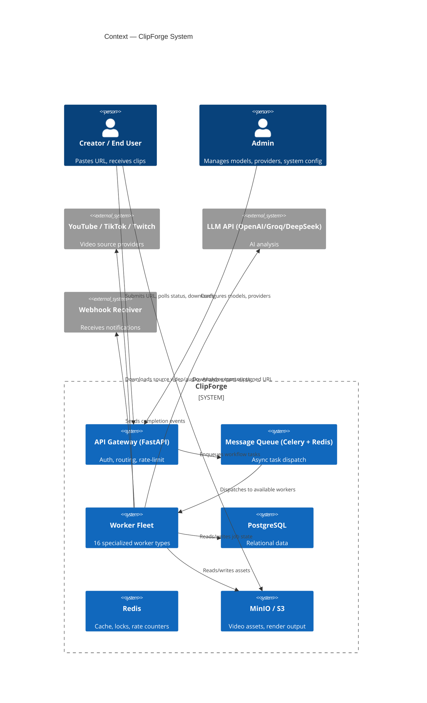
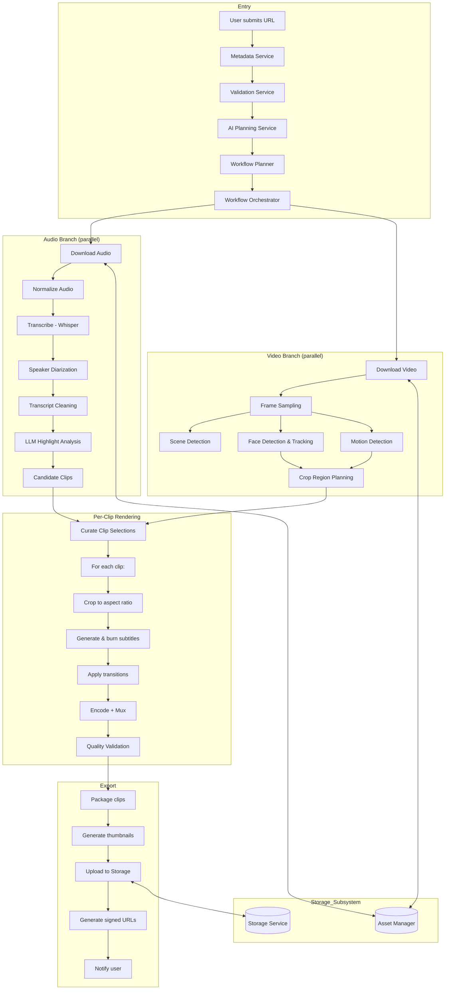
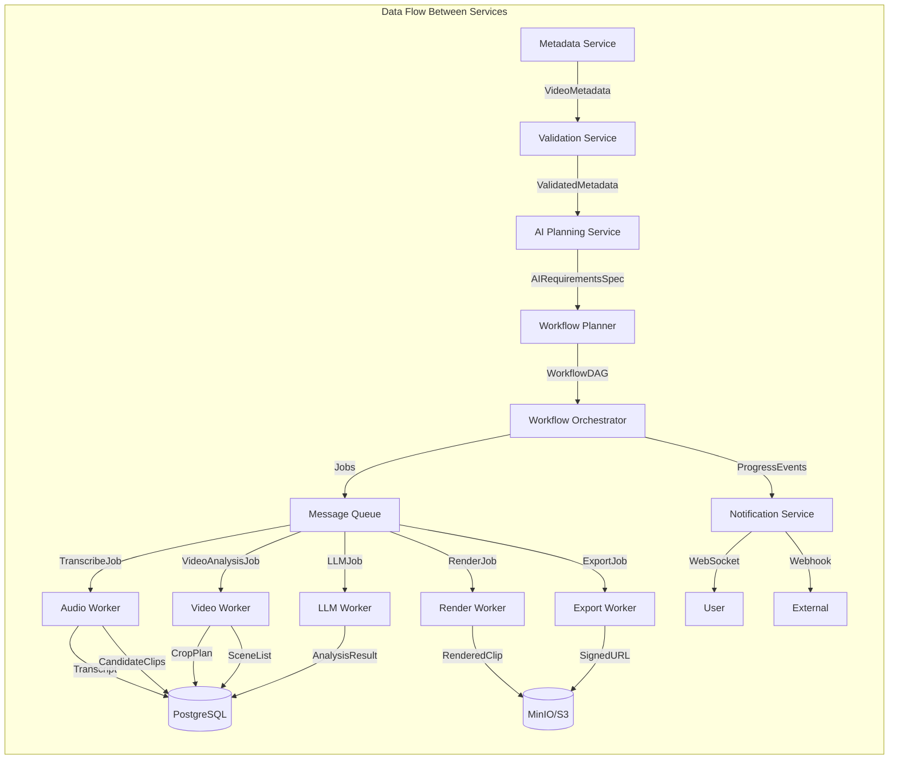
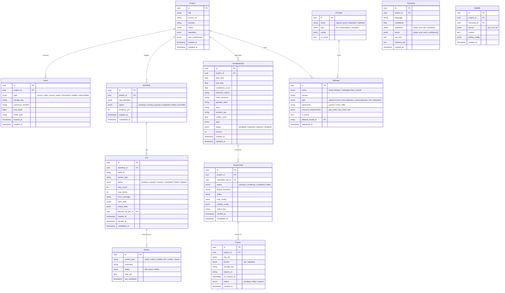

# ClipForge Architecture Blueprint

> Enterprise-grade architecture for an AI-powered video clipping platform.
> Turns long-form videos into viral-ready short clips via modular, event-driven, worker-based pipelines.

---

## 1. System Overview — C4 Context Diagram



### Actors

| Actor | Role |
|-------|------|
| **Creator** | Submits video URL, views progress, downloads clips |
| **Admin** | Registers AI models, configures providers, monitors health |
| **External APIs** | YouTube/Twitch/TikTok (source), LLM providers (analysis) |

### System Boundary

16 services across 4 layers:

| Layer | Services |
|-------|----------|
| **Entry** | API Gateway, Auth, Rate Limiter |
| **Orchestration** | Metadata, Validation, AI Planning, Workflow Planner, Workflow Orchestrator |
| **Processing** | Audio Pipeline, Video Pipeline, Subtitle Pipeline, Candidate Clip, Rendering Pipeline |
| **Infrastructure** | Asset Manager, AI Model Registry, Export, Storage, Notification, Monitoring |

---

## 2. Design Principles

| Principle | Application |
|-----------|-------------|
| **Domain-Driven Design** | Each service owns its domain. Bounded contexts: ingestion, analysis, rendering, export. Ubiquitous language across code, DB, docs. |
| **Clean Architecture** | Controllers → Use Cases → Repositories. Dependency inversion: outer layers depend on abstractions, not concretions. |
| **Event-Driven** | Services communicate via message queue events, not direct calls. Loose coupling, async, replayable. |
| **Workflow Orchestration** | DAG-based pipeline execution. Orchestrator tracks state; workers are stateless executors. |
| **Dependency Injection** | Every service receives its dependencies via constructor. Testable, swappable. |
| **Repository Pattern** | Data access abstracted behind interfaces. Swap PostgreSQL for DynamoDB without touching business logic. |
| **Stateless Workers** | Workers hold no state. All state in DB/queue. Scale horizontally by adding instances. |
| **Extensible AI Pipelines** | AI Model Registry decouples model selection from pipeline logic. Swap Whisper for Deepgram via config. |
| **Polyglot Storage** | Asset Manager abstracts local/MinIO/S3. Storage Service handles lifecycle independently. |
| **Fail-Fast Validation** | Validate at the boundary (Pydantic schemas, Validation Service). Internal services trust their inputs. |

---

## 3. Core Services (16 Subsystems)

### 3.1 Metadata Service

**Purpose:** Extract all metadata from a video source before processing.

**Responsibilities:**
- Fetch video metadata from provider API (YouTube Data API, Twitch API, etc.)
- Extract: duration, resolution, fps, codecs, audio channels, chapters/timestamps
- Fetch existing thumbnails, captions, subtitles
- Detect source language from audio track or metadata
- Validate file integrity and stream availability

**Inputs:** Source URL, provider type
**Outputs:** `VideoMetadata` object (duration, resolution, streams, chapters, language, thumbnails)
**Dependencies:** External provider APIs, Asset Manager (cache metadata)
**Future:** Multi-language metadata, livestream metadata extraction, playlist support

### 3.2 Validation Service

**Purpose:** Gatekeeper that rejects invalid or non-compliant requests early.

**Responsibilities:**
- URL format and provider validation (YouTube, TikTok, Twitch, direct file)
- Duration limits (min/max, configurable per tier)
- Resolution limits (4K max, configurable)
- Duplicate detection (same URL within N days → return cached result)
- Content policy checks (blocklisted domains, age-restricted content)
- User quota checks (jobs per day, concurrent limit)

**Inputs:** Source URL, user/tier info
**Outputs:** `ValidationResult` (pass/fail, reason, suggested action)
**Dependencies:** Metadata Service (needs duration/details), User Service (quotas)
**Future:** Content moderation via AI classifier, team-level quotas

### 3.3 AI Planning Service

**Purpose:** The "brain" that decides which models and workers are needed for a given video.

**Responsibilities:**
- Consume enriched metadata and determine processing requirements
- Decide: transcription needed? (podcast → yes, music video → no)
- Decide: face detection needed? (talking head → yes, screencast → no)
- Decide: scene detection needed? (gaming → yes, interview → maybe)
- Model selection: GPU vs CPU, large vs small Whisper model
- Confidence estimation: estimate processing complexity and duration

**Inputs:** `VideoMetadata`, user preferences (optional)
**Outputs:** `AIRequirementsSpec` (required models, estimated complexity, processing hints)
**Dependencies:** Metadata Service, AI Model Registry (to check available models)
**Future:** ML-based complexity predictor, cost-optimized model selection per user tier

### 3.4 Workflow Planner

**Purpose:** Generate an executable DAG from processing requirements.

**Responsibilities:**
- Translate `AIRequirementsSpec` into a directed acyclic graph of nodes
- Define parallel paths: audio branch || video branch
- Assign each node: worker type, retry config, timeout, resource requirements
- Set dependencies between nodes (crop plan must wait for face detection)
- Prune unnecessary nodes (no face data → skip face tracking)
- Serialize DAG as ordered list of `Job` records

**Inputs:** `AIRequirementsSpec`, available worker types
**Outputs:** `WorkflowDAG` (list of nodes with edges, retry config, resource hints)
**Dependencies:** AI Planning Service, AI Model Registry
**Future:** Dynamic DAG modification mid-execution, A/B test different pipelines

### 3.5 Workflow Orchestrator

**Purpose:** Execute the DAG — the main state machine.

**Responsibilities:**
- Read DAG from DB, transition nodes through states: `pending → queued → running → completed | failed | skipped`
- Dispatch ready nodes to message queue when dependencies satisfied
- Handle node completion events, unblock downstream nodes
- Track overall progress (completed/total nodes)
- Handle cancellation (mark remaining nodes `cancelled`, stop in-flight)
- Handle resume from failed node (re-enter DAG at failure point)
- Implement global timeout per workflow

**Inputs:** `WorkflowDAG`, completion/failure events from workers
**Outputs:** State transitions, queue dispatches, progress events
**Dependencies:** Queue, Database, all processing services
**Future:** Partial re-execution (retry only failed nodes), workflow branching

### 3.6 Asset Manager

**Purpose:** Unified file storage abstraction over any backend.

**Responsibilities:**
- Abstract local FS, MinIO, S3 behind `StorageBackend` interface
- Provider-agnostic upload/download/delete
- Cache layer: avoid re-downloading source video for same URL
- Content-addressed storage (SHA256-based paths for dedup)
- Temporary URL generation (signed S3 URLs for download)
- Lifecycle management: temp files TTL, cleanup policies

**Inputs:** File data, storage path, provider hint
**Outputs:** Storage key/handle, download URL
**Dependencies:** Storage Service (actual I/O), Cache (dedup)
**Future:** CDN integration, multi-region replication, cold storage tiering

### 3.7 AI Model Registry

**Purpose:** Lifecycle management for all ML models.

**Responsibilities:**
- Register models with metadata: name, version, type, framework, resource reqs
- Route inference requests to correct model version
- Track GPU/CPU availability and schedule accordingly
- Health check models (warmth, load, error rate)
- Blue-green model deployments
- Fallback chain: primary → secondary → fallback (e.g., faster-whisper → whisper → Google STT)

**Inputs:** Model registration data, inference requests
**Outputs:** Model endpoint/handle, inference result
**Dependencies:** Worker Manager (GPU scheduling), Monitoring
**Future:** Auto-scaling model replicas, A/B inference, model caching on GPU

### 3.8 Audio Pipeline

**Purpose:** Extract, process, transcribe, and analyze audio.

**Responsibilities:**
- Download audio stream (best available, fallback to video + extract)
- Normalize audio (loudness, sample rate, channel count)
- Transcribe with word-level timestamps via Whisper
- Detect source language (auto or override)
- Run speaker diarization via Pyannote
- Clean transcript (remove filler words, merge segments)
- Pass transcript to LLM for highlight analysis
- Generate candidate clip suggestions with confidence scores

**Inputs:** Source URL or audio file reference
**Outputs:** `Transcript` (text, word timestamps, speaker labels), `CandidateClips[]`
**Dependencies:** Asset Manager (audio files), AI Model Registry (Whisper, Pyannote), LLM API, Metadata Service
**Future:** Real-time transcription, multi-language translation, custom vocabulary

### 3.9 Video Pipeline

**Purpose:** Analyze, segment, and prepare video for clipping.

**Responsibilities:**
- Download video stream
- Extract frames at configurable intervals
- Run scene detection (PySceneDetect: content-aware cuts)
- Run face detection + tracking (MediaPipe → YOLOv8 + ByteTrack)
- Run motion detection (optical flow analysis)
- Plan crop regions: identify active speaker, track movement, smooth camera
- Generate segment list with metadata (scene boundaries, face positions, motion scores)
- Prepare render input: source segments, crop regions, timing

**Inputs:** Source URL or video file reference
**Outputs:** `CropPlan[]`, `SceneList`, `FaceTrackData`
**Dependencies:** Asset Manager, AI Model Registry (face, tracking, scene models), Metadata Service
**Future:** Object detection, logo/brand detection, OCR for text overlays

### 3.10 Subtitle Pipeline

**Purpose:** Generate styled, synced, multi-format subtitles.

**Responsibilities:**
- Source subtitle data (transcript output, existing captions, or generate)
- Align subtitles to video timestamps
- Generate word-level timestamps for karaoke-style highlights
- Render ASS subtitle format with styling (font, color, position, highlight)
- Generate SRT/VTT fallbacks
- Prepare burn-in configuration for renderer
- Handle multi-language subtitles

**Inputs:** `Transcript` with word timestamps, styling config
**Outputs:** `SubtitleData` (ASS content, SRT/VTT, burn-in config)
**Dependencies:** Audio Pipeline (transcript), Asset Manager (font assets)
**Future:** Real-time subtitle generation, translation, animated subtitle effects

### 3.11 Candidate Clip Service

**Purpose:** Store and manage AI-generated clip suggestions.

**Responsibilities:**
- Store clip candidates: start/end time, confidence score, selection reason
- Attach metadata: transcript excerpt, tags, hook sentence, speaker, topic, emotion
- Compute virality score (engagement prediction)
- Support manual override: user can edit start/end, reorder, delete
- Versioning: track edits, allow rollback
- Sort by confidence, duration, or user preference

**Inputs:** `CandidateClips[]` from Audio Pipeline + user edits
**Outputs:** Curated clip list for rendering
**Dependencies:** Audio Pipeline, Database
**Future:** A/B clip selection, collaborative editing, clip templates

### 3.12 Rendering Pipeline

**Purpose:** Transform source segments into finished clips.

**Responsibilities:**
- Receive curated clip list + crop plan + subtitle data
- Execute render stages in sequence per clip:
  1. **Crop**: smart crop to target aspect ratio with smooth camera movement
  2. **Subtitle burn-in**: overlay ASS subtitles
  3. **Transition**: add crossfade, smooth cuts
  4. **Encode**: GPU-accelerated codec (h264_videotoolbox / NVENC)
  5. **Mux**: combine video + audio, normalize loudness
- Quality validation: check output resolution, bitrate, duration, file integrity
- Optimize for target platform (TikTok 1080x1920, Reels 1080x1920, Shorts 1080x1920)
- Generate thumbnail preview per clip

**Inputs:** Source video, `CropPlan[]`, `SubtitleData`, render config
**Outputs:** Rendered clip files + thumbnails
**Dependencies:** Asset Manager (source assets), Subtitle Pipeline, Video Pipeline, AI Model Registry
**Future:** Template-based rendering, custom overlays (logo, progress bar), multi-resolution batch

### 3.13 Export Service

**Purpose:** Package, deliver, and manage final exports.

**Responsibilities:**
- Package clips into downloadable format (zip, individual files)
- Generate export metadata JSON (clip info, timestamps, stats)
- Attach thumbnail previews
- Support multiple export formats (mp4 only, zip, ZIP + metadata)
- Generate signed download URLs with expiry
- Clean up temporary render artifacts after TTL
- Multi-format export: draft (low-res quick preview), final (high-res)

**Inputs:** Rendered clips, export format preference
**Outputs:** Download package, signed URL, export metadata
**Dependencies:** Storage Service, Rendering Pipeline, Notification Service
**Future:** Direct publish to TikTok/Reels/Shorts API, batch export presets

### 3.14 Storage Service

**Purpose:** Persistent file storage with lifecycle management.

**Responsibilities:**
- Backend abstraction: support local FS, MinIO, S3, GCS via pluggable driver
- Upload, download, delete, list, copy operations
- Signed URL generation with configurable TTL
- Cache management: CDN purge, warm cache for hot assets
- Lifecycle policies: temp → cold → archive → delete
- Background cleanup of orphaned/stale files
- Quota enforcement per user/project

**Inputs:** File operations from Asset Manager and other services
**Outputs:** File handles, URLs, lifecycle events
**Dependencies:** Underlying storage backend (MinIO/S3/local)
**Future:** Multi-region replication, CDN auto-config, glacier tier for archived projects

### 3.15 Notification Service

**Purpose:** Push events to users and external systems.

**Responsibilities:**
- Send WebSocket events for real-time progress (per-node status updates)
- Send webhook POST on completion with download URL
- Email notifications for long-running jobs (async)
- Event bus for internal services (pub/sub on status transitions)
- Rate-limit notifications per user/channel
- Retry failed webhooks with exponential backoff

**Inputs:** Workflow events (node complete, workflow complete, error)
**Outputs:** WebSocket push, webhook POST, email, internal event
**Dependencies:** Workflow Orchestrator (event source), Queue (event delivery)
**Future:** SMS notifications, Slack/Discord integration, notification preferences per user

### 3.16 Monitoring

**Purpose:** Observability across all services.

**Responsibilities:**
- **Metrics**: Prometheus counters/gauges per service (jobs processed, duration, errors, queues depth, GPU utilization)
- **Logging**: Structured JSON logs (structlog) with correlation IDs spanning the full workflow
- **Tracing**: OpenTelemetry distributed traces across worker boundaries
- **Health checks**: `/health` endpoint for every service (liveness, readiness, dependencies)
- **Alerting**: Alert on: queue backlog > threshold, job failure rate > 5%, GPU memory > 90%, render errors
- **Dashboards**: Grafana dashboards: pipeline overview, worker fleet, GPU farm, job latency histograms

**Inputs:** Events from all services
**Outputs:** Metrics, logs, traces, alerts
**Dependencies:** All services (instrumented), Prometheus + Grafana, OpenTelemetry collector
**Future:** Anomaly detection (ML-based alerting), SLA dashboards per tenant, cost attribution per job

---

## 4. Complete Workflow — Mermaid DAG



### Data Flow Diagram



---

## 5. Database Design — High-Level Entities



---

## 6. API Design — REST Endpoints by Domain

### Projects

| Method | Path | Description |
|--------|------|-------------|
| `POST` | `/api/v1/projects` | Create project from URL |
| `GET` | `/api/v1/projects` | List user's projects |
| `GET` | `/api/v1/projects/{id}` | Get project + status |
| `DELETE` | `/api/v1/projects/{id}` | Delete project + assets |
| `POST` | `/api/v1/projects/{id}/process` | Start processing pipeline |
| `POST` | `/api/v1/projects/{id}/cancel` | Cancel running workflow |
| `POST` | `/api/v1/projects/{id}/resume` | Resume failed workflow |

### Assets

| Method | Path | Description |
|--------|------|-------------|
| `POST` | `/api/v1/assets/upload` | Direct file upload (non-URL source) |
| `GET` | `/api/v1/assets/{id}` | Get asset metadata |
| `GET` | `/api/v1/assets/{id}/download` | Download original asset |

### Clips (Candidate Clip Service)

| Method | Path | Description |
|--------|------|-------------|
| `GET` | `/api/v1/projects/{id}/clips` | List candidate clips for project |
| `PATCH` | `/api/v1/clips/{id}` | Edit clip (start/end, reorder, delete) |
| `POST` | `/api/v1/projects/{id}/clips/reorder` | Batch reorder clips |
| `POST` | `/api/v1/projects/{id}/clips/reanalyze` | Re-run LLM analysis with new prompt |

### Exports

| Method | Path | Description |
|--------|------|-------------|
| `POST` | `/api/v1/projects/{id}/exports` | Create export from selected clips |
| `GET` | `/api/v1/exports/{id}` | Get export status |
| `GET` | `/api/v1/exports/{id}/download` | Download signed URL redirect |
| `GET` | `/api/v1/projects/{id}/exports` | List project exports |

### Workflows

| Method | Path | Description |
|--------|------|-------------|
| `GET` | `/api/v1/workflows/{id}` | Get DAG state + node statuses |
| `GET` | `/api/v1/workflows/{id}/nodes` | List all nodes with states |
| `GET` | `/api/v1/workflows/{id}/events` | Stream workflow events (SSE) |
| `POST` | `/api/v1/workflows/{id}/retry-node/{nodeId}` | Retry specific failed node |

### Admin

| Method | Path | Description |
|--------|------|-------------|
| `GET` | `/api/v1/admin/models` | List registered AI models |
| `POST` | `/api/v1/admin/models` | Register new model |
| `PATCH` | `/api/v1/admin/models/{id}` | Update model config |
| `DELETE` | `/api/v1/admin/models/{id}` | Deactivate model |
| `GET` | `/api/v1/admin/providers` | List providers |
| `POST` | `/api/v1/admin/providers` | Add provider (LLM API key, etc.) |
| `GET` | `/api/v1/admin/workers` | List worker fleet status |
| `GET` | `/api/v1/admin/metrics` | System-wide metrics summary |

### WebSocket

| Path | Description |
|------|-------------|
| `ws://host/api/v1/ws/projects/{id}` | Real-time project progress stream |

---

## 7. Worker Design

### Worker Types

| Worker | Queue | Responsibility | Resource |
|--------|-------|----------------|----------|
| `AudioWorker` | `audio` | Audio download, transcribe, diarize | GPU (Whisper) |
| `VideoWorker` | `video` | Video download, scene/face/motion analysis | GPU (YOLO) |
| `SubtitleWorker` | `subtitle` | ASS/SRT generation, styling | CPU |
| `LLMWorker` | `llm` | Highlight analysis, clip scoring | Network (API) |
| `RenderWorker` | `render` | Crop, subtitle burn, encode, mux | GPU (encoder) |
| `ExportWorker` | `export` | Package, upload, notify | CPU, Network |
| `CleanupWorker` | `cleanup` | TTL-based cleanup of stale assets | CPU |

### Worker Contract

Every worker implements:

```
interface Worker {
  type: string                    // unique type identifier
  async execute(job: Job): Result // idempotent execution
  maxRetries: number              // retry count before DLQ
  timeout: number                 // max execution time
  resources: ResourceSpec         // CPU/GPU/RAM requirements
}
```

### Communication Pattern

```
Orchestrator → [Queue] → Worker → [Queue] → Orchestrator
                      ↘ [DB] ↙
```

- Workers are **stateless**: all input/output passes through queue or DB
- Workers **never call each other directly** — only through the orchestrator via queue events
- Workers write results to DB, then emit completion event back to orchestrator
- Orchestrator reads completion event, transitions DAG, dispatches next nodes

---

## 8. Queue Design

### Queue Architecture

```
                    ┌─────────────────┐
                    │   Redis (Celery) │
                    │  ┌───────────┐   │
                    │  │ high-pri  │   │
                    │  ├───────────┤   │
                    │  │ default   │   │
                    │  ├───────────┤   │
                    │  │ batch     │   │
                    │  ├───────────┤   │
                    │  │ DLQ       │   │
                    │  └───────────┘   │
                    └─────────────────┘
```

### Priority Tiers

| Tier | Queue | Use Case |
|------|-------|----------|
| High | `high-pri` | Paid users, re-tries, resume from failure |
| Default | `default` | Standard processing |
| Batch | `batch` | Background cleanup, re-analysis |
| Dead Letter | `dlq` | Exhausted retries, manual inspection |

### Retry Policy

```
exponential_backoff(attempt):
  base = 10 seconds
  max = 3600 seconds (1 hour)
  return min(base * 2^attempt, max)
```

| Attempt | Wait | Action |
|---------|------|--------|
| 1 | 10s | Retry |
| 2 | 20s | Retry |
| 3 | 40s | Retry |
| 4 | 80s | Retry |
| 5 | 160s | Escalate + retry |
| 6 | 320s | Escalate + retry |
| 7 | 640s | Escalate + retry |
| 8 | — | Send to DLQ |

### Cancellation & Resume

- **Cancel**: Orchestrator publishes `cancel.workflow.{id}` event. Workers check for cancellation flag before each processing step. In-flight tasks receive SIGTERM.
- **Resume**: On resume, orchestrator loads DAG state from DB, identifies `failed` nodes, re-dispatches them. `completed` nodes are skipped. State is fully reconstructable from DB.

### Timeout Model

| Scope | Timeout |
|-------|---------|
| Per-node | Max execution time per job (configurable, default 30min) |
| Per-workflow | Max wall-clock time (default 6h) |
| Per-download | Max download time (default 15min) |

---

## 9. Error Handling

### Error Classification

```
                    ┌────────────────────────────┐
                    │       Error Occurs          │
                    └────────────┬───────────────┘
                                 │
                    ┌────────────┴────────────┐
                    ▼                         ▼
            ┌──────────────┐        ┌──────────────────┐
            │  Recoverable  │        │     Fatal        │
            │  (transient)  │        │  (non-transient) │
            └──────┬───────┘        └───────┬──────────┘
                   │                        │
                   ▼                        ▼
       ┌──────────────────────┐  ┌──────────────────────┐
       │ Retry with backoff   │  │ Mark node failed     │
       │ Max 8 attempts       │  │ Pause DAG            │
       │ Then → DLQ           │  │ Notify user          │
       └──────────────────────┘  └──────────────────────┘
```

### Recoverable Errors (Retry)

| Error | Cause | Retry Strategy |
|-------|-------|----------------|
| Network timeout | Downstream API unavailable | 3 retries, backoff |
| Rate limited | LLM API quota exceeded | Retry after `Retry-After` header |
| Download interrupted | Provider stream cut | Resume download |
| GPU OOM | Model too large for GPU | Fallback to CPU model |
| DB connection pool | C oncurrent load | Retry with jitter |
| File locked | Concurrent write | Retry after short delay |

### Fatal Errors (No Retry)

| Error | Cause | Action |
|-------|-------|--------|
| Invalid URL | User-provided bad link | Return validation error |
| Unsupported format | Corrupted or unknown codec | Return error to user |
| Auth failure | YouTube API key expired | Alert admin |
| Storage full | Disk/quota exceeded | Alert admin, pause processing |
| Model load failure | Corrupted model file | Alert admin, check fallback |

### Fallback Chain

```
Primary        → Secondary          → Fallback
─────────────────────────────────────────────────
faster-whisper → whisper            → Google STT API
MediaPipe Face → YOLOv8 face        → center-crop heuristic
Pyannote       → speechbrain diariz → no diarization (mono label)
LLM (Groq)     → LLM (DeepSeek)     → heuristic scoring (duration + energy)
GPU encode     → CPU encode         → software fallback
```

---

## 10. Extensibility

### Adding a New AI Model

```
1. Create model adapter (implements ModelPort interface)
2. Register in AIModel table via admin API
3. Set fallback chain in config
4. AI Planning Service auto-discovers via registry
5. No pipeline code changes needed
```

### Adding a New Provider (YouTube → Twitch → TikTok)

```
1. Implement ProviderAdapter interface:
   - fetch_metadata(url) → VideoMetadata
   - get_download_url(url) → URL
   - validate_url(url) → bool
2. Register in Provider table via admin API
3. Metadata Service routes by provider type
4. Zero changes to downstream services
```

### Adding a New Export Format

```
1. Implement ExportPlugin interface
2. Register plugin in Export Service config
3. User selects format in request
4. Zero changes to rendering or storage
```

### Adding a New Worker

```
1. Create worker implementation
2. Subscribe to queue topic
3. Register in Workers table
4. Workflow Planner adds node to DAG
5. Workflow Orchestrator dispatches to new queue
6. Zero changes to existing workers
```

### Adding a New LLM Provider

```
1. Implement LLMAdapter interface (analyze, summarize, score)
2. Set API key in Provider config via admin UI
3. Set as primary or fallback in AIModel registry
4. AI Planning Service picks model based on tier/availability
5. Zero changes to prompt templates or pipeline logic
```

### Extension Points Summary

| Extension | Interface | Registration | Impact |
|-----------|-----------|--------------|--------|
| AI Model | `ModelPort` | Registry Table | None existing |
| Provider | `ProviderAdapter` | Provider Table | Metadata Service only |
| Export | `ExportPlugin` | Plugin Config | None existing |
| Worker | `WorkerInterface` | Queue + Table | Planner adds node |
| LLM | `LLMAdapter` | Registry Table | None existing |
| Storage | `StorageBackend` | Config | None existing |

---

## 11. Scalability & Tradeoffs

### Bottlenecks & Mitigations

| Bottleneck | Service | Cause | Mitigation |
|------------|---------|-------|------------|
| **Whisper inference** | Audio Pipeline | GPU-bound, large model | Horizontal scale: multiple GPU workers. Model caching. Batch transcription. |
| **Render encoding** | Rendering Pipeline | GPU-bound, per-clip serial | Pool of GPU render workers. Segment-level parallel encoding. |
| **LLM API rate limits** | LLM Worker | External API quota | Multiple provider fallback. Request batching. Token caching. |
| **Scene detection** | Video Pipeline | CPU-bound on high-res | Downscale before analysis. Keyframe-only analysis. |
| **Diarization** | Audio Pipeline | Slow sequential model | Use faster diarization (speechbrain). Skip diarization for solo speakers. |

### Horizontal Scaling

```
                    ┌──────────────┐
                    │  Load        │
                    │  Balancer    │
                    └──────┬───────┘
                           │
              ┌────────────┼────────────┐
              ▼            ▼            ▼
        ┌──────────┐ ┌──────────┐ ┌──────────┐
        │ API      │ │ API      │ │ API      │
        │ Gateway  │ │ Gateway  │ │ Gateway  │
        └──────────┘ └──────────┘ └──────────┘
              │            │            │
              └────────────┼────────────┘
                           ▼
                    ┌──────────────┐
                    │  Queue       │
                    │  (Redis)     │
                    └──────────────┘
                           │
              ┌────────────┼────────────┐
              ▼            ▼            ▼
        ┌──────────┐ ┌──────────┐ ┌──────────┐
        │ Audio    │ │ Video    │ │ Render   │
        │ Worker N │ │ Worker N │ │ Worker N │
        └──────────┘ └──────────┘ └──────────┘
```

- **API Gateways**: Stateless, scale horizontally behind load balancer
- **Workers**: Scale per queue type. Add audio workers when transcription backlog grows
- **Database**: Read replicas for asset metadata. Connection pooling. Partition by project ID
- **Storage**: MinIO scales horizontally natively. CDN for hot export files
- **Redis Cluster**: For high-throughput queue scenarios

### Tradeoffs

| Approach | Pro | Con |
|----------|-----|-----|
| **Event-driven** | Loose coupling, independent scaling | Debugging across async boundaries is harder |
| **Monolith** | Simple, single binary, easy debug | Cannot scale components independently |
| **Our choice: Event-driven** | Long-term flexibility | Initial complexity overhead |

| Approach | Pro | Con |
|----------|-----|-----|
| **DAG Orchestration** | Full control, retry per node, resumable | More infrastructure than sequential pipeline |
| **Sequential pipeline** | Simple, linear progress | One failure kills entire job, no parallelism |
| **Our choice: DAG Orchestration** | Resilience, parallelism, partial retry | Must build/maintain orchestrator |

### Future Scaling

1. **Streaming Pipeline** — Real-time processing during download (transcribe while downloading)
2. **Edge Processing** — Initial metadata extraction at edge nodes before asset upload
3. **Model Serving** — Dedicated model server (Triton, TorchServe) replacing per-worker model loading
4. **Multi-Region** — Regional processing for latency-sensitive markets (EU, APAC, US)
5. **Spot/Preemptible Workers** — Cost optimization for GPU workers on spot instances with checkpoint-resume
6. **Bandwidth Throttling** — Per-user download bandwidth limits, asset transfer scheduling
7. **Cold Start Optimization** — Pre-warm model containers, keep-warm policies for frequent models

---

*This document is a living architecture blueprint. All component decisions should be validated against evolving requirements and production metrics.*
